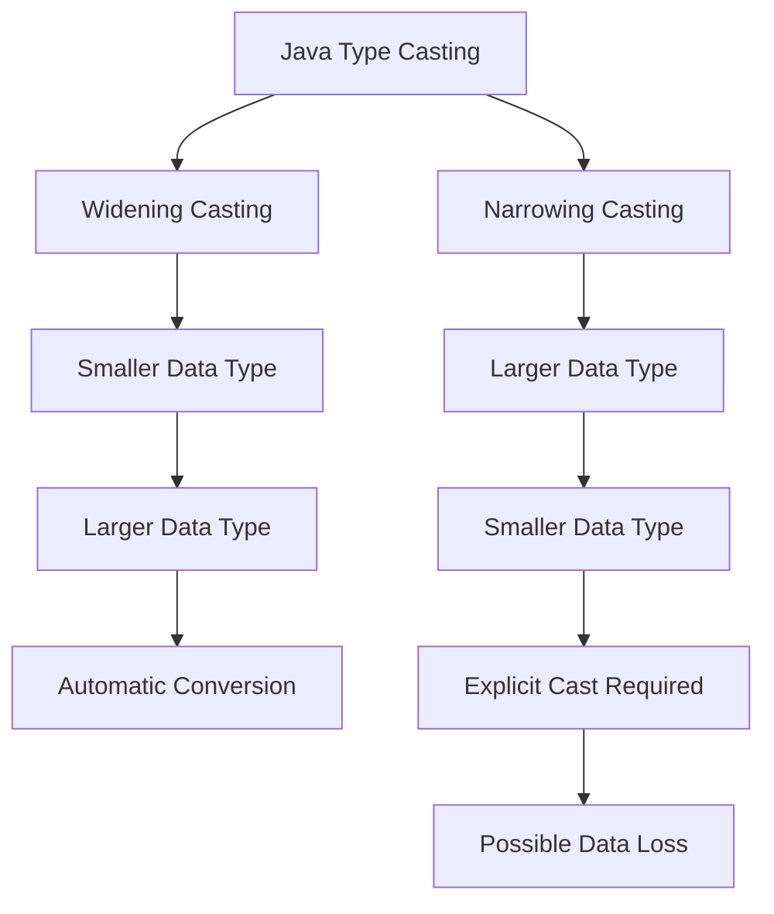

# 📘 Java Type Casting

## 1. What Is Type Casting?

**Type casting** is the process of converting a value from one data type to another data type.

In Java, type casting is commonly used when converting between compatible data types.

For example:

```java
double amount = 100.50;

int value = (int) amount;

System.out.println(value);
```

Output:

```text
100
```

The syntax is:

```text
(targetType) value
```

Example:

```java
int value = (int) 100.50;
```

Here:

```text
(int)
  ↓
Target type

100.50
  ↓
Original value

100
  ↓
Converted value
```

---

## 2. Two Types of Type Casting

Java type casting can be divided into two main categories:

```text
Java Type Casting
│
├── Widening Casting
│   └── Automatic
│
└── Narrowing Casting
    └── Explicit
```

## Java Type Casting Flow



## 3. Widening Casting

Widening casting converts a smaller compatible numeric type into a larger type.

Java performs this conversion automatically.

byte -> short -> char -> int -> long -> float -> double

Example:

```java
int number = 100;

long value = number;

System.out.println(value);
```

Output:

```text
100
```

No explicit cast is required.

Another example:

```java
int number = 100;

double value = number;

System.out.println(value);
```

Output:

```text
100.0
```

The conversion happens automatically:

```text
int
 ↓
long
 ↓
float
 ↓
double
```

A simplified example:

```java
int amount = 100;

double result = amount;
```

Conceptually:

```text
int 100
   ↓
double 100.0
```

Because the destination type can represent the source value's numeric range more broadly, Java allows the conversion automatically.

---

## 4. Narrowing Casting

Narrowing casting converts a larger numeric type into a smaller numeric type.

Unlike widening conversion, narrowing conversion requires an explicit cast.

double -> float -> long -> int -> char -> short -> byte

Example:

```java
double amount = 100.75;

int value = (int) amount;

System.out.println(value);
```

Output:

```text
100
```

The syntax is:

```java
int value = (int) amount;
```

Here:

```text
double
   ↓
(int)
   ↓
int
```

---

## 5. Type Casting Can Lose Data

When narrowing a floating-point value to an integer, the decimal portion is discarded.

Example:

```java
double amount = 100.99;

int value = (int) amount;

System.out.println(value);
```

Output:

```text
100
```

Java does not round the value.

It removes the fractional portion.

Therefore:

```text
100.99
  ↓
(int)
  ↓
100
```

Another example:

```java
double amount = -100.99;

int value = (int) amount;

System.out.println(value);
```

Output:

```text
-100
```

---

## 6. Narrowing Can Cause Overflow

Consider:

```java
long number = 3_000_000_000L;

int value = (int) number;

System.out.println(value);
```

The value `3_000_000_000` is outside the range of `int`.

Therefore, the conversion can produce an unexpected result because the higher-order bits cannot be represented by `int`.

This is why narrowing casts should be used carefully.

---

## 7. Type Casting Between char and int

A `char` can be converted to an integer value.

Example:

```java
char letter = 'A';

int value = letter;

System.out.println(value);
```

Output:

```text
65
```

You can also explicitly cast an integer to `char`:

```java
int value = 66;

char letter = (char) value;

System.out.println(letter);
```

Output:

```text
B
```

Conceptually:

```text
'A'
 ↓
65

66
 ↓
'B'
```

---

## 8. Type Casting Does Not Mean String Conversion

This is an important distinction.

You cannot cast a `String` directly to an `int`.

This is invalid:

```java
String value = "100";

int number = (int) value;
```

Use parsing instead:

```java
String value = "100";

int number = Integer.parseInt(value);
```

Output:

```text
100
```

Therefore:

```text
Numeric Type → Numeric Type
        ↓
     Casting

String → Numeric Type
        ↓
     Parsing
```

---

## 9. Type Casting vs Parsing

These two concepts are different.

### Type Casting

Used for compatible types.

Example:

```java
double amount = 100.50;

int value = (int) amount;
```

### Parsing

Used to convert text into another type.

Example:

```java
String amount = "100.50";

double value =
        Double.parseDouble(amount);
```

Comparison:

| Operation  | Example                   | Purpose                                   |
| ---------- | ------------------------- | ----------------------------------------- |
| Casting    | `(int) 100.50`            | Convert compatible numeric types          |
| Parsing    | `Integer.parseInt("100")` | Convert text to numeric value             |
| Conversion | `String.valueOf(100)`     | Convert a value to another representation |

---

## 10. Type Casting with BigDecimal

`BigDecimal` is a reference type and should not be treated like primitive numeric types.

For example, this is invalid:

```java
BigDecimal amount =
        new BigDecimal("100.50");

int value = (int) amount;
```

Instead, use the appropriate conversion method:

```java
BigDecimal amount =
        new BigDecimal("100.50");

int value = amount.intValue();

System.out.println(value);
```

Output:

```text
100
```

However, be careful because `intValue()` can discard the fractional portion and can overflow if the value is outside the `int` range.

If you want Java to detect overflow, consider:

```java
int value = amount.intValueExact();
```

Example:

```java
BigDecimal amount =
        new BigDecimal("100.50");

int value = amount.intValueExact();
```

This throws an `ArithmeticException` because `100.50` cannot be represented exactly as an integer.

For financial applications, this distinction is very important.

---

## 11. Primitive Type Casting Example

```java
public class Main {

    public static void main(String[] args) {

        // Widening casting
        int number = 100;

        double doubleValue = number;

        System.out.println(doubleValue);

        // Narrowing casting
        double amount = 100.75;

        int intValue = (int) amount;

        System.out.println(intValue);
    }
}
```

Output:

```text
100.0
100
```

---

## 12. Important Rules to Remember

```text
1. Widening conversion is normally automatic.

2. Narrowing conversion normally requires an explicit cast.

3. Narrowing can cause data loss.

4. Floating-point to integer casting discards the fractional portion.

5. Casting is not the same as parsing.

6. String values cannot be directly cast to primitive numeric types.

7. Use parseInt(), parseLong(), parseDouble(), etc. for String-to-number conversion.

8. BigDecimal uses methods such as intValue() and intValueExact()
   rather than primitive-style casting.

9. Always consider overflow when narrowing numeric values.
```

---

## 13. Simple Mental Model

Remember type casting like this:

```text
Widening
---------
Small Type
    ↓
Large Type

Example:

int
 ↓
long
 ↓
double

Automatic
Usually safe from range loss
```

```text
Narrowing
---------
Large Type
    ↓
Small Type

Example:

double
   ↓
  (int)
   ↓
int

Explicit
May lose data
```

---

## 14. Real-World Example

Suppose an application receives a decimal value:

```java
double amount = 1250.75;
```

If you intentionally need only the integer portion:

```java
int wholeAmount = (int) amount;
```

The result is:

```text
1250
```

But in a banking application, you should **not** use this approach to handle monetary rounding.

For example:

```java
BigDecimal amount =
        new BigDecimal("1250.75");
```

If business requirements say the amount must be rounded to a whole unit, use an explicit rounding policy with `BigDecimal`, rather than simply casting:

```java
BigDecimal rounded =
        amount.setScale(
                0,
                RoundingMode.HALF_UP
        );
```

Result:

```text
1251
```

This makes the business rule explicit.

---

## 15. Type Casting Summary

| Concept          | Example              | Automatic? | Possible Data Loss?                 |
| ---------------- | -------------------- | ---------- | ----------------------------------- |
| Widening         | `int → long`         | Yes        | Usually no                          |
| Widening         | `int → double`       | Yes        | Precision considerations may apply  |
| Narrowing        | `double → int`       | No         | Yes                                 |
| Narrowing        | `long → int`         | No         | Yes                                 |
| char → int       | `char → int`         | Yes        | No                                  |
| int → char       | `int → (char)`       | No         | Yes                                 |
| String → int     | `Integer.parseInt()` | No         | Can fail if text is invalid         |
| BigDecimal → int | `intValue()`         | No         | Yes                                 |
| BigDecimal → int | `intValueExact()`    | No         | Throws if not exactly representable |

---

# Key Takeaway

**Type casting is the explicit conversion of a value from one compatible type to another.**

The most important distinction is:

```text
Widening
    ↓
Automatic
    ↓
Smaller → Larger

Narrowing
    ↓
Explicit cast
    ↓
Larger → Smaller
    ↓
Possible data loss
```

Example:

```java
int number = 100;

double value = number;       // Widening

double amount = 100.75;

int result = (int) amount;   // Narrowing
```

And remember:

```text
Casting ≠ Parsing

(int) 100.50
    ↓
Casting

Integer.parseInt("100")
    ↓
Parsing
```
