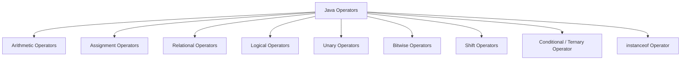
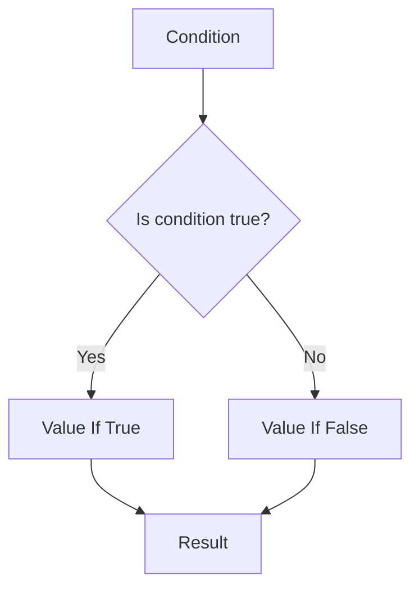
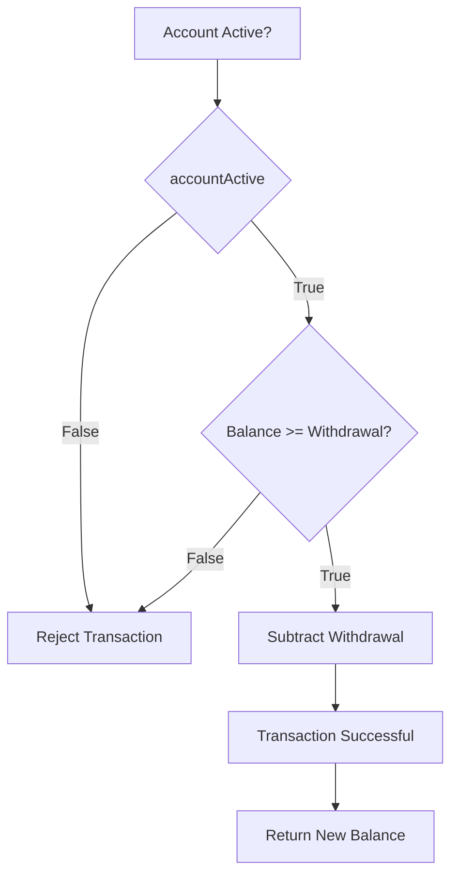
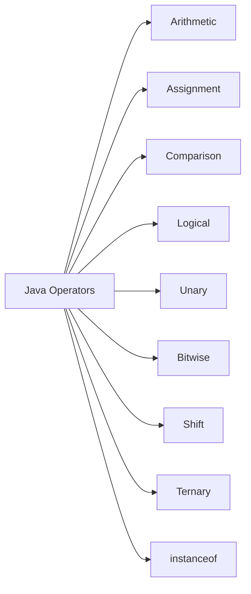
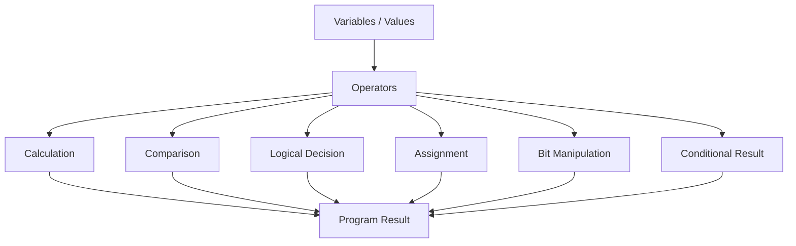

# 📘 Java Operators

## 1. What Are Java Operators?

**Operators** are special symbols or keywords that Java uses to perform operations on values and variables.

For example:

```java
int a = 10;
int b = 20;

int result = a + b;
```

Here:

```text
a
+
b
=
result
```

The `+` symbol is an **operator**.

It tells Java to add `a` and `b`.

The values that an operator works with are called **operands**.

```text
   Operand
      ↓
     10
      +
     20
      ↑
   Operand

      ↓

   Operator: +
```

---

## 2. Why Are Operators Important?

Operators are used throughout Java programs.

They allow us to:

- Perform calculations
- Compare values
- Assign values
- Check conditions
- Combine boolean expressions
- Increment and decrement values
- Perform bit-level operations
- Make conditional decisions

For example:

```java
int balance = 1000;
int deposit = 500;

int newBalance = balance + deposit;
```

Output:

```text
1500
```

---

# 3. Categories of Java Operators

Java operators can be grouped into several categories:



The main categories are:

| Category      | Operators                         |             |        |
| ------------- | --------------------------------- | ----------- | ------ |
| Arithmetic    | `+`, `-`, `*`, `/`, `%`           |             |        |
| Assignment    | `=`, `+=`, `-=`, `*=`, `/=`, `%=` |             |        |
| Relational    | `==`, `!=`, `>`, `<`, `>=`, `<=`  |             |        |
| Logical       | `&&`, `                           |             | `, `!` |
| Unary         | `+`, `-`, `++`, `--`, `!`, `~`    |             |        |
| Bitwise       | `&`, `                            | `, `^`, `~` |        |
| Shift         | `<<`, `>>`, `>>>`                 |             |        |
| Ternary       | `? :`                             |             |        |
| Type checking | `instanceof`                      |             |        |

---

# 4. Arithmetic Operators

Arithmetic operators are used to perform mathematical calculations.

Java provides:

```text
+
-
*
/
%
```

They represent:

```text
+   Addition
-   Subtraction
*   Multiplication
/   Division
%   Remainder
```

---

# 5. Addition Operator +

The `+` operator adds two values.

Example:

```java
int a = 10;
int b = 20;

int result = a + b;

System.out.println(result);
```

Output:

```text
30
```

Another example:

```java
double price = 100.50;
double tax = 10.50;

double total = price + tax;

System.out.println(total);
```

Output:

```text
111.0
```

---

# 6. Addition With Strings

The `+` operator can also concatenate strings.

Example:

```java
String firstName = "John";
String lastName = "Smith";

String fullName = firstName + " " + lastName;

System.out.println(fullName);
```

Output:

```text
John Smith
```

Therefore, the `+` operator has two important uses:

```text
+
│
├── Numeric Addition
│
└── String Concatenation
```

---

# 7. String Concatenation With Numbers

Example:

```java
String name = "John";
int age = 30;

System.out.println(
        name + " is " + age + " years old."
);
```

Output:

```text
John is 30 years old.
```

Java automatically converts the numeric value to a string as part of the concatenation operation.

---

# 8. Important String + Rule

Consider:

```java
System.out.println(10 + 20);
```

Output:

```text
30
```

But:

```java
System.out.println("Result: " + 10 + 20);
```

Output:

```text
Result: 1020
```

Why?

Evaluation happens from left to right.

```text
"Result: " + 10
       ↓
"Result: 10"

"Result: 10" + 20
       ↓
"Result: 1020"
```

If you want addition first:

```java
System.out.println(
        "Result: " + (10 + 20)
);
```

Output:

```text
Result: 30
```

---

# 9. Subtraction Operator -

The `-` operator subtracts one value from another.

Example:

```java
int balance = 1000;
int withdrawal = 250;

int remaining =
        balance - withdrawal;

System.out.println(remaining);
```

Output:

```text
750
```

---

# 10. Multiplication Operator \*

The `*` operator performs multiplication.

Example:

```java
int price = 100;
int quantity = 5;

int total =
        price * quantity;

System.out.println(total);
```

Output:

```text
500
```

---

# 11. Division Operator /

The `/` operator performs division.

Example:

```java
int total = 100;
int people = 4;

int result =
        total / people;

System.out.println(result);
```

Output:

```text
25
```

---

# 12. Integer Division

When both operands are integers, Java performs integer division.

Example:

```java
int result = 10 / 3;

System.out.println(result);
```

Output:

```text
3
```

The decimal portion is discarded.

```text
10 / 3

= 3.333...

int result
    ↓
3
```

If you need a decimal result:

```java
double result = 10.0 / 3.0;

System.out.println(result);
```

Output:

```text
3.3333333333333335
```

---

# 13. Remainder Operator %

The `%` operator returns the remainder after division.

Example:

```java
int result = 10 % 3;

System.out.println(result);
```

Output:

```text
1
```

Because:

```text
10 ÷ 3 = 3 remainder 1
```

Therefore:

```text
10 % 3 = 1
```

---

# 14. Practical Use of %

The remainder operator is commonly used to determine whether a number is even or odd.

Example:

```java
int number = 10;

if (number % 2 == 0) {

    System.out.println("Even");
}
```

Output:

```text
Even
```

For an odd number:

```java
int number = 7;

if (number % 2 != 0) {

    System.out.println("Odd");
}
```

Output:

```text
Odd
```

---

# 15. Arithmetic Operators Example

```java
public class Main {

    public static void main(String[] args) {

        int a = 20;
        int b = 6;

        System.out.println("Addition: "
                + (a + b));

        System.out.println("Subtraction: "
                + (a - b));

        System.out.println("Multiplication: "
                + (a * b));

        System.out.println("Division: "
                + (a / b));

        System.out.println("Remainder: "
                + (a % b));
    }
}
```

Output:

```text
Addition: 26
Subtraction: 14
Multiplication: 120
Division: 3
Remainder: 2
```

---

# 16. Assignment Operator =

The `=` operator assigns a value to a variable.

Example:

```java
int age = 30;
```

Conceptually:

```text
30
 ↓
age
```

Another example:

```java
String name = "John";
```

The variable `name` receives the reference to the string object.

---

# 17. Assignment Is Not Equality

This is a very important distinction.

```java
int age = 30;
```

means:

```text
Assign 30 to age
```

But:

```java
age == 30
```

means:

```text
Check whether age equals 30
```

Therefore:

```text
=    Assignment

==   Equality comparison
```

---

# 18. Compound Assignment Operators

Java provides shorthand assignment operators.

They include:

```text
+=
-=
*=
/=
%=
```

Example:

```java
int balance = 1000;

balance += 500;
```

This is equivalent to:

```java
balance = balance + 500;
```

Result:

```text
1500
```

---

# 19. += Operator

Example:

```java
int amount = 1000;

amount += 250;

System.out.println(amount);
```

Output:

```text
1250
```

Equivalent to:

```java
amount = amount + 250;
```

---

# 20. -= Operator

Example:

```java
int balance = 1000;

balance -= 250;

System.out.println(balance);
```

Output:

```text
750
```

Equivalent to:

```java
balance = balance - 250;
```

---

# 21. \*= Operator

Example:

```java
int value = 10;

value *= 5;

System.out.println(value);
```

Output:

```text
50
```

Equivalent to:

```java
value = value * 5;
```

---

# 22. /= Operator

Example:

```java
int value = 100;

value /= 4;

System.out.println(value);
```

Output:

```text
25
```

Equivalent to:

```java
value = value / 4;
```

---

# 23. %= Operator

Example:

```java
int value = 10;

value %= 3;

System.out.println(value);
```

Output:

```text
1
```

Equivalent to:

```java
value = value % 3;
```

---

# 24. Relational Operators

Relational operators compare two values.

They return a `boolean`:

```text
true
```

or:

```text
false
```

Java provides:

```text
==
!=
>
<
>=
<=
```

---

# 25. == Equality Operator

The `==` operator compares values for primitive types.

Example:

```java
int a = 10;
int b = 10;

System.out.println(a == b);
```

Output:

```text
true
```

Another example:

```java
int a = 10;
int b = 20;

System.out.println(a == b);
```

Output:

```text
false
```

---

# 26. != Not Equal Operator

The `!=` operator checks whether two values are different.

Example:

```java
int a = 10;
int b = 20;

System.out.println(a != b);
```

Output:

```text
true
```

---

# 27. > Greater Than

Example:

```java
int balance = 1000;

System.out.println(
        balance > 500
);
```

Output:

```text
true
```

---

# 28. < Less Than

Example:

```java
int balance = 100;

System.out.println(
        balance < 500
);
```

Output:

```text
true
```

---

# 29. >= Greater Than or Equal

Example:

```java
int age = 18;

System.out.println(
        age >= 18
);
```

Output:

```text
true
```

---

# 30. <= Less Than or Equal

Example:

```java
int amount = 500;

System.out.println(
        amount <= 500
);
```

Output:

```text
true
```

---

# 31. Relational Operator Summary

| Operator | Meaning               | Example  |
| -------- | --------------------- | -------- |
| `==`     | Equal                 | `a == b` |
| `!=`     | Not equal             | `a != b` |
| `>`      | Greater than          | `a > b`  |
| `<`      | Less than             | `a < b`  |
| `>=`     | Greater than or equal | `a >= b` |
| `<=`     | Less than or equal    | `a <= b` |

---

# 32. Logical Operators

Logical operators are used to combine boolean expressions.

Java provides:

```text
&&
||
!
```

They mean:

```text
&&   AND
||   OR
!    NOT
```

---

# 33. Logical AND &&

The `&&` operator returns `true` only when both conditions are true.

Example:

```java
int age = 25;
boolean active = true;

boolean result =
        age >= 18 && active;

System.out.println(result);
```

Output:

```text
true
```

---

# 34. AND Truth Table

| A       | B       | A && B  |
| ------- | ------- | ------- |
| `false` | `false` | `false` |
| `false` | `true`  | `false` |
| `true`  | `false` | `false` |
| `true`  | `true`  | `true`  |

The rule is:

```text
TRUE && TRUE = TRUE
Everything else = FALSE
```

---

# 35. Logical OR ||

The `||` operator returns `true` when at least one condition is true.

Example:

```java
boolean admin = false;
boolean manager = true;

boolean allowed =
        admin || manager;

System.out.println(allowed);
```

Output:

```text
true
```

---

# 36. OR Truth Table

| A       | B       | A `     |     | ` B |
| ------- | ------- | ------- | --- | --- |
| `false` | `false` | `false` |
| `false` | `true`  | `true`  |
| `true`  | `false` | `true`  |
| `true`  | `true`  | `true`  |

The rule is:

```text
FALSE || FALSE = FALSE
Everything else = TRUE
```

---

# 37. Logical NOT !

The `!` operator reverses a boolean value.

Example:

```java
boolean active = true;

System.out.println(!active);
```

Output:

```text
false
```

Another example:

```java
boolean active = false;

System.out.println(!active);
```

Output:

```text
true
```

---

# 38. Logical Operator Example

Suppose a banking application checks whether a customer can perform a transaction.

```java
boolean accountActive = true;
boolean sufficientBalance = true;

if (accountActive && sufficientBalance) {

    System.out.println(
            "Transaction allowed"
    );
}
```

Output:

```text
Transaction allowed
```

---

# 39. Short-Circuit Evaluation

Java's:

```text
&&
||
```

operators use **short-circuit evaluation**.

For `&&`, if the first condition is `false`, Java does not need to evaluate the second condition.

Example:

```java
boolean result =
        false && someMethod();
```

`someMethod()` does not need to execute.

For `||`, if the first condition is `true`, Java does not need to evaluate the second condition.

Example:

```java
boolean result =
        true || someMethod();
```

The second condition is skipped.

---

# 40. Why Short-Circuit Evaluation Matters

Consider:

```java
String name = null;

if (name != null &&
        name.length() > 0) {

    System.out.println(name);
}
```

This is safe because:

```text
name != null
```

is evaluated first.

If it is `false`, Java stops and does not evaluate:

```text
name.length()
```

This prevents a `NullPointerException`.

---

# 41. Unary Operators

Unary operators work with one operand.

Common unary operators include:

```text
+
-
++
--
!
~
```

Example:

```java
int value = 10;

value++;
```

Only one operand is involved:

```text
value++
```

---

# 42. Unary Plus +

Unary `+` indicates a positive numeric value.

Example:

```java
int value = +10;

System.out.println(value);
```

Output:

```text
10
```

It is rarely necessary because positive numbers are already positive by default.

---

# 43. Unary Minus -

Unary `-` changes the sign of a numeric value.

Example:

```java
int value = 10;

int result = -value;

System.out.println(result);
```

Output:

```text
-10
```

---

# 44. Increment Operator ++

The `++` operator increases a numeric variable by one.

Example:

```java
int count = 10;

count++;

System.out.println(count);
```

Output:

```text
11
```

Equivalent to:

```java
count = count + 1;
```

---

# 45. Decrement Operator --

The `--` operator decreases a numeric variable by one.

Example:

```java
int count = 10;

count--;

System.out.println(count);
```

Output:

```text
9
```

Equivalent to:

```java
count = count - 1;
```

---

# 46. Prefix Increment

Prefix increment places `++` before the variable.

Example:

```java
int count = 10;

int result = ++count;

System.out.println(count);
System.out.println(result);
```

Output:

```text
11
11
```

The variable is incremented before its value is used.

```text
count = 10

++count
   ↓
count = 11
   ↓
result = 11
```

---

# 47. Postfix Increment

Postfix increment places `++` after the variable.

Example:

```java
int count = 10;

int result = count++;

System.out.println(count);
System.out.println(result);
```

Output:

```text
11
10
```

The original value is used first, then the variable is incremented.

```text
count = 10

result = count
   ↓
result = 10

then:

count++
   ↓
count = 11
```

---

# 48. Prefix vs Postfix

| Expression | What Happens First? | Example Result |
| ---------- | ------------------- | -------------- |
| `++count`  | Increment, then use | `11`           |
| `count++`  | Use, then increment | `10`           |

Example:

```java
int count = 10;

System.out.println(++count);
```

Output:

```text
11
```

But:

```java
int count = 10;

System.out.println(count++);
```

Output:

```text
10
```

After the statement:

```text
count = 11
```

---

# 49. Decrement Prefix vs Postfix

The same principle applies to `--`.

Prefix:

```java
int count = 10;

System.out.println(--count);
```

Output:

```text
9
```

Postfix:

```java
int count = 10;

System.out.println(count--);
```

Output:

```text
10
```

After the statement:

```text
count = 9
```

---

# 50. Bitwise Operators

Bitwise operators work at the individual bit level.

Java provides:

```text
&
|
^
~
```

They are commonly used with integral types such as:

```text
byte
short
int
long
char
```

Example:

```java
int a = 5;
int b = 3;

int result = a & b;
```

---

# 51. Binary Representation

Consider:

```text
5 = 0101
3 = 0011
```

Bitwise AND:

```text
  0101
& 0011
------
  0001
```

Therefore:

```text
5 & 3 = 1
```

---

# 52. Bitwise AND &

The `&` operator performs bitwise AND.

Example:

```java
int a = 5;
int b = 3;

System.out.println(a & b);
```

Output:

```text
1
```

Truth table for individual bits:

| A   | B   | A & B |
| --- | --- | ----- |
| 0   | 0   | 0     |
| 0   | 1   | 0     |
| 1   | 0   | 0     |
| 1   | 1   | 1     |

---

# 53. Bitwise OR |

Example:

```java
int a = 5;
int b = 3;

System.out.println(a | b);
```

Binary:

```text
  0101
| 0011
------
  0111
```

Output:

```text
7
```

---

# 54. Bitwise XOR ^

XOR returns `1` when the two bits are different.

Example:

```java
int a = 5;
int b = 3;

System.out.println(a ^ b);
```

Binary:

```text
  0101
^ 0011
------
  0110
```

Output:

```text
6
```

Truth table:

| A   | B   | A ^ B |
| --- | --- | ----- |
| 0   | 0   | 0     |
| 0   | 1   | 1     |
| 1   | 0   | 1     |
| 1   | 1   | 0     |

---

# 55. Bitwise NOT ~

The `~` operator reverses every bit.

Example:

```java
int value = 5;

System.out.println(~value);
```

Output:

```text
-6
```

This may seem surprising.

The reason is that Java integer types use signed two's-complement representation.

For beginners, remember:

```text
~x
```

means:

```text
Invert every bit of x
```

---

# 56. Shift Operators

Java provides three shift operators:

```text
<<
>>
>>>
```

They are:

```text
<<    Left shift
>>    Signed right shift
>>>   Unsigned right shift
```

---

# 57. Left Shift <<

The `<<` operator shifts bits to the left.

Example:

```java
int value = 5;

int result = value << 1;

System.out.println(result);
```

Output:

```text
10
```

Binary:

```text
5:

0101

5 << 1:

1010

= 10
```

---

# 58. Right Shift >>

The `>>` operator performs a signed right shift.

Example:

```java
int value = 20;

int result = value >> 2;

System.out.println(result);
```

Output:

```text
5
```

Conceptually:

```text
20 >> 1 = 10

20 >> 2 = 5
```

For positive numbers, right shifting by one is similar to integer division by two, though the precise behavior is defined in terms of bit shifting.

---

# 59. Unsigned Right Shift >>>

The `>>>` operator performs a right shift while filling the left side with zero bits.

Example:

```java
int value = -8;

System.out.println(value >> 1);

System.out.println(value >>> 1);
```

The results are different because:

```text
>>>
```

does not preserve the sign bit.

This operator is more commonly encountered in low-level and bit-manipulation code.

---

# 60. Ternary Operator ?:

The ternary operator provides a compact way to choose between two values.

Syntax:

```text
condition ? valueIfTrue : valueIfFalse
```

Example:

```java
int age = 20;

String result =
        age >= 18
                ? "Adult"
                : "Minor";

System.out.println(result);
```

Output:

```text
Adult
```

---

# 61. Ternary Operator Flow



---

# 62. Ternary Operator Example

Instead of:

```java
int age = 20;

String status;

if (age >= 18) {
    status = "Adult";
} else {
    status = "Minor";
}
```

You can write:

```java
int age = 20;

String status =
        age >= 18
                ? "Adult"
                : "Minor";
```

The ternary operator is useful when the logic is simple.

For complex logic, a normal `if/else` is usually easier to read.

---

# 63. Banking Example With Ternary

```java
BigDecimal balance =
        new BigDecimal("1000.00");

BigDecimal minimum =
        new BigDecimal("500.00");

String status =
        balance.compareTo(minimum) >= 0
                ? "Sufficient"
                : "Insufficient";

System.out.println(status);
```

Output:

```text
Sufficient
```

---

# 64. instanceof Operator

The `instanceof` operator checks whether an object is an instance of a particular type.

Example:

```java
String name = "John";

System.out.println(
        name instanceof String
);
```

Output:

```text
true
```

---

# 65. instanceof Example

```java
Object value = "Hello";

if (value instanceof String) {

    System.out.println(
            "Value is a String"
    );
}
```

Output:

```text
Value is a String
```

---

# 66. instanceof and Pattern Matching

Modern Java supports pattern matching with `instanceof`.

Example:

```java
Object value = "Hello Java";

if (value instanceof String text) {

    System.out.println(
            text.toUpperCase()
    );
}
```

Output:

```text
HELLO JAVA
```

The variable:

```java
text
```

is available inside the appropriate scope when the pattern matches.

This is a useful modern Java feature.

---

# 67. Operator Precedence

When an expression contains multiple operators, Java follows operator precedence rules.

Example:

```java
int result =
        10 + 5 * 2;
```

The result is:

```text
20
```

not:

```text
30
```

Because multiplication is performed before addition.

```text
10 + 5 * 2
     ↓
10 + 10
     ↓
20
```

---

# 68. Use Parentheses

When you want a specific order, use parentheses.

Example:

```java
int result =
        (10 + 5) * 2;
```

Output:

```text
30
```

Parentheses make the intended calculation clear.

---

# 69. Common Operator Precedence

A simplified precedence order from higher to lower is:

```text
1.  Unary
2.  Multiplication / Division / Remainder
3.  Addition / Subtraction
4.  Shift
5.  Relational
6.  Equality
7.  Bitwise AND
8.  Bitwise XOR
9.  Bitwise OR
10. Logical AND
11. Logical OR
12. Ternary
13. Assignment
```

For complicated expressions, use parentheses rather than relying on memory.

---

# 70. Example of Precedence

```java
int result =
        10 + 20 * 3;
```

Java evaluates:

```text
20 * 3
   ↓
60

10 + 60
   ↓
70
```

Therefore:

```text
result = 70
```

---

# 71. Parentheses Change the Result

Without parentheses:

```java
int result =
        10 + 20 * 3;
```

Result:

```text
70
```

With parentheses:

```java
int result =
        (10 + 20) * 3;
```

Result:

```text
90
```

---

# 72. Operator Associativity

When operators have the same precedence, Java also has associativity rules that determine the evaluation order.

For example:

```java
int result =
        20 / 5 * 2;
```

Both `/` and `*` have the same precedence.

They are evaluated left to right:

```text
20 / 5
   ↓
4

4 * 2
   ↓
8
```

Therefore:

```text
result = 8
```

---

# 73. Assignment Associativity

Assignment operators are evaluated from right to left.

Example:

```java
int a;
int b;
int c;

a = b = c = 10;
```

Conceptually:

```text
c = 10
 ↓
b = 10
 ↓
a = 10
```

After execution:

```text
a = 10
b = 10
c = 10
```

Although this is valid Java, separate assignments are often clearer in production code.

---

# 74. Compound Assignment and Type Conversion

Consider:

```java
byte value = 10;

value += 20;
```

This is valid.

But:

```java
byte value = 10;

value = value + 20;
```

does not compile because arithmetic promotion makes:

```text
value + 20
```

an `int`.

Compound assignment includes an implicit conversion back to the left-hand type, subject to the rules of compound assignment.

---

# 75. Example

```java
byte value = 10;

value += 20;

System.out.println(value);
```

Output:

```text
30
```

But:

```java
byte value = 10;

value = value + 20;
```

causes a compilation error.

This is an important Java rule.

---

# 76. Operators With BigDecimal

For financial applications, `BigDecimal` does not use normal arithmetic operators such as:

```text
+
-
*
/
```

Instead, use methods.

Example:

```java
BigDecimal balance =
        new BigDecimal("1000.00");

BigDecimal deposit =
        new BigDecimal("500.00");

BigDecimal newBalance =
        balance.add(deposit);
```

Output:

```text
1500.00
```

---

# 77. BigDecimal Arithmetic

Common methods:

```text
add()
subtract()
multiply()
divide()
remainder()
compareTo()
```

Example:

```java
BigDecimal amount =
        new BigDecimal("100.00");

BigDecimal fee =
        new BigDecimal("5.00");

BigDecimal total =
        amount.add(fee);
```

---

# 78. BigDecimal Comparison

Do not use:

```java
if (balance > minimum) {
}
```

because `>` cannot be used with `BigDecimal`.

Use:

```java
if (balance.compareTo(minimum) > 0) {

    System.out.println(
            "Balance is greater"
    );
}
```

The result of `compareTo()` is:

```text
< 0    First value is smaller
= 0    Values are numerically equal
> 0    First value is greater
```

---

# 79. Banking Transaction Example

Consider:

```java
BigDecimal openingBalance =
        new BigDecimal("5000.00");

BigDecimal deposit =
        new BigDecimal("1000.00");

BigDecimal withdrawal =
        new BigDecimal("750.00");

BigDecimal balance =
        openingBalance
                .add(deposit)
                .subtract(withdrawal);

System.out.println(
        "Balance: " + balance
);
```

Output:

```text
Balance: 5250.00
```

The operators here are method calls:

```text
add()
subtract()
```

because `BigDecimal` is an object type.

---

# 80. Complete Banking Example

```java
import java.math.BigDecimal;

public class Main {

    public static void main(String[] args) {

        BigDecimal balance =
                new BigDecimal("5000.00");

        BigDecimal deposit =
                new BigDecimal("1000.00");

        BigDecimal withdrawal =
                new BigDecimal("750.00");

        boolean accountActive = true;

        balance = balance.add(deposit);

        if (accountActive &&
                balance.compareTo(withdrawal) >= 0) {

            balance =
                    balance.subtract(withdrawal);

            System.out.println(
                    "Transaction successful"
            );

            System.out.println(
                    "New Balance: " + balance
            );

        } else {

            System.out.println(
                    "Transaction rejected"
            );
        }
    }
}
```

Output:

```text
Transaction successful
New Balance: 5250.00
```

This example demonstrates several operators and concepts:

```text
=
&&
>=
```

as well as:

```text
add()
subtract()
compareTo()
```

---

# 81. Operator Example Flow



---

# 82. Common Operator Mistakes

## Mistake 1: Using = Instead of ==

Incorrect:

```java
if (age = 18) {
}
```

Correct:

```java
if (age == 18) {
}
```

Remember:

```text
=    Assignment

==   Comparison
```

---

# 83. Mistake 2: Incorrect Integer Division

Example:

```java
int result = 5 / 2;

System.out.println(result);
```

Output:

```text
2
```

If you want:

```text
2.5
```

use:

```java
double result = 5.0 / 2;
```

---

# 84. Mistake 3: Unexpected String Concatenation

Example:

```java
System.out.println(
        "Total: " + 10 + 20
);
```

Output:

```text
Total: 1020
```

Correct:

```java
System.out.println(
        "Total: " + (10 + 20)
);
```

Output:

```text
Total: 30
```

---

# 85. Mistake 4: Confusing == and equals()

For objects such as `String`, `==` checks whether two references refer to the same object.

Example:

```java
String a = new String("Java");
String b = new String("Java");

System.out.println(a == b);
```

Output:

```text
false
```

For content comparison:

```java
System.out.println(a.equals(b));
```

Output:

```text
true
```

For null-safe comparison:

```java
System.out.println(
        "Java".equals(a)
);
```

---

# 86. Mistake 5: Using && When You Need ||

Example:

```java
boolean admin = false;
boolean manager = true;

if (admin && manager) {
}
```

This is false because both conditions must be true.

If either role should be accepted:

```java
if (admin || manager) {
}
```

---

# 87. Mistake 6: Misunderstanding ++

Consider:

```java
int count = 10;

int result = count++;
```

The result is:

```text
result = 10
count  = 11
```

Whereas:

```java
int count = 10;

int result = ++count;
```

gives:

```text
result = 11
count  = 11
```

---

# 88. Mistake 7: Overusing Complex Expressions

Avoid writing difficult expressions such as:

```java
int result =
        a + b * c / d - e + f * g;
```

when the calculation is business-critical.

Prefer:

```java
int multiplication = b * c;
int division = multiplication / d;
int result = a + division - e + f * g;
```

Or use parentheses to clearly communicate the intended order.

Readable code is often better than clever code.

---

# 89. Operator Best Practices

### 1. Use parentheses when logic is complex

Prefer:

```java
if ((age >= 18) && accountActive) {
}
```

when parentheses improve readability.

### 2. Avoid overly complicated expressions

Break complicated calculations into meaningful variables.

### 3. Use BigDecimal for exact monetary calculations

Prefer:

```java
balance.add(amount)
```

instead of floating-point arithmetic for money.

### 4. Use `equals()` for String content comparison

Prefer:

```java
"ACTIVE".equals(status)
```

over:

```java
status == "ACTIVE"
```

### 5. Be careful with integer division

Understand whether the calculation should produce an integer or decimal result.

### 6. Use `&&` and `||` intentionally

Remember that they short-circuit.

### 7. Use increment/decrement carefully

Especially when they appear inside larger expressions.

---

# 90. Java Operator Cheat Sheet

| Category             | Operators    | Example               |     |     |     |     |
| -------------------- | ------------ | --------------------- | --- | --- | --- | --- |
| Addition             | `+`          | `a + b`               |     |     |     |     |
| Subtraction          | `-`          | `a - b`               |     |     |     |     |
| Multiplication       | `*`          | `a * b`               |     |     |     |     |
| Division             | `/`          | `a / b`               |     |     |     |     |
| Remainder            | `%`          | `a % b`               |     |     |     |     |
| Assignment           | `=`          | `a = 10`              |     |     |     |     |
| Add assignment       | `+=`         | `a += 5`              |     |     |     |     |
| Subtract assignment  | `-=`         | `a -= 5`              |     |     |     |     |
| Multiply assignment  | `*=`         | `a *= 5`              |     |     |     |     |
| Divide assignment    | `/=`         | `a /= 5`              |     |     |     |     |
| Remainder assignment | `%=`         | `a %= 5`              |     |     |     |     |
| Equal                | `==`         | `a == b`              |     |     |     |     |
| Not equal            | `!=`         | `a != b`              |     |     |     |     |
| Greater              | `>`          | `a > b`               |     |     |     |     |
| Less                 | `<`          | `a < b`               |     |     |     |     |
| Greater/equal        | `>=`         | `a >= b`              |     |     |     |     |
| Less/equal           | `<=`         | `a <= b`              |     |     |     |     |
| AND                  | `&&`         | `a && b`              |     |     |     |     |
| OR                   | `            |                       | `   | `a  |     | b`  |
| NOT                  | `!`          | `!active`             |     |     |     |     |
| Increment            | `++`         | `count++`             |     |     |     |     |
| Decrement            | `--`         | `count--`             |     |     |     |     |
| Bitwise AND          | `&`          | `a & b`               |     |     |     |     |
| Bitwise OR           | `            | `                     | `a  | b`  |     |     |
| Bitwise XOR          | `^`          | `a ^ b`               |     |     |     |     |
| Bitwise NOT          | `~`          | `~a`                  |     |     |     |     |
| Left shift           | `<<`         | `a << 1`              |     |     |     |     |
| Signed right shift   | `>>`         | `a >> 1`              |     |     |     |     |
| Unsigned right shift | `>>>`        | `a >>> 1`             |     |     |     |     |
| Ternary              | `?:`         | `a > b ? a : b`       |     |     |     |     |
| Type checking        | `instanceof` | `x instanceof String` |     |     |     |     |

---

# 91. Operator Precedence Cheat Sheet

A simplified precedence order is:

```text
Highest
   ↓

()
[]

Postfix: ++ --

Unary: + - ! ~

Multiplication: * / %

Addition: + -

Shift: << >> >>>

Relational: < > <= >= instanceof

Equality: == !=

Bitwise AND: &

Bitwise XOR: ^

Bitwise OR: |

Logical AND: &&

Logical OR: ||

Ternary: ?:

Assignment: = += -= *= /= %= ...

Lowest
   ↓
```

When in doubt, use parentheses.

---

# 92. Practice Exercise 1

What is the output?

```java
int a = 10;
int b = 5;

System.out.println(a + b);
System.out.println(a - b);
System.out.println(a * b);
System.out.println(a / b);
System.out.println(a % b);
```

Expected output:

```text
15
5
50
2
0
```

---

# 93. Practice Exercise 2

What is the output?

```java
int result = 10 + 20 * 2;

System.out.println(result);
```

Answer:

```text
50
```

Because multiplication happens before addition.

---

# 94. Practice Exercise 3

What is the output?

```java
int result =
        (10 + 20) * 2;

System.out.println(result);
```

Answer:

```text
60
```

---

# 95. Practice Exercise 4

What is the output?

```java
int count = 10;

System.out.println(count++);

System.out.println(count);
```

Answer:

```text
10
11
```

---

# 96. Practice Exercise 5

What is the output?

```java
int count = 10;

System.out.println(++count);

System.out.println(count);
```

Answer:

```text
11
11
```

---

# 97. Practice Exercise 6

What is the output?

```java
System.out.println(
        "Result: " + 10 + 20
);
```

Answer:

```text
Result: 1020
```

Correct version:

```java
System.out.println(
        "Result: " + (10 + 20)
);
```

Output:

```text
Result: 30
```

---

# 98. Practice Exercise 7

Write a Java program that checks whether a number is even or odd.

Expected approach:

```java
int number = 25;

if (number % 2 == 0) {

    System.out.println("Even");

} else {

    System.out.println("Odd");
}
```

Output:

```text
Odd
```

---

# 99. Practice Exercise 8

Write a program that checks whether a customer is allowed to perform a transaction.

Conditions:

```text
Account must be active
AND
Balance must be sufficient
```

Example:

```java
boolean accountActive = true;
boolean sufficientBalance = true;

if (accountActive &&
        sufficientBalance) {

    System.out.println(
            "Transaction allowed"
    );

} else {

    System.out.println(
            "Transaction rejected"
    );
}
```

---

# 100. Practice Exercise 9

Use the ternary operator to determine whether a customer is an adult.

```java
int age = 25;
```

Expected:

```java
String status =
        age >= 18
                ? "Adult"
                : "Minor";
```

---

# 101. Practice Exercise 10

What is the result?

```java
int a = 5;
int b = 3;

System.out.println(a & b);
System.out.println(a | b);
System.out.println(a ^ b);
```

Expected:

```text
1
7
6
```

---

# 102. Interview Questions

## Question 1

### What is an operator in Java?

An operator is a symbol or keyword used to perform an operation on one or more operands.

Example:

```java
int result = a + b;
```

Here `+` is the operator.

---

## Question 2

### What is the difference between `=` and `==`?

`=` assigns a value.

```java
int age = 30;
```

`==` compares values or references depending on the operands.

```java
age == 30
```

---

## Question 3

### What is the difference between `/` and `%`?

`/` performs division.

```java
10 / 3
```

produces:

```text
3
```

when both operands are integers.

`%` returns the remainder:

```java
10 % 3
```

produces:

```text
1
```

---

## Question 4

### What is the difference between `++i` and `i++`?

`++i` increments first and then uses the value.

`i++` uses the current value first and then increments it.

---

## Question 5

### What is short-circuit evaluation?

Short-circuit evaluation means Java may stop evaluating a logical expression as soon as its result is known.

For example:

```java
false && someMethod()
```

does not need to evaluate `someMethod()`.

---

## Question 6

### What is the difference between `&&` and `&`?

`&&` is the conditional logical AND operator and short-circuits.

`&` can perform bitwise AND for integral operands and can also perform boolean AND without short-circuiting when used with boolean operands.

---

## Question 7

### What is the ternary operator?

The ternary operator is a compact conditional expression:

```java
condition ? valueIfTrue : valueIfFalse
```

Example:

```java
String result =
        age >= 18
                ? "Adult"
                : "Minor";
```

---

## Question 8

### What is operator precedence?

Operator precedence determines which operators are evaluated first in an expression.

For example:

```java
10 + 20 * 2
```

produces:

```text
50
```

because `*` has higher precedence than `+`.

---

## Question 9

### What are bitwise operators?

Bitwise operators operate on individual bits.

Common operators are:

```text
&
|
^
~
```

---

## Question 10

### What is the difference between `>>` and `>>>`?

`>>` performs a signed right shift and preserves the sign bit.

`>>>` performs an unsigned right shift and fills the left side with zero bits.

---

## Question 11

### Can BigDecimal use `+` and `-` operators?

No.

For example:

```java
BigDecimal a =
        new BigDecimal("10.00");

BigDecimal b =
        new BigDecimal("5.00");
```

Use:

```java
BigDecimal result =
        a.add(b);
```

rather than:

```java
BigDecimal result = a + b;
```

---

## Question 12

### How do you compare two BigDecimal values?

Use:

```java
a.compareTo(b)
```

For example:

```java
if (a.compareTo(b) > 0) {
}
```

---

## Question 13

### Why should parentheses be used in complex expressions?

Parentheses:

- Make evaluation order explicit
- Improve readability
- Reduce mistakes
- Make business logic easier to understand

Example:

```java
int result =
        (price + tax) * quantity;
```

---

# 103. Final Summary

Java operators allow developers to perform calculations, comparisons, assignments, logical operations, bit manipulation, and conditional expressions.

The main categories are:



The most important operators to remember are:

```text
Arithmetic
+ - * / %

Assignment
= += -= *= /= %=

Comparison
== != > < >= <=

Logical
&& || !

Unary
++ -- + - ! ~

Bitwise
& | ^ ~

Shift
<< >> >>>

Ternary
? :

Type checking
instanceof
```

For everyday Java development, the most frequently used operators are:

```text
+
-
*
/
%
=
==
!=
>
<
>=
<=
&&
||
!
++
--
?:
```

For enterprise and banking applications, pay particular attention to:

```text
BigDecimal
   ↓
add()
subtract()
multiply()
divide()
compareTo()
```

rather than trying to use primitive arithmetic operators with `BigDecimal`.

---

# 104. Key Takeaways

```text
1. Operators perform operations on values.

2. + can perform numeric addition or String concatenation.

3. Integer division removes the fractional portion.

4. % returns the remainder.

5. = assigns a value.

6. == compares values/references depending on operand types.

7. && and || use short-circuit evaluation.

8. ++ and -- can be prefix or postfix.

9. The ternary operator provides a compact conditional expression.

10. Bitwise operators work at the bit level.

11. Operator precedence determines evaluation order.

12. Parentheses can make complex expressions clearer.

13. BigDecimal uses methods such as add(), subtract(), and compareTo().

14. Use operators carefully in financial calculations.
```

---

# 105. Final Concept

Think of Java operators as the tools that allow your variables and values to interact:



In simple terms:

```text
Variables
    +
Operators
    ↓
Expressions
    ↓
Results
    ↓
Program Logic
```

Understanding operators is essential before moving to the next major Java topic:

```text
Java Variables
      ↓
Java Data Types
      ↓
Java Operators
      ↓
Java Expressions
      ↓
Java Control Flow
      ↓
if / else
      ↓
switch
      ↓
for / while / do-while
      ↓
Methods
```

**Next recommended lesson: Java Control Flow Statements.**
