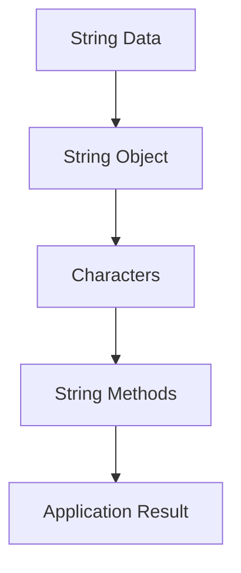
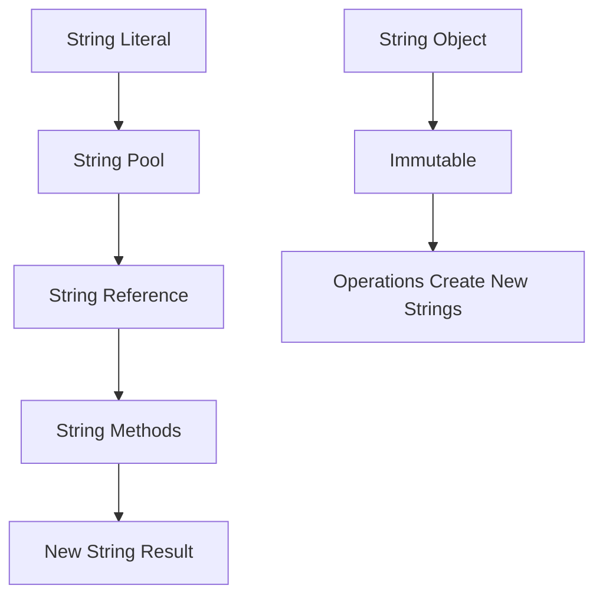
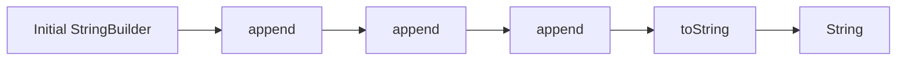
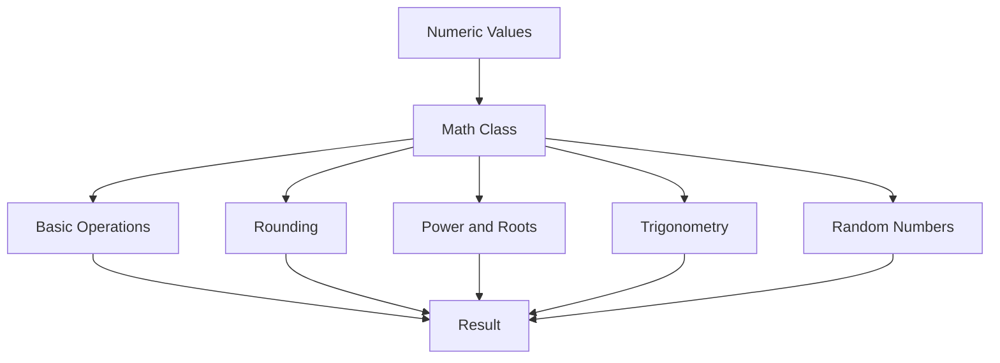
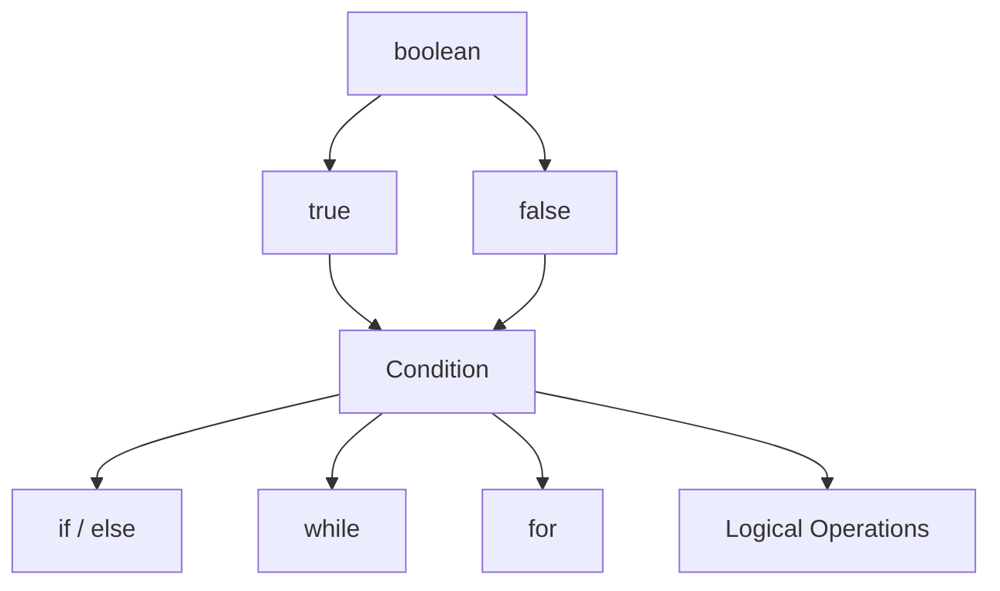
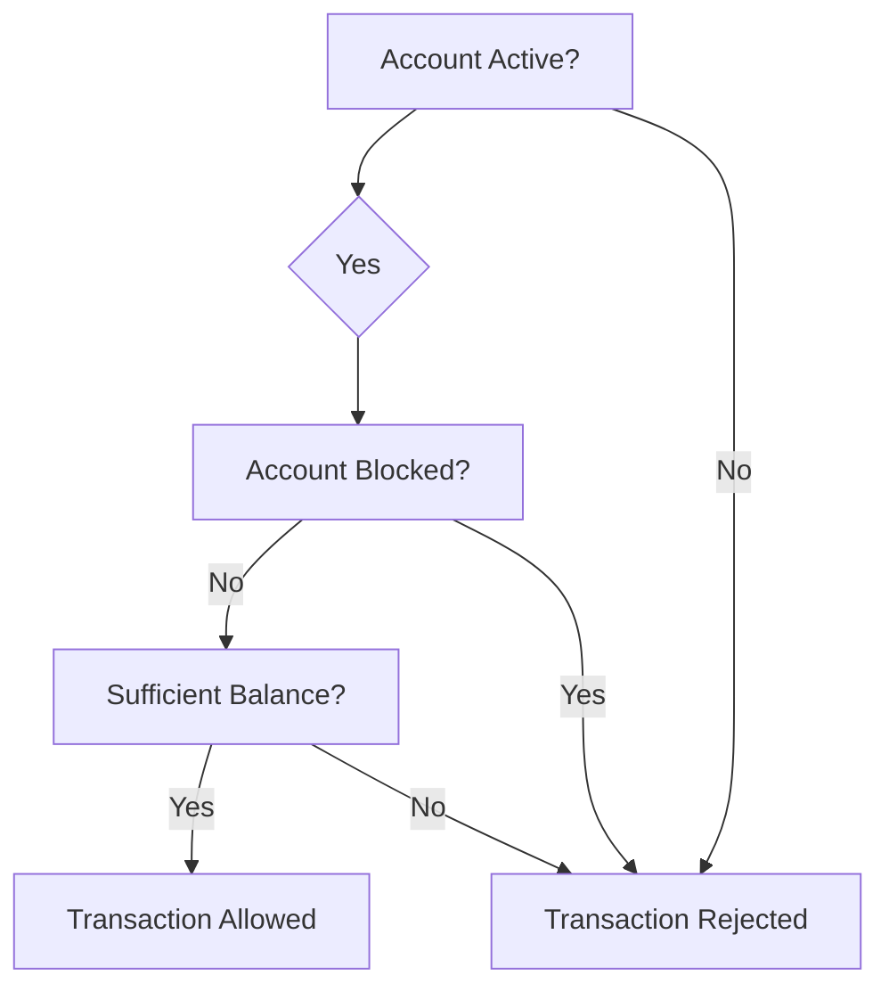
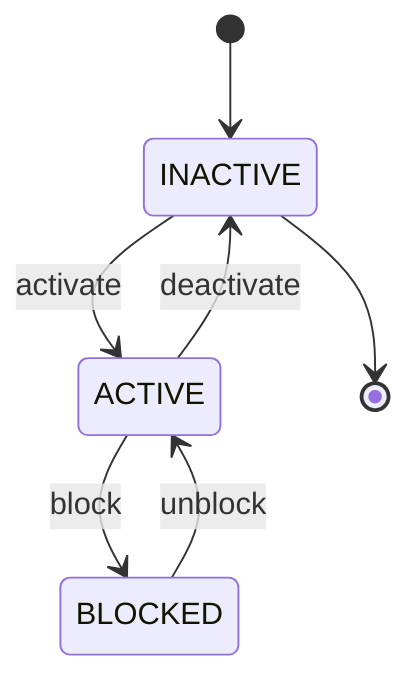
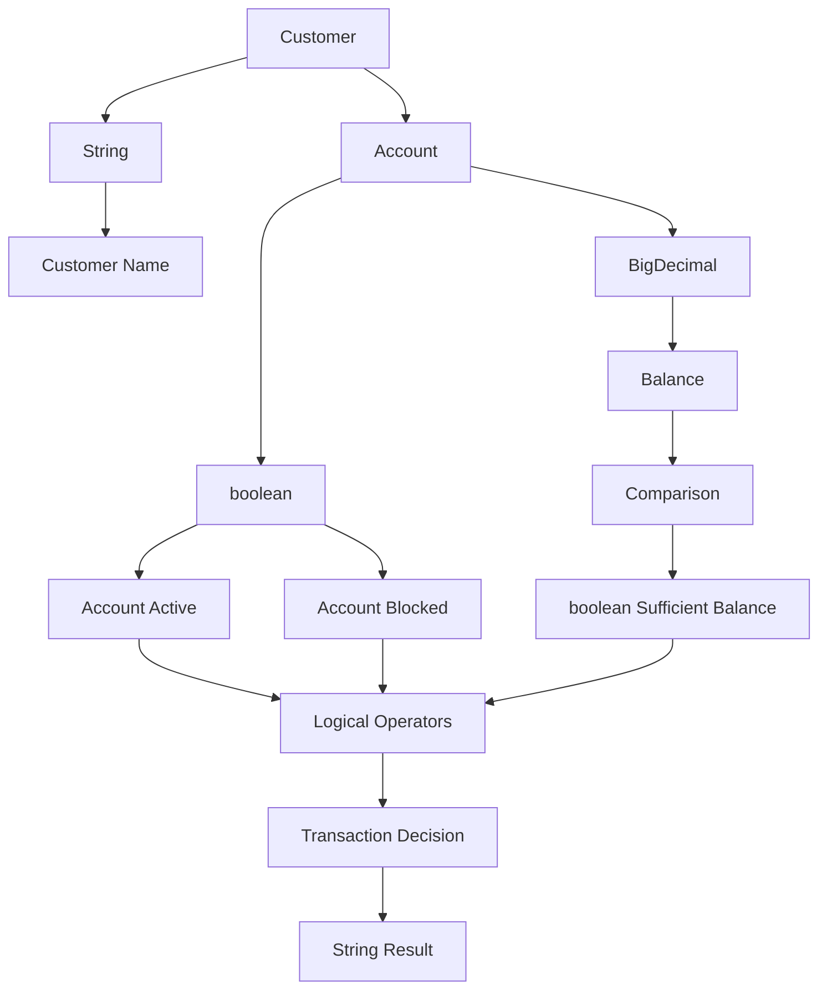
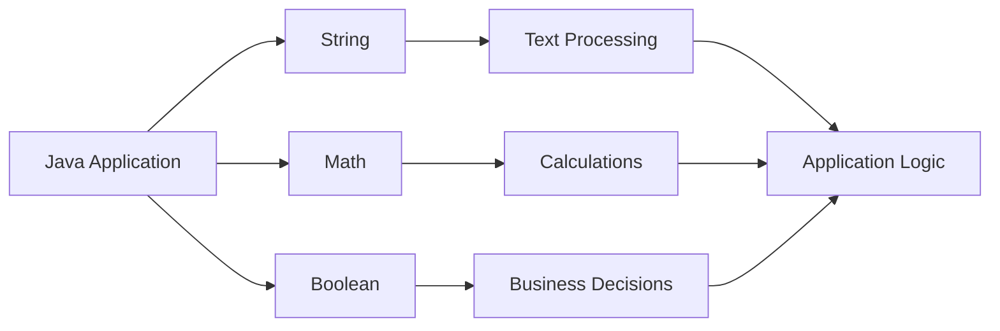

# 📘 Java String

---

## 1. What Is a String?

A `String` in Java represents a sequence of characters.

For example:

```java
String name = "John";
```

The value:

```text
John
```

is a string.

A string can contain:

```text
Letters
Numbers
Spaces
Symbols
Special characters
```

Examples:

```java
String firstName = "John";
String message = "Hello Java";
String accountNumber = "ACC-10001";
String phoneNumber = "012345678";
String empty = "";
```

---

## 2. String Is a Class

Unlike primitive data types such as:

```text
int
double
boolean
char
```

`String` is a class.

```java
String name = "John";
```

Conceptually:

```text
String
  |
  └── Object
       |
       └── "John"
```

`String` belongs to the `java.lang` package, which Java makes available automatically.

Therefore, you normally do not need:

```java
import java.lang.String;
```

---

## 3. Creating a String

There are several ways to create a string.

### Using a String Literal

The most common approach is:

```java
String name = "John";
```

### Using the String Constructor

You can also write:

```java
String name = new String("John");
```

However, for normal application code, prefer the string literal:

```java
String name = "John";
```

rather than unnecessarily creating a new `String` object.

---

## 4. String Flow



---

# 5. String Is Immutable

One of the most important characteristics of `String` is that it is **immutable**.

Immutable means that once a `String` object has been created, its contents cannot be changed.

Example:

```java
String name = "John";

name = name + " Smith";
```

It may look like the original string was modified.

However, Java actually creates another string value:

```text
"John"
   ↓
"John Smith"
```

The variable `name` is then made to refer to the new string.

---

## 6. String Immutability Example

```java
String name = "John";

name.concat(" Smith");

System.out.println(name);
```

Output:

```text
John
```

Why?

Because:

```java
name.concat(" Smith");
```

returns a new string, but we did not assign it back.

Correct:

```java
name = name.concat(" Smith");

System.out.println(name);
```

Output:

```text
John Smith
```

---

# 7. String Concatenation

You can combine strings using the `+` operator.

```java
String firstName = "John";
String lastName = "Smith";

String fullName =
        firstName + " " + lastName;

System.out.println(fullName);
```

Output:

```text
John Smith
```

---

# 8. String Concatenation With Numbers

The `+` operator can combine strings and other values.

```java
String name = "John";
int age = 30;

String message =
        name + " is " + age + " years old.";

System.out.println(message);
```

Output:

```text
John is 30 years old.
```

---

# 9. Important String Concatenation Rule

Consider:

```java
System.out.println(10 + 20);
```

Output:

```text
30
```

But:

```java
System.out.println("Result: " + 10 + 20);
```

Output:

```text
Result: 1020
```

To perform the calculation first:

```java
System.out.println(
        "Result: " + (10 + 20)
);
```

Output:

```text
Result: 30
```

---

# 10. String Length

Use the `length()` method to determine how many characters are in a string.

```java
String name = "Java";

System.out.println(name.length());
```

Output:

```text
4
```

Example:

```java
String accountNumber = "ACC10001";

System.out.println(
        accountNumber.length()
);
```

Output:

```text
8
```

---

# 11. String Index

String characters are indexed starting from `0`.

For example:

```text
Java
```

has indexes:

```text
J   a   v   a
0   1   2   3
```

Therefore:

```java
String text = "Java";

System.out.println(text.charAt(0));
System.out.println(text.charAt(1));
System.out.println(text.charAt(2));
System.out.println(text.charAt(3));
```

Output:

```text
J
a
v
a
```

---

# 12. charAt()

The `charAt()` method returns the character at a specific index.

```java
String text = "Hello";

char first = text.charAt(0);

System.out.println(first);
```

Output:

```text
H
```

Be careful with invalid indexes.

```java
String text = "Hello";

System.out.println(text.charAt(10));
```

This causes:

```text
StringIndexOutOfBoundsException
```

---

# 13. substring()

The `substring()` method extracts part of a string.

Example:

```java
String text = "Hello Java";

String result =
        text.substring(6);

System.out.println(result);
```

Output:

```text
Java
```

---

# 14. substring(start, end)

You can specify both the starting and ending indexes.

```java
String text = "Hello Java";

String result =
        text.substring(0, 5);

System.out.println(result);
```

Output:

```text
Hello
```

The ending index is exclusive.

```text
H e l l o
0 1 2 3 4 5
```

The substring uses:

```text
0 → 5
```

but does not include index `5`.

---

# 15. toUpperCase()

Convert a string to uppercase.

```java
String name = "john";

System.out.println(
        name.toUpperCase()
);
```

Output:

```text
JOHN
```

---

# 16. toLowerCase()

Convert a string to lowercase.

```java
String name = "JOHN";

System.out.println(
        name.toLowerCase()
);
```

Output:

```text
john
```

---

# 17. trim()

`trim()` removes leading and trailing characters that are recognized as ASCII whitespace.

Example:

```java
String name = "   John   ";

System.out.println(
        name.trim()
);
```

Output:

```text
John
```

For modern Java applications where Unicode whitespace handling matters, `strip()` is often preferable.

---

# 18. strip()

Java provides:

```java
strip()
stripLeading()
stripTrailing()
```

Example:

```java
String name = "   John   ";

System.out.println(
        name.strip()
);
```

Output:

```text
John
```

---

# 19. isEmpty()

`isEmpty()` checks whether the string contains zero characters.

```java
String text = "";

System.out.println(
        text.isEmpty()
);
```

Output:

```text
true
```

But:

```java
String text = " ";

System.out.println(
        text.isEmpty()
);
```

Output:

```text
false
```

because the string contains one space character.

---

# 20. isBlank()

`isBlank()` checks whether a string is empty or contains only whitespace.

```java
String text = "   ";

System.out.println(
        text.isBlank()
);
```

Output:

```text
true
```

Comparison:

| Method      | `" "`   |
| ----------- | ------- |
| `isEmpty()` | `false` |
| `isBlank()` | `true`  |

For validating user input, `isBlank()` is often more useful.

---

# 21. contains()

Use `contains()` to determine whether a string contains a specific sequence.

```java
String message =
        "Welcome to Java";

System.out.println(
        message.contains("Java")
);
```

Output:

```text
true
```

---

# 22. startsWith()

```java
String account =
        "ACC-10001";

System.out.println(
        account.startsWith("ACC")
);
```

Output:

```text
true
```

---

# 23. endsWith()

```java
String fileName =
        "customer.json";

System.out.println(
        fileName.endsWith(".json")
);
```

Output:

```text
true
```

---

# 24. indexOf()

`indexOf()` finds the position of a character or string.

```java
String text = "Hello Java";

System.out.println(
        text.indexOf("Java")
);
```

Output:

```text
6
```

If the value is not found, `indexOf()` returns:

```text
-1
```

---

# 25. replace()

The `replace()` method replaces characters or character sequences.

```java
String text =
        "Hello Java";

String result =
        text.replace("Java", "World");

System.out.println(result);
```

Output:

```text
Hello World
```

Remember that the original string is not modified because `String` is immutable.

---

# 26. replaceAll()

`replaceAll()` uses a regular expression.

Example:

```java
String account =
        "ACC-123-456";

String result =
        account.replaceAll("-", "");

System.out.println(result);
```

Output:

```text
ACC123456
```

Because regular expressions have special rules, use `replace()` when you only need simple literal replacement.

---

# 27. split()

The `split()` method divides a string into multiple pieces.

```java
String data =
        "Java,Spring,Angular";

String[] values =
        data.split(",");

for (String value : values) {
    System.out.println(value);
}
```

Output:

```text
Java
Spring
Angular
```

---

# 28. equals()

Use `equals()` to compare string contents.

```java
String a = "Java";
String b = "Java";

System.out.println(
        a.equals(b)
);
```

Output:

```text
true
```

---

# 29. equalsIgnoreCase()

This method compares strings without considering letter case.

```java
String a = "JAVA";
String b = "java";

System.out.println(a.equalsIgnoreCase(b));
```

Output:

```text
true
```

---

# 30. == vs equals()

This is one of the most important String concepts.

Consider:

```java
String a = new String("Java");
String b = new String("Java");

System.out.println(a == b);
System.out.println(a.equals(b));
```

Output:

```text
false
true
```

Why?

```text
==

Checks whether two references refer to the same object.

equals()

Checks whether the String contents are equal.
```

For String content comparison, normally use:

```java
a.equals(b)
```

not:

```java
a == b
```

---

# 31. String Pool

Java maintains a special area commonly called the **String Pool** for string literals.

Example:

```java
String a = "Java";
String b = "Java";
```

The literals can refer to the same pooled string object.

Therefore:

```java
System.out.println(a == b);
```

may produce:

```text
true
```

But do not use `==` as your general String content comparison rule.

Always use:

```java
a.equals(b)
```

when comparing String contents.

---

# 32. String Flow



---

# 33. String Formatting

Modern Java provides several ways to format text.

Example using `formatted()`:

```java
String name = "John";
int age = 30;

String message =
        "Name: %s, Age: %d"
                .formatted(name, age);

System.out.println(message);
```

Output:

```text
Name: John, Age: 30
```

---

# 34. String.format()

You can also use:

```java
String message =
        String.format(
                "Name: %s, Age: %d",
                name,
                age
        );
```

Output:

```text
Name: John, Age: 30
```

---

# 35. Text Blocks

Java supports multiline String literals using text blocks.

Example:

```java
String json = """
        {
          "name": "John",
          "age": 30
        }
        """;

System.out.println(json);
```

Output:

```text
{
  "name": "John",
  "age": 30
}
```

Text blocks are particularly useful for:

```text
JSON
SQL
HTML
XML
Multiline messages
```

---

# 36. Text Block Example With SQL

```java
String sql = """
        SELECT id, name, balance
        FROM customer_account
        WHERE status = 'ACTIVE'
        """;
```

This is much easier to read than concatenating many strings.

---

# 37. StringBuilder

When you need to build a string repeatedly, `StringBuilder` can be more appropriate than repeated String concatenation.

Example:

```java
StringBuilder builder =
        new StringBuilder();

builder.append("Hello ");
builder.append("Java");
builder.append(" World");

System.out.println(
        builder.toString()
);
```

Output:

```text
Hello Java World
```

---

# 38. StringBuilder Flow



---

# 39. StringBuilder vs String

Use `String` when the value represents normal text that does not need repeated mutation.

Use `StringBuilder` when constructing text through many modifications.

Example:

```java
StringBuilder builder =
        new StringBuilder();

for (int i = 1; i <= 5; i++) {
    builder.append(i);
}
```

Result:

```text
12345
```

---

# 40. String Joining

Java provides `String.join()`.

Example:

```java
String result =
        String.join(
                ", ",
                "Java",
                "Spring",
                "Angular"
        );

System.out.println(result);
```

Output:

```text
Java, Spring, Angular
```

This is useful for building comma-separated values.

---

# 41. String Conversion

You can convert other types into strings.

Example:

```java
int number = 100;

String text =
        String.valueOf(number);

System.out.println(text);
```

Output:

```text
100
```

Another example:

```java
double amount = 100.50;

String text =
        String.valueOf(amount);
```

---

# 42. Converting String to Number

Use parsing methods.

```java
String text = "100";

int number =
        Integer.parseInt(text);

System.out.println(number + 50);
```

Output:

```text
150
```

For decimal values:

```java
String text = "100.50";

double value =
        Double.parseDouble(text);
```

For money, prefer parsing into `BigDecimal`:

```java
String text = "100.50";

BigDecimal amount =
        new BigDecimal(text);
```

---

# 43. Null vs Empty vs Blank

These concepts are different.

```text
null
""
"   "
```

They mean:

```text
null
    No String object/reference

""
    String exists but contains zero characters

"   "
    String exists and contains whitespace
```

Example:

```java
String a = null;
String b = "";
String c = "   ";
```

A common mistake is:

```java
a.isEmpty();
```

This causes:

```text
NullPointerException
```

because `a` is `null`.

---

# 44. Null-Safe String Comparison

Instead of:

```java
status.equals("ACTIVE")
```

you can write:

```java
"ACTIVE".equals(status)
```

If `status` is `null`, this is safe.

Example:

```java
String status = null;

if ("ACTIVE".equals(status)) {
    System.out.println("Active");
}
```

No `NullPointerException` occurs.

---

# 45. String Example

```java
public class Main {

    public static void main(String[] args) {

        String customerName =
                "  John Smith  ";

        String cleanedName =
                customerName.strip();

        System.out.println(
                cleanedName
        );

        System.out.println(
                cleanedName.length()
        );

        System.out.println(
                cleanedName.toUpperCase()
        );
    }
}
```

Output:

```text
John Smith
10
JOHN SMITH
```

---

# 46. Common String Mistakes

### Mistake 1: Using `==` for content comparison

Avoid:

```java
if (name == "John") {
}
```

Prefer:

```java
if ("John".equals(name)) {
}
```

### Mistake 2: Forgetting String immutability

This does not change the original String:

```java
name.toUpperCase();
```

Use:

```java
name = name.toUpperCase();
```

### Mistake 3: Calling methods on null

Avoid:

```java
name.isEmpty();
```

when `name` could be `null`.

### Mistake 4: Excessive String concatenation

For large repeated string construction, consider `StringBuilder`.

---

# 47. String Cheat Sheet

| Method               | Purpose                               |
| -------------------- | ------------------------------------- |
| `length()`           | Get number of characters              |
| `charAt()`           | Get character by index                |
| `substring()`        | Extract part of string                |
| `toUpperCase()`      | Convert to uppercase                  |
| `toLowerCase()`      | Convert to lowercase                  |
| `strip()`            | Remove surrounding Unicode whitespace |
| `isEmpty()`          | Check zero characters                 |
| `isBlank()`          | Check empty/whitespace-only           |
| `contains()`         | Check whether text exists             |
| `startsWith()`       | Check beginning                       |
| `endsWith()`         | Check ending                          |
| `indexOf()`          | Find index                            |
| `replace()`          | Replace literal text                  |
| `replaceAll()`       | Replace using regex                   |
| `split()`            | Split into pieces                     |
| `equals()`           | Compare contents                      |
| `equalsIgnoreCase()` | Case-insensitive comparison           |
| `formatted()`        | Format a string                       |
| `concat()`           | Concatenate strings                   |
| `repeat()`           | Repeat a string                       |
| `valueOf()`          | Convert value to String               |

---

# 48. String Key Takeaways

```text
1. String represents text.

2. String is a class, not a primitive type.

3. String objects are immutable.

4. Use equals() for String content comparison.

5. Use isBlank() when whitespace-only input should be considered empty.

6. String literals can be stored in the String Pool.

7. Use StringBuilder for repeated string construction.

8. Use text blocks for multiline content.

9. Be careful with null.

10. Use BigDecimal rather than double for financial amounts.
```

---

# Java Math

---

# 49. What Is Java Math?

Java provides the `Math` class for common mathematical operations.

The class is:

```java
java.lang.Math
```

Because it belongs to `java.lang`, you normally do not need an import statement.

Example:

```java
int result =
        Math.max(10, 20);

System.out.println(result);
```

Output:

```text
20
```

---

# 50. Math Class Flow



---

# 51. Math Constants

The `Math` class provides mathematical constants.

## Math.PI

```java
System.out.println(Math.PI);
```

Output:

```text
3.141592653589793
```

## Math.E

```java
System.out.println(Math.E);
```

Output:

```text
2.718281828459045
```

---

# 52. Math.abs()

`Math.abs()` returns the absolute value.

```java
System.out.println(
        Math.abs(-100)
);
```

Output:

```text
100
```

Example:

```java
double value = -25.50;

System.out.println(
        Math.abs(value)
);
```

Output:

```text
25.5
```

---

# 53. Math.max()

Returns the larger value.

```java
int result =
        Math.max(100, 200);

System.out.println(result);
```

Output:

```text
200
```

---

# 54. Math.min()

Returns the smaller value.

```java
int result =
        Math.min(100, 200);

System.out.println(result);
```

Output:

```text
100
```

---

# 55. Math.pow()

`Math.pow()` calculates a number raised to a power.

```java
double result =
        Math.pow(2, 3);

System.out.println(result);
```

Output:

```text
8.0
```

Conceptually:

```text
2³ = 2 × 2 × 2 = 8
```

---

# 56. Math.sqrt()

Calculates the square root.

```java
double result =
        Math.sqrt(25);

System.out.println(result);
```

Output:

```text
5.0
```

---

# 57. Math.cbrt()

Calculates the cube root.

```java
double result =
        Math.cbrt(27);

System.out.println(result);
```

Output:

```text
3.0
```

---

# 58. Rounding Methods

Java provides several useful rounding methods:

```text
Math.round()
Math.floor()
Math.ceil()
```

---

# 59. Math.round()

`Math.round()` rounds to the nearest whole number.

```java
System.out.println(
        Math.round(10.4)
);

System.out.println(
        Math.round(10.6)
);
```

Output:

```text
10
11
```

---

# 60. Math.floor()

`Math.floor()` rounds down toward negative infinity.

```java
System.out.println(
        Math.floor(10.9)
);
```

Output:

```text
10.0
```

With a negative number:

```java
System.out.println(
        Math.floor(-10.1)
);
```

Output:

```text
-11.0
```

---

# 61. Math.ceil()

`Math.ceil()` rounds up toward positive infinity.

```java
System.out.println(
        Math.ceil(10.1)
);
```

Output:

```text
11.0
```

With a negative number:

```java
System.out.println(
        Math.ceil(-10.9)
);
```

Output:

```text
-10.0
```

---

# 62. Rounding Comparison

| Method         | `10.7` | `-10.7` |
| -------------- | -----: | ------: |
| `Math.round()` |   `11` |   `-11` |
| `Math.floor()` | `10.0` | `-11.0` |
| `Math.ceil()`  | `11.0` | `-10.0` |

---

# 63. Math Random

`Math.random()` generates a pseudo-random `double` value in the range:

```text
0.0 <= value < 1.0
```

Example:

```java
double value =
        Math.random();

System.out.println(value);
```

Possible output:

```text
0.5837291847
```

The exact value changes from execution to execution.

---

# 64. Generate Random Integer

To generate an integer from `0` to `9`:

```java
int number =
        (int) (Math.random() * 10);

System.out.println(number);
```

Possible output:

```text
7
```

The possible values are:

```text
0 1 2 3 4 5 6 7 8 9
```

For modern applications requiring more control over random generation, prefer the `java.util.random` APIs or suitable random classes rather than relying on `Math.random()`.

---

# 65. Math Trigonometric Methods

The `Math` class provides:

```text
Math.sin()
Math.cos()
Math.tan()
```

Example:

```java
double result =
        Math.sin(Math.PI / 2);

System.out.println(result);
```

Output:

```text
1.0
```

---

# 66. Degrees and Radians

Java's trigonometric methods use radians.

You can convert degrees to radians:

```java
double radians =
        Math.toRadians(90);

System.out.println(radians);
```

Output:

```text
1.5707963267948966
```

Convert radians back to degrees:

```java
double degrees =
        Math.toDegrees(Math.PI);

System.out.println(degrees);
```

Output:

```text
180.0
```

---

# 67. Math Example

```java
public class Main {

    public static void main(String[] args) {

        int a = -10;
        int b = 20;

        System.out.println(
                Math.abs(a)
        );

        System.out.println(
                Math.max(a, b)
        );

        System.out.println(
                Math.min(a, b)
        );

        System.out.println(
                Math.pow(2, 3)
        );

        System.out.println(
                Math.sqrt(25)
        );
    }
}
```

Output:

```text
10
20
-10
8.0
5.0
```

---

# 68. Math and Financial Applications

Be careful when using `Math` with financial calculations.

For example:

```java
double amount = 10.25;
```

Floating-point values are not generally suitable for exact monetary arithmetic.

For financial values, prefer:

```java
BigDecimal
```

Example:

```java
BigDecimal amount =
        new BigDecimal("100.25");

BigDecimal tax =
        new BigDecimal("10.05");

BigDecimal total =
        amount.add(tax);
```

Result:

```text
110.30
```

---

# 69. Math Cheat Sheet

| Method             | Purpose                  |
| ------------------ | ------------------------ |
| `Math.abs()`       | Absolute value           |
| `Math.max()`       | Maximum                  |
| `Math.min()`       | Minimum                  |
| `Math.pow()`       | Power                    |
| `Math.sqrt()`      | Square root              |
| `Math.cbrt()`      | Cube root                |
| `Math.round()`     | Round to nearest integer |
| `Math.floor()`     | Round down               |
| `Math.ceil()`      | Round up                 |
| `Math.random()`    | Pseudo-random number     |
| `Math.sin()`       | Sine                     |
| `Math.cos()`       | Cosine                   |
| `Math.tan()`       | Tangent                  |
| `Math.toRadians()` | Degrees to radians       |
| `Math.toDegrees()` | Radians to degrees       |

---

# 70. Math Key Takeaways

```text
1. Math is a utility class for mathematical operations.

2. Math.PI provides π.

3. Math.abs() returns absolute value.

4. Math.max() returns the larger value.

5. Math.min() returns the smaller value.

6. Math.pow() calculates powers.

7. Math.sqrt() calculates square roots.

8. Math.round(), floor(), and ceil() have different rounding behavior.

9. Math.random() generates values from 0.0 inclusive to 1.0 exclusive.

10. Do not use double for exact monetary calculations.
```

---

# Java Boolean

---

# 71. What Is Boolean?

`boolean` is a Java primitive data type.

It can have only two values:

```text
true
false
```

Example:

```java
boolean active = true;
boolean blocked = false;
```

---

# 72. Boolean Flow



---

# 73. Boolean Example

```java
boolean accountActive = true;

System.out.println(
        accountActive
);
```

Output:

```text
true
```

---

# 74. Boolean With if

Boolean values are commonly used in conditions.

```java
boolean accountActive = true;

if (accountActive) {

    System.out.println(
            "Account is active"
    );
}
```

Output:

```text
Account is active
```

---

# 75. Boolean With if/else

```java
boolean accountActive = false;

if (accountActive) {

    System.out.println(
            "Account is active"
    );

} else {

    System.out.println(
            "Account is inactive"
    );
}
```

Output:

```text
Account is inactive
```

---

# 76. Boolean From Comparison

A comparison expression produces a boolean.

Example:

```java
int balance = 1000;

boolean sufficient =
        balance >= 500;

System.out.println(
        sufficient
);
```

Output:

```text
true
```

Conceptually:

```text
balance >= 500
       ↓
1000 >= 500
       ↓
     true
```

---

# 77. Boolean Operators

Boolean values can be combined using:

```text
&&
||
!
```

Example:

```java
boolean active = true;
boolean verified = true;

boolean allowed =
        active && verified;
```

Result:

```text
true
```

---

# 78. Boolean AND

Both conditions must be true.

```java
boolean active = true;
boolean verified = false;

boolean allowed =
        active && verified;

System.out.println(allowed);
```

Output:

```text
false
```

---

# 79. Boolean OR

At least one condition must be true.

```java
boolean admin = false;
boolean manager = true;

boolean allowed =
        admin || manager;

System.out.println(allowed);
```

Output:

```text
true
```

---

# 80. Boolean NOT

`!` reverses a boolean.

```java
boolean active = true;

System.out.println(!active);
```

Output:

```text
false
```

---

# 81. Boolean Truth Table

## AND

| A     | B     | A && B |
| ----- | ----- | ------ |
| false | false | false  |
| false | true  | false  |
| true  | false | false  |
| true  | true  | true   |

## OR

| A     | B     | A `   |     | ` B |
| ----- | ----- | ----- | --- | --- |
| false | false | false |
| false | true  | true  |
| true  | false | true  |
| true  | true  | true  |

## NOT

| A     | !A    |
| ----- | ----- |
| false | true  |
| true  | false |

---

# 82. Boolean Expression

You can directly use a comparison:

```java
int age = 25;

if (age >= 18) {

    System.out.println(
            "Adult"
    );
}
```

The expression:

```java
age >= 18
```

returns:

```text
true
```

---

# 83. Avoid Unnecessary Boolean Comparison

You may see code like:

```java
if (accountActive == true) {
}
```

This works, but it is unnecessarily verbose.

Prefer:

```java
if (accountActive) {
}
```

Similarly, instead of:

```java
if (accountActive == false) {
}
```

prefer:

```java
if (!accountActive) {
}
```

---

# 84. Boolean Naming Convention

Boolean variables should normally have names that clearly describe a state or condition.

Good examples:

```java
boolean active;
boolean enabled;
boolean verified;
boolean approved;
boolean authenticated;
boolean hasPermission;
boolean isValid;
```

Poor example:

```java
boolean flag;
```

A descriptive name makes the code easier to understand.

---

# 85. Boolean Methods

Methods that return boolean often use names such as:

```text
is...
has...
can...
should...
```

Examples:

```java
boolean isActive() {
    return true;
}
```

```java
boolean hasPermission() {
    return true;
}
```

```java
boolean canWithdraw() {
    return true;
}
```

---

# 86. Boolean in Banking Example

```java
boolean accountActive = true;
boolean accountBlocked = false;
boolean sufficientBalance = true;

if (accountActive
        && !accountBlocked
        && sufficientBalance) {

    System.out.println(
            "Transaction allowed"
    );
}
```

Output:

```text
Transaction allowed
```

The logic is:



---

# 87. Boolean With Ternary Operator

Boolean expressions can be used with the ternary operator.

```java
boolean active = true;

String status =
        active
                ? "ACTIVE"
                : "INACTIVE";

System.out.println(status);
```

Output:

```text
ACTIVE
```

---

# 88. Boolean With Loops

Boolean values can control loops.

Example:

```java
boolean running = true;

while (running) {

    System.out.println(
            "Application is running"
    );

    running = false;
}
```

Output:

```text
Application is running
```

---

# 89. Boolean and Short-Circuit Evaluation

Example:

```java
String name = null;

boolean valid =
        name != null
        && !name.isBlank();
```

Because:

```java
name != null
```

is false, Java does not evaluate:

```java
name.isBlank()
```

This prevents a `NullPointerException`.

---

# 90. Boolean Wrapper Type

Java also provides a wrapper class:

```java
Boolean
```

Remember the difference:

```text
boolean
    Primitive

Boolean
    Reference type / wrapper class
```

Example:

```java
boolean active = true;

Boolean enabled = true;
```

---

# 91. boolean vs Boolean

| Type      | Category       | Can be `null`? |
| --------- | -------------- | -------------- |
| `boolean` | Primitive      | No             |
| `Boolean` | Wrapper object | Yes            |

Example:

```java
boolean active = null;
```

This does not compile.

But:

```java
Boolean active = null;
```

is valid.

---

# 92. Boolean and Null

Be careful with:

```java
Boolean active = null;

if (active) {
}
```

This can cause a `NullPointerException` because Java attempts to unbox the `Boolean` into a primitive `boolean`.

Safer:

```java
if (Boolean.TRUE.equals(active)) {

    System.out.println(
            "Active"
    );
}
```

This safely handles `null`.

---

# 93. Boolean.valueOf()

You can convert a String to a Boolean:

```java
Boolean value =
        Boolean.valueOf("true");

System.out.println(value);
```

Output:

```text
true
```

Example:

```java
Boolean value =
        Boolean.valueOf("false");

System.out.println(value);
```

Output:

```text
false
```

---

# 94. Boolean.parseBoolean()

You can parse a String into primitive `boolean`.

```java
boolean active =
        Boolean.parseBoolean("true");

System.out.println(active);
```

Output:

```text
true
```

Be aware that `parseBoolean()` is intentionally simple: values other than `"true"` ignoring case result in `false`.

---

# 95. Boolean Example

```java
public class Main {

    public static void main(String[] args) {

        boolean active = true;
        boolean verified = true;
        boolean blocked = false;

        boolean allowed =
                active
                && verified
                && !blocked;

        System.out.println(
                "Allowed: " + allowed
        );
    }
}
```

Output:

```text
Allowed: true
```

---

# 96. Boolean State Diagram



This type of diagram is useful when explaining boolean state management in real applications.

---

# 97. Common Boolean Mistakes

### Mistake 1: Comparing a boolean unnecessarily

Instead of:

```java
if (active == true) {
}
```

prefer:

```java
if (active) {
}
```

---

### Mistake 2: Incorrect assignment

This is not valid Java:

```java
if (active = true) {
}
```

Use:

```java
if (active) {
}
```

---

### Mistake 3: Forgetting Boolean can be null

```java
Boolean active = null;

if (active) {
}
```

can throw:

```text
NullPointerException
```

Prefer a null-safe check when appropriate:

```java
if (Boolean.TRUE.equals(active)) {
}
```

---

### Mistake 4: Poor variable names

Avoid:

```java
boolean flag;
```

Prefer:

```java
boolean accountActive;
```

---

# 98. String + Math + Boolean Together

These three concepts are often used together in real Java applications.

Example:

```java
String customerName =
        "John Smith";

double balance = 1500.75;

boolean accountActive = true;

double minimumBalance = 500.00;

boolean canWithdraw =
        accountActive
        && balance >= minimumBalance;

String message =
        customerName
        + " can withdraw: "
        + canWithdraw;

System.out.println(message);
```

Output:

```text
John Smith can withdraw: true
```

---

# 99. More Practical Banking Example

For real monetary calculations, use `BigDecimal` rather than `double`.

```java
import java.math.BigDecimal;

public class Main {

    public static void main(String[] args) {

        String customerName =
                "John Smith";

        BigDecimal balance =
                new BigDecimal("1500.75");

        BigDecimal withdrawal =
                new BigDecimal("500.00");

        boolean accountActive = true;
        boolean accountBlocked = false;

        boolean sufficientBalance =
                balance.compareTo(withdrawal) >= 0;

        boolean canWithdraw =
                accountActive
                && !accountBlocked
                && sufficientBalance;

        String message =
                customerName
                + " can withdraw: "
                + canWithdraw;

        System.out.println(message);
    }
}
```

Output:

```text
John Smith can withdraw: true
```

This example combines:

```text
String
   ↓
Customer information

BigDecimal
   ↓
Money

boolean
   ↓
Business conditions

compareTo()
   ↓
Money comparison

&& / !
   ↓
Business logic
```

---

# 100. Combined Concept Diagram



---

# 101. Combined Cheat Sheet

| Topic             | Main Concept            | Example          |     |     |
| ----------------- | ----------------------- | ---------------- | --- | --- |
| String            | Text                    | `"Hello Java"`   |     |     |
| String length     | Number of characters    | `text.length()`  |     |     |
| String comparison | Content comparison      | `a.equals(b)`    |     |     |
| String validation | Empty/blank check       | `text.isBlank()` |     |     |
| String building   | Mutable builder         | `StringBuilder`  |     |     |
| Text block        | Multiline String        | `""" ... """`    |     |     |
| Math              | Mathematical operations | `Math.max()`     |     |     |
| Absolute value    | Positive magnitude      | `Math.abs()`     |     |     |
| Power             | Exponentiation          | `Math.pow()`     |     |     |
| Square root       | Root calculation        | `Math.sqrt()`    |     |     |
| Rounding          | Round values            | `Math.round()`   |     |     |
| Boolean           | True/false              | `true`           |     |     |
| AND               | Both conditions         | `&&`             |     |     |
| OR                | Either condition        | `                |     | `   |
| NOT               | Reverse condition       | `!`              |     |     |
| Boolean wrapper   | Nullable boolean        | `Boolean`        |     |     |

---

# 102. Interview Questions

## String

### Question 1

What is a String in Java?

A `String` is a class representing a sequence of characters.

---

### Question 2

Is String primitive?

No.

`String` is a reference type/class.

---

### Question 3

Is String mutable?

No.

`String` is immutable.

---

### Question 4

What is the difference between `==` and `equals()` for String?

`==` compares object references.

`equals()` compares String contents.

---

### Question 5

What is String Pool?

The String Pool is a JVM-managed area used to reuse String literal instances.

---

### Question 6

What is the difference between `isEmpty()` and `isBlank()`?

`isEmpty()` checks whether the String has zero characters.

`isBlank()` checks whether the String is empty or contains only whitespace.

---

## Math

### Question 7

What is the Math class?

`Math` is a utility class that provides common mathematical operations.

---

### Question 8

What is the difference between `Math.floor()` and `Math.ceil()`?

`floor()` rounds toward negative infinity.

`ceil()` rounds toward positive infinity.

---

### Question 9

What does `Math.random()` return?

It returns a pseudo-random `double` value from `0.0` inclusive to `1.0` exclusive.

---

### Question 10

Should Math/double be used for financial calculations?

Generally, no.

For exact monetary calculations, use `BigDecimal`.

---

## Boolean

### Question 11

What values can a boolean contain?

Only:

```text
true
false
```

---

### Question 12

What is the difference between boolean and Boolean?

```text
boolean
    Primitive

Boolean
    Wrapper/reference type
```

`Boolean` can be `null`.

---

### Question 13

What does `!` do?

It reverses a boolean value.

```java
!true
```

produces:

```text
false
```

---

### Question 14

What is short-circuit evaluation?

Java can stop evaluating `&&` or `||` once the final result is already known.

---

# 103. Final Summary

The three topics introduced in this lesson are fundamental Java building blocks.



## String

Use `String` for text:

```java
String name = "John";
```

Remember:

```text
String is immutable.
Use equals() for content comparison.
Use isBlank() for whitespace-aware validation.
Use StringBuilder for repeated construction.
Use text blocks for multiline text.
```

## Math

Use `Math` for common mathematical operations:

```java
Math.abs()
Math.max()
Math.min()
Math.pow()
Math.sqrt()
Math.round()
Math.floor()
Math.ceil()
Math.random()
```

For financial calculations:

```text
Prefer BigDecimal
```

over:

```text
double
```

when exact decimal arithmetic is required.

## Boolean

Use `boolean` for true/false conditions:

```java
boolean active = true;
```

Combine conditions with:

```text
&&
||
!
```

And remember:

```text
boolean → primitive
Boolean → wrapper/reference type
```

---

# 104. Key Takeaways

```text
String
    ↓
Used for text
    ↓
Immutable
    ↓
Use equals() for content comparison

Math
    ↓
Used for mathematical operations
    ↓
abs / max / min / pow / sqrt / round
    ↓
Do not use floating-point types for exact monetary calculations

Boolean
    ↓
true / false
    ↓
Used for conditions and business decisions
    ↓
&& / || / !
```

These three topics connect directly to the next Java concepts:

```text
Java Variables
      ↓
Java Data Types
      ↓
Java Operators
      ↓
String / Math / Boolean
      ↓
Expressions
      ↓
Control Flow
      ↓
if / else
      ↓
switch
      ↓
Loops
      ↓
Methods
```
