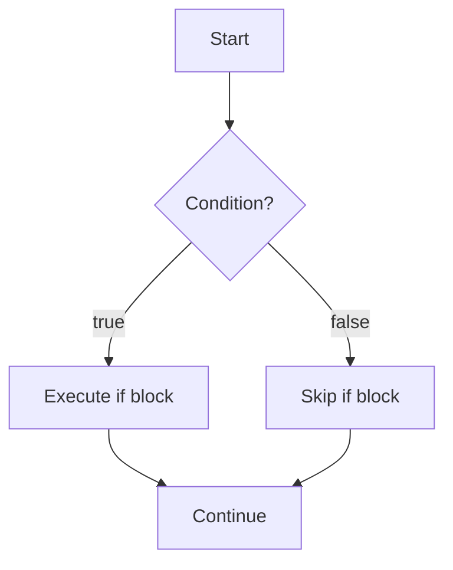
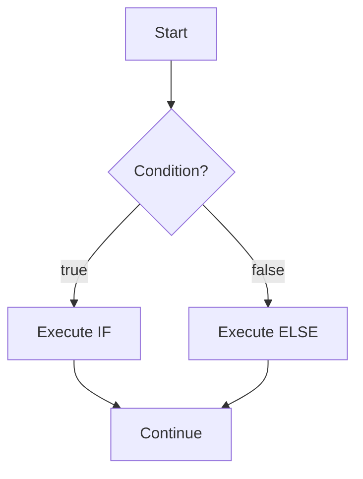
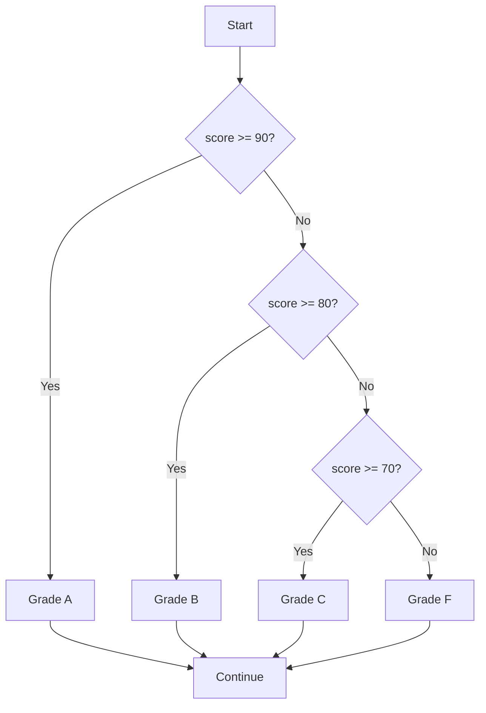
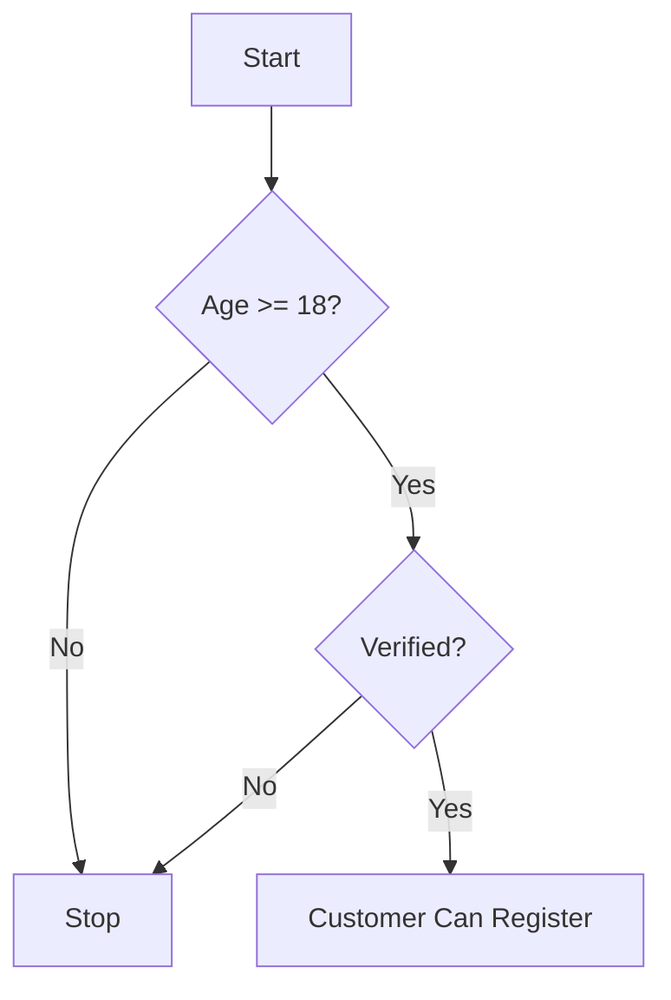
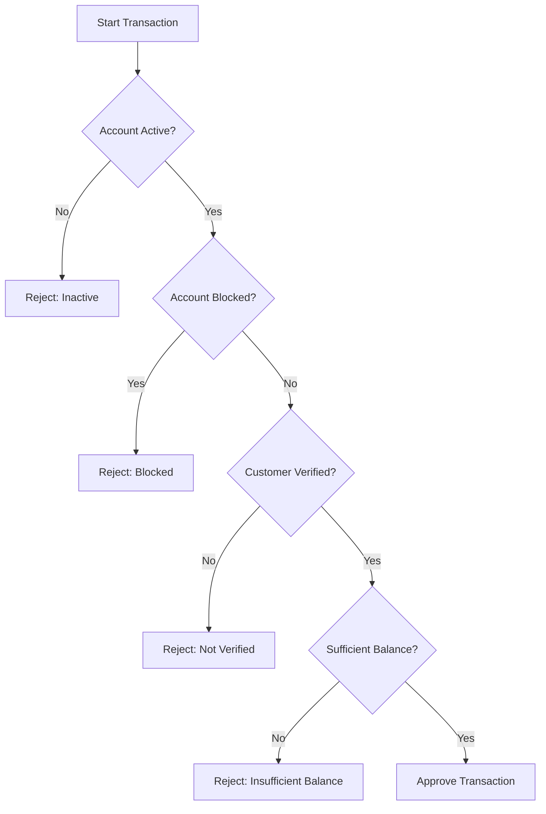
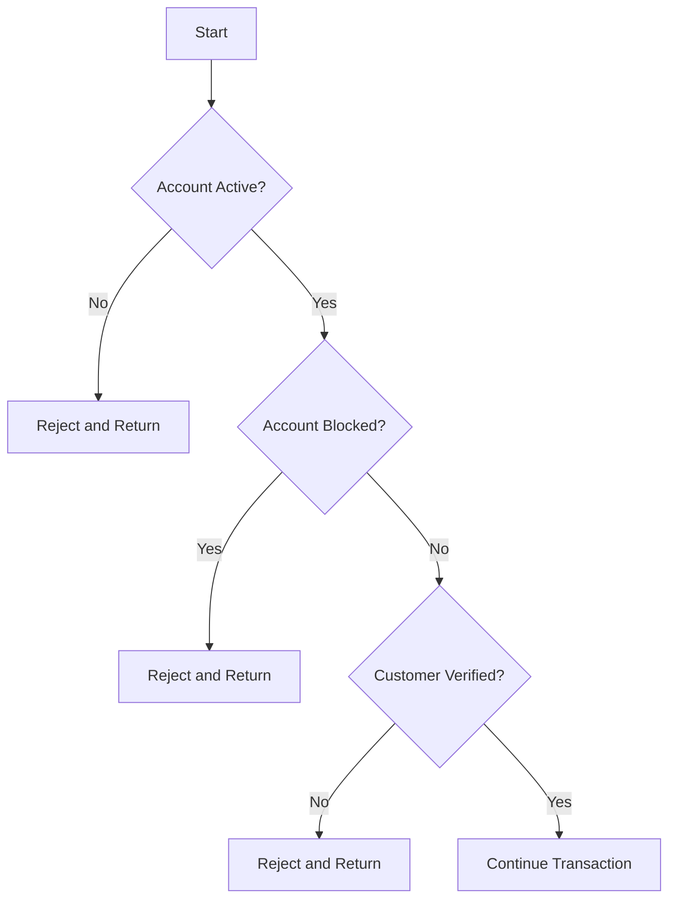
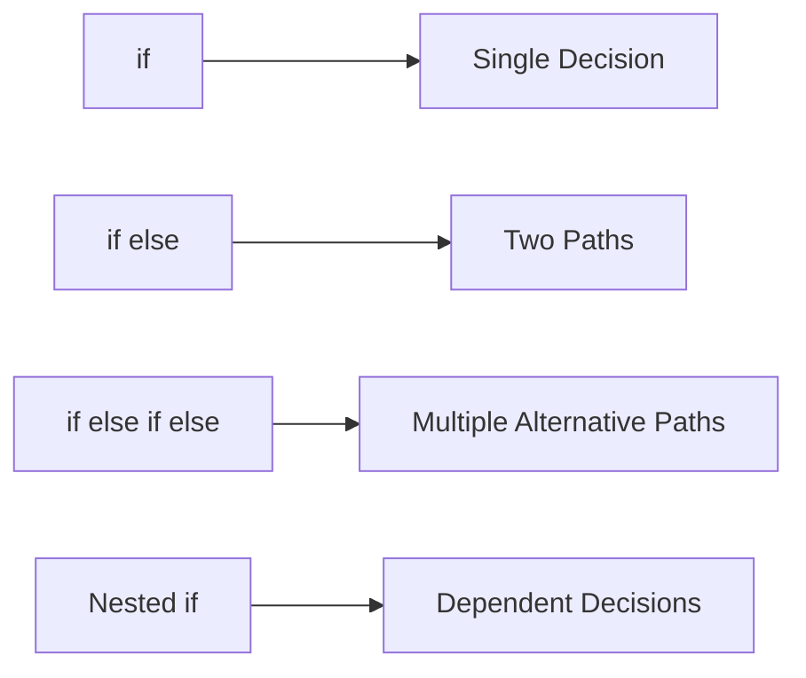
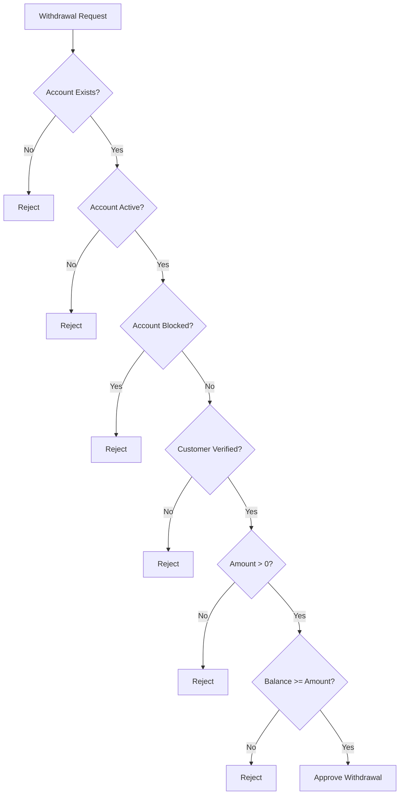
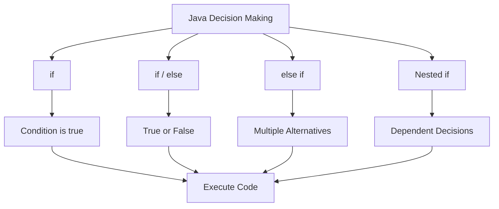

# 📘 Java If Statement

## 1. What Is an If Statement?

The `if` statement is used to execute a block of Java code only when a specified condition is `true`.

The basic idea is:

```text
IF condition is true
    ↓
Execute code
```

If the condition is `false`, Java skips the code inside the `if` block.

---

## 2. Basic Syntax

The basic syntax of an `if` statement is:

```java
if (condition) {
    // code executed when condition is true
}
```

Example:

```java
int age = 20;

if (age >= 18) {
    System.out.println("You are an adult.");
}
```

Output:

```text
You are an adult.
```

Because:

```text
age >= 18
20 >= 18
true
```

Therefore, Java executes the code inside the `if` block.

---

## 3. If Statement Flow



---

## 4. Boolean Condition

The condition inside `if` must produce a boolean value:

```text
true
```

or:

```text
false
```

Example:

```java
int balance = 1000;

if (balance > 500) {
    System.out.println("Sufficient balance.");
}
```

The expression:

```java
balance > 500
```

produces:

```text
true
```

because:

```text
1000 > 500
```

---

# 5. Using a Boolean Variable

You can directly use a boolean variable as the condition.

```java
boolean accountActive = true;

if (accountActive) {
    System.out.println("Account is active.");
}
```

Output:

```text
Account is active.
```

You do not need to write:

```java
if (accountActive == true)
```

Prefer:

```java
if (accountActive)
```

---

# 6. If With Comparison Operators

You can use comparison operators inside an `if` statement.

Java comparison operators include:

| Operator | Meaning               | Example  |
| -------- | --------------------- | -------- |
| `==`     | Equal to              | `a == b` |
| `!=`     | Not equal to          | `a != b` |
| `>`      | Greater than          | `a > b`  |
| `<`      | Less than             | `a < b`  |
| `>=`     | Greater than or equal | `a >= b` |
| `<=`     | Less than or equal    | `a <= b` |

Example:

```java
int age = 25;

if (age >= 18) {
    System.out.println("Adult");
}
```

Output:

```text
Adult
```

---

# 7. If With Strings

When comparing String contents, use:

```java
equals()
```

Example:

```java
String status = "ACTIVE";

if ("ACTIVE".equals(status)) {
    System.out.println("Account is active.");
}
```

Output:

```text
Account is active.
```

Avoid:

```java
if (status == "ACTIVE") {
}
```

because `==` compares references rather than String contents.

---

# 8. If With Multiple Conditions

You can combine conditions using logical operators.

The main logical operators are:

```text
&&    AND
||    OR
!     NOT
```

Example:

```java
int age = 25;
boolean verified = true;

if (age >= 18 && verified) {
    System.out.println("Customer is allowed.");
}
```

Output:

```text
Customer is allowed.
```

Both conditions must be true.

---

# 9. AND Condition

The `&&` operator means **AND**.

Example:

```java
boolean accountActive = true;
boolean accountVerified = true;

if (accountActive && accountVerified) {
    System.out.println("Transaction allowed.");
}
```

Output:

```text
Transaction allowed.
```

Both conditions are required.

```text
accountActive
     ↓
   true
     +
accountVerified
     ↓
   true
     ↓
   &&
     ↓
   true
```

---

# 10. OR Condition

The `||` operator means **OR**.

Example:

```java
boolean admin = false;
boolean manager = true;

if (admin || manager) {
    System.out.println("Access granted.");
}
```

Output:

```text
Access granted.
```

Only one of the conditions needs to be true.

---

# 11. NOT Condition

The `!` operator reverses a boolean value.

Example:

```java
boolean blocked = false;

if (!blocked) {
    System.out.println("Account can be used.");
}
```

Output:

```text
Account can be used.
```

The expression:

```java
!blocked
```

means:

```text
blocked = false
        ↓
!false
        ↓
true
```

---

# 12. If With Method Result

An `if` condition can use the result of a method.

Example:

```java
String name = "John";

if (!name.isBlank()) {
    System.out.println("Name is valid.");
}
```

Output:

```text
Name is valid.
```

Another example:

```java
String accountNumber = "ACC-10001";

if (accountNumber.startsWith("ACC")) {
    System.out.println("Valid account number.");
}
```

Output:

```text
Valid account number.
```

---

# 13. If With Math

You can use mathematical expressions inside an `if`.

```java
double balance = 1500.00;
double withdrawal = 500.00;

if (balance >= withdrawal) {
    System.out.println("Withdrawal is possible.");
}
```

Output:

```text
Withdrawal is possible.
```

---

# 14. If With BigDecimal

For banking applications, use `BigDecimal` for monetary values.

```java
import java.math.BigDecimal;

BigDecimal balance =
        new BigDecimal("1500.00");

BigDecimal withdrawal =
        new BigDecimal("500.00");

if (balance.compareTo(withdrawal) >= 0) {
    System.out.println(
            "Withdrawal is possible."
    );
}
```

Output:

```text
Withdrawal is possible.
```

Remember:

```text
compareTo() < 0
    First value is smaller

compareTo() == 0
    Values are equal

compareTo() > 0
    First value is larger
```

---

# 15. If With Negative Values

Example:

```java
int balance = -100;

if (balance < 0) {
    System.out.println(
            "Account has negative balance."
    );
}
```

Output:

```text
Account has negative balance.
```

---

# 16. If With Character

You can also use `char` comparisons.

```java
char grade = 'A';

if (grade == 'A') {
    System.out.println("Excellent");
}
```

Output:

```text
Excellent
```

---

# 17. If With Multiple Statements

An `if` block can contain multiple statements.

```java
int age = 25;

if (age >= 18) {

    System.out.println("Adult");
    System.out.println("Customer can open an account.");
    System.out.println("Customer can apply for services.");
}
```

Output:

```text
Adult
Customer can open an account.
Customer can apply for services.
```

All statements inside the block execute when the condition is true.

---

# 18. Curly Braces

Curly braces define the block controlled by the `if`.

Example:

```java
if (age >= 18) {
    System.out.println("Adult");
    System.out.println("Allowed");
}
```

Both statements belong to the `if`.

It is possible to write:

```java
if (age >= 18)
    System.out.println("Adult");
```

However, using braces is strongly recommended, especially in production applications.

Prefer:

```java
if (age >= 18) {
    System.out.println("Adult");
}
```

---

# 19. If Without Braces: Common Problem

Consider:

```java
if (age >= 18)
    System.out.println("Adult");

    System.out.println("Can open account.");
```

Only the first statement belongs to the `if`.

The second statement always executes.

This can create bugs.

Prefer:

```java
if (age >= 18) {
    System.out.println("Adult");
    System.out.println("Can open account.");
}
```

---

# 20. If With else

The `else` statement executes when the `if` condition is false.

Syntax:

```java
if (condition) {

    // condition is true

} else {

    // condition is false
}
```

Example:

```java
int age = 16;

if (age >= 18) {
    System.out.println("Adult");
} else {
    System.out.println("Minor");
}
```

Output:

```text
Minor
```

---

# 21. If-Else Flow



---

# 22. Practical If-Else Example

```java
double balance = 1000.00;
double withdrawal = 1500.00;

if (balance >= withdrawal) {

    System.out.println(
            "Withdrawal successful."
    );

} else {

    System.out.println(
            "Insufficient balance."
    );
}
```

Output:

```text
Insufficient balance.
```

---

# 23. If-Else If

When you need to test multiple conditions, use:

```text
if
else if
else
```

Example:

```java
int score = 85;

if (score >= 90) {

    System.out.println("Grade A");

} else if (score >= 80) {

    System.out.println("Grade B");

} else if (score >= 70) {

    System.out.println("Grade C");

} else {

    System.out.println("Grade F");
}
```

Output:

```text
Grade B
```

---

# 24. If-Else If Flow



---

# 25. Order of Conditions Is Important

Consider:

```java
int score = 95;

if (score >= 70) {

    System.out.println("Grade C");

} else if (score >= 80) {

    System.out.println("Grade B");

} else if (score >= 90) {

    System.out.println("Grade A");
}
```

Output:

```text
Grade C
```

Why?

Because:

```text
95 >= 70
```

is already true.

Java executes the first matching condition and skips the remaining `else if` blocks.

Correct order:

```java
if (score >= 90) {

    System.out.println("Grade A");

} else if (score >= 80) {

    System.out.println("Grade B");

} else if (score >= 70) {

    System.out.println("Grade C");

} else {

    System.out.println("Grade F");
}
```

---

# 26. Multiple Independent If Statements

Be careful about the difference between:

```java
if
if
if
```

and:

```java
if
else if
else if
```

Example:

```java
int score = 95;

if (score >= 70) {
    System.out.println("Passed");
}

if (score >= 90) {
    System.out.println("Excellent");
}
```

Output:

```text
Passed
Excellent
```

Both `if` statements are evaluated.

---

# 27. Else If Chain

Now compare:

```java
int score = 95;

if (score >= 70) {

    System.out.println("Passed");

} else if (score >= 90) {

    System.out.println("Excellent");
}
```

Output:

```text
Passed
```

Only the first matching branch executes.

---

# 28. Nested If

A **nested if** means putting one `if` statement inside another `if` statement.

Example:

```java
if (condition1) {

    if (condition2) {

        // execute code

    }
}
```

Conceptually:

```text
IF condition 1 is true
        ↓
    Check condition 2
        ↓
    IF condition 2 is true
        ↓
    Execute code
```

---

# 29. Basic Nested If Example

```java
int age = 25;
boolean verified = true;

if (age >= 18) {

    if (verified) {

        System.out.println(
                "Customer can register."
        );
    }
}
```

Output:

```text
Customer can register.
```

Both conditions must be true.

---

# 30. Nested If Flow



---

# 31. Nested If With Else

You can have an `else` inside another `if`.

Example:

```java
int age = 25;
boolean verified = false;

if (age >= 18) {

    if (verified) {

        System.out.println(
                "Registration allowed."
        );

    } else {

        System.out.println(
                "Customer must be verified."
        );
    }

} else {

    System.out.println(
            "Customer must be at least 18."
    );
}
```

Output:

```text
Customer must be verified.
```

---

# 32. Nested If Structure

The structure can be visualized as:

```text
IF Age >= 18
│
├── YES
│   │
│   └── IF Verified
│       │
│       ├── YES → Registration allowed
│       │
│       └── NO  → Verification required
│
└── NO → Age requirement not met
```

---

# 33. Three-Level Nested If

Java allows multiple levels of nesting.

Example:

```java
boolean active = true;
boolean verified = true;
boolean sufficientBalance = true;

if (active) {

    if (verified) {

        if (sufficientBalance) {

            System.out.println(
                    "Transaction allowed."
            );
        }
    }
}
```

Output:

```text
Transaction allowed.
```

However, too much nesting can make code difficult to read.

---

# 34. Nested If Banking Example

Consider a withdrawal transaction.

Requirements:

```text
1. Account must be active.
2. Account must not be blocked.
3. Customer must be verified.
4. Balance must be sufficient.
```

A nested implementation could be:

```java
import java.math.BigDecimal;

boolean accountActive = true;
boolean accountBlocked = false;
boolean customerVerified = true;

BigDecimal balance =
        new BigDecimal("1000.00");

BigDecimal withdrawal =
        new BigDecimal("500.00");

if (accountActive) {

    if (!accountBlocked) {

        if (customerVerified) {

            if (balance.compareTo(withdrawal) >= 0) {

                System.out.println(
                        "Transaction approved."
                );
            }
        }
    }
}
```

Output:

```text
Transaction approved.
```

---

# 35. Nested If With Rejection Messages

A more useful version provides a reason when the transaction fails.

```java
import java.math.BigDecimal;

boolean accountActive = true;
boolean accountBlocked = false;
boolean customerVerified = true;

BigDecimal balance =
        new BigDecimal("300.00");

BigDecimal withdrawal =
        new BigDecimal("500.00");

if (!accountActive) {

    System.out.println(
            "Transaction rejected: account inactive."
    );

} else if (accountBlocked) {

    System.out.println(
            "Transaction rejected: account blocked."
    );

} else if (!customerVerified) {

    System.out.println(
            "Transaction rejected: customer not verified."
    );

} else if (balance.compareTo(withdrawal) < 0) {

    System.out.println(
            "Transaction rejected: insufficient balance."
    );

} else {

    System.out.println(
            "Transaction approved."
    );
}
```

Output:

```text
Transaction rejected: insufficient balance.
```

Notice that this uses an `if / else if` chain rather than deeply nested `if` statements.

---

# 36. Nested If vs Logical Operators

Sometimes nested `if` statements can be simplified.

Nested version:

```java
if (accountActive) {

    if (customerVerified) {

        System.out.println(
                "Transaction allowed."
        );
    }
}
```

Equivalent logical condition:

```java
if (accountActive && customerVerified) {

    System.out.println(
            "Transaction allowed."
    );
}
```

Both require:

```text
accountActive = true
customerVerified = true
```

---

# 37. When Should You Use Nested If?

Nested `if` can be useful when the second condition only makes sense after the first condition passes.

Example:

```java
if (customer != null) {

    if (customer.isActive()) {

        System.out.println(
                "Customer is active."
        );
    }
}
```

The second check depends on the first check.

---

# 38. When Should You Avoid Nested If?

Avoid deeply nested code such as:

```java
if (condition1) {

    if (condition2) {

        if (condition3) {

            if (condition4) {

                if (condition5) {

                    // Business logic
                }
            }
        }
    }
}
```

This is difficult to read and maintain.

Prefer:

```java
if (condition1
        && condition2
        && condition3
        && condition4
        && condition5) {

    // Business logic
}
```

when the conditions can safely be combined.

---

# 39. Nested If With Short-Circuit Logic

Short-circuit evaluation can sometimes replace nested checks.

Nested:

```java
String name = null;

if (name != null) {

    if (!name.isBlank()) {

        System.out.println(
                "Valid name."
        );
    }
}
```

Can be simplified to:

```java
if (name != null && !name.isBlank()) {

    System.out.println(
            "Valid name."
    );
}
```

The `&&` operator is important because Java evaluates the left side first.

If:

```java
name != null
```

is false, Java does not evaluate:

```java
name.isBlank()
```

Therefore, this avoids a `NullPointerException`.

---

# 40. Nested If With String

Example:

```java
String role = "ADMIN";
boolean active = true;

if ("ADMIN".equals(role)) {

    if (active) {

        System.out.println(
                "Admin account is active."
        );
    }
}
```

Output:

```text
Admin account is active.
```

---

# 41. Nested If With Numbers

```java
int age = 30;
double income = 2500.00;

if (age >= 18) {

    if (income >= 1000) {

        System.out.println(
                "Customer meets the requirements."
        );
    }
}
```

Output:

```text
Customer meets the requirements.
```

---

# 42. Nested If With Multiple Conditions

```java
int age = 30;
boolean employed = true;
boolean verified = true;

if (age >= 18) {

    if (employed) {

        if (verified) {

            System.out.println(
                    "Application can proceed."
            );
        }
    }
}
```

Output:

```text
Application can proceed.
```

---

# 43. Nested If and else Ambiguity

Consider:

```java
if (condition1) {

    if (condition2) {

        System.out.println("A");

    } else {

        System.out.println("B");
    }
}
```

The `else` belongs to the nearest unmatched `if`.

Conceptually:

```text
if condition1
    |
    └── if condition2
            |
            ├── true  → A
            └── false → B
```

Using braces makes this relationship clear.

---

# 44. The Dangling Else Problem

Avoid code like this:

```java
if (condition1)
    if (condition2)
        System.out.println("A");
    else
        System.out.println("B");
```

Although Java has a defined rule for which `if` the `else` belongs to, the code is difficult to understand.

Prefer:

```java
if (condition1) {

    if (condition2) {

        System.out.println("A");

    } else {

        System.out.println("B");
    }
}
```

---

# 45. If Statement Decision Tree

A real application may have several decisions.

Example:



This is a common pattern in banking and enterprise applications.

---

# 46. Guard Clauses

Instead of deeply nesting business logic, you can use **guard clauses**.

Example:

```java
if (!accountActive) {
    System.out.println("Account inactive.");
    return;
}

if (accountBlocked) {
    System.out.println("Account blocked.");
    return;
}

if (!customerVerified) {
    System.out.println("Customer not verified.");
    return;
}

System.out.println(
        "Transaction can continue."
);
```

This keeps the main business logic at a lower indentation level.

---

# 47. Guard Clause Flow



---

# 48. If Statement Best Practices

### 1. Use meaningful conditions

Prefer:

```java
if (account.isActive()) {
}
```

instead of:

```java
if (flag) {
}
```

---

### 2. Use braces

Prefer:

```java
if (active) {
    process();
}
```

rather than:

```java
if (active)
    process();
```

---

### 3. Avoid excessive nesting

Avoid:

```java
if (a) {
    if (b) {
        if (c) {
            if (d) {
            }
        }
    }
}
```

when the logic can safely be simplified.

---

### 4. Use `equals()` for String content

Prefer:

```java
if ("ACTIVE".equals(status)) {
}
```

---

### 5. Use short-circuit operators carefully

Example:

```java
if (customer != null
        && customer.isActive()) {
}
```

The null check happens first.

---

# 49. Common Mistakes

## Mistake 1: Assignment instead of comparison

Incorrect:

```java
if (active = true) {
}
```

Prefer:

```java
if (active) {
}
```

---

## Mistake 2: String comparison using `==`

Incorrect:

```java
if (status == "ACTIVE") {
}
```

Prefer:

```java
if ("ACTIVE".equals(status)) {
}
```

---

## Mistake 3: Missing braces

Avoid:

```java
if (active)
    process();

    log();
```

The `log()` statement is not controlled by the `if`.

---

## Mistake 4: Too much nesting

Avoid:

```java
if (a) {
    if (b) {
        if (c) {
            if (d) {
                process();
            }
        }
    }
}
```

Consider:

```java
if (a && b && c && d) {
    process();
}
```

when appropriate.

---

# 50. Complete If Example

```java
public class Main {

    public static void main(String[] args) {

        int age = 25;
        boolean verified = true;

        if (age >= 18 && verified) {

            System.out.println(
                    "Customer is eligible."
            );

        } else {

            System.out.println(
                    "Customer is not eligible."
            );
        }
    }
}
```

Output:

```text
Customer is eligible.
```

---

# 51. Complete Nested If Example

```java
public class Main {

    public static void main(String[] args) {

        int age = 25;
        boolean verified = true;

        if (age >= 18) {

            if (verified) {

                System.out.println(
                        "Customer is eligible."
                );

            } else {

                System.out.println(
                        "Customer must be verified."
                );
            }

        } else {

            System.out.println(
                    "Customer must be at least 18."
            );
        }
    }
}
```

Output:

```text
Customer is eligible.
```

---

# 52. If vs Nested If

| Feature              | If              | Nested If                       |
| -------------------- | --------------- | ------------------------------- |
| Number of conditions | One or more     | Conditions inside conditions    |
| Complexity           | Usually simpler | Can become more complex         |
| Readability          | Usually high    | Depends on nesting depth        |
| Use case             | Simple decision | Dependent decisions             |
| Example              | `if (active)`   | `if (active) { if (verified) }` |

---

# 53. If vs Else If vs Nested If

```text
if
    ↓
One decision

if / else
    ↓
Two possible paths

if / else if / else
    ↓
Multiple alternative paths

Nested if
    ↓
A decision inside another decision
```

---

# 54. Comparison Diagram



---

# 55. Practical Banking Example

Consider an account withdrawal.

Business rules:

```text
1. Account must exist.
2. Account must be active.
3. Account must not be blocked.
4. Customer must be verified.
5. Withdrawal amount must be positive.
6. Balance must be sufficient.
```

Example:

```java
import java.math.BigDecimal;

public class Main {

    public static void main(String[] args) {

        boolean accountExists = true;
        boolean accountActive = true;
        boolean accountBlocked = false;
        boolean customerVerified = true;

        BigDecimal balance =
                new BigDecimal("1500.00");

        BigDecimal withdrawal =
                new BigDecimal("500.00");

        if (!accountExists) {

            System.out.println(
                    "Rejected: account does not exist."
            );

        } else if (!accountActive) {

            System.out.println(
                    "Rejected: account is inactive."
            );

        } else if (accountBlocked) {

            System.out.println(
                    "Rejected: account is blocked."
            );

        } else if (!customerVerified) {

            System.out.println(
                    "Rejected: customer is not verified."
            );

        } else if (withdrawal.signum() <= 0) {

            System.out.println(
                    "Rejected: invalid withdrawal amount."
            );

        } else if (
                balance.compareTo(withdrawal) < 0
        ) {

            System.out.println(
                    "Rejected: insufficient balance."
            );

        } else {

            System.out.println(
                    "Withdrawal approved."
            );
        }
    }
}
```

Output:

```text
Withdrawal approved.
```

---

# 56. Practical Banking Decision Flow



---

# 57. Nested If Banking Version

The same business logic could be expressed using nested `if` statements:

```java
import java.math.BigDecimal;

public class Main {

    public static void main(String[] args) {

        boolean accountExists = true;
        boolean accountActive = true;
        boolean accountBlocked = false;
        boolean customerVerified = true;

        BigDecimal balance =
                new BigDecimal("1500.00");

        BigDecimal withdrawal =
                new BigDecimal("500.00");

        if (accountExists) {

            if (accountActive) {

                if (!accountBlocked) {

                    if (customerVerified) {

                        if (withdrawal.signum() > 0) {

                            if (
                                    balance.compareTo(
                                            withdrawal
                                    ) >= 0
                            ) {

                                System.out.println(
                                        "Withdrawal approved."
                                );
                            }
                        }
                    }
                }
            }
        }
    }
}
```

Although this works, the nested version is harder to read than the `else if` or guard-clause version.

---

# 58. Important Lesson From the Banking Example

In real enterprise applications, you should not choose nested `if` simply because it is possible.

Consider:

```text
Simple independent conditions
        ↓
Use logical operators

Alternative business outcomes
        ↓
Use if / else if / else

Dependent conditions
        ↓
Nested if can be appropriate

Many validation failures
        ↓
Consider guard clauses

Complex business rules
        ↓
Consider extracting methods/classes
```

---

# 59. Exercises

## Exercise 1: Age Check

Create a Java program that:

```text
If age >= 18
    print "Adult"

Otherwise
    print "Minor"
```

Expected output for age `20`:

```text
Adult
```

---

## Exercise 2: Positive Number

Create a program that checks whether a number is positive.

Example:

```java
int number = 10;
```

Expected output:

```text
Positive number
```

---

## Exercise 3: Login Validation

Create:

```java
String username = "admin";
String password = "1234";
```

Check:

```text
username must be "admin"
AND
password must be "1234"
```

Expected output:

```text
Login successful
```

---

## Exercise 4: Nested If

Create:

```java
int age = 25;
boolean verified = true;
```

Use nested `if` statements:

```text
IF age >= 18
    IF verified
        print "Registration allowed"
```

---

## Exercise 5: Banking Withdrawal

Create:

```java
BigDecimal balance = new BigDecimal("1000.00");
BigDecimal withdrawal = new BigDecimal("500.00");
boolean accountActive = true;
```

Check:

```text
Account must be active
AND
balance must be sufficient
```

Expected output:

```text
Withdrawal approved
```

---

# 60. Interview Questions

## Question 1

What is an `if` statement?

An `if` statement executes a block of code when a specified boolean condition is true.

---

## Question 2

What type of value must an `if` condition produce?

It must produce a boolean value:

```text
true
```

or:

```text
false
```

---

## Question 3

What is the difference between `if` and `if-else`?

`if` executes code only when the condition is true.

`if-else` provides an alternative block when the condition is false.

---

## Question 4

What is `else if`?

`else if` allows multiple alternative conditions to be tested in sequence.

---

## Question 5

What is a nested `if`?

A nested `if` is an `if` statement inside another `if` statement.

---

## Question 6

Can Java have multiple nested `if` statements?

Yes.

However, excessive nesting can reduce readability.

---

## Question 7

What is the difference between:

```java
if (a && b)
```

and:

```java
if (a) {
    if (b) {
    }
}
```

Both can represent similar logic when there are no differences in control flow or side effects.

The first combines the conditions.

The second explicitly nests one decision inside another.

---

## Question 8

What is short-circuit evaluation?

With `&&`, Java stops evaluating when the left side is false.

With `||`, Java stops evaluating when the left side is true.

---

## Question 9

Why are braces recommended with `if`?

Braces make the controlled block explicit and reduce accidental logic errors when code is modified.

---

## Question 10

What is a guard clause?

A guard clause checks an invalid or terminating condition early and exits the current method, reducing unnecessary nesting.

Example:

```java
if (!accountActive) {
    return;
}
```

---

# 61. Key Takeaways

```text
1. if executes code when a condition is true.

2. An if condition must produce a boolean result.

3. else handles the false case.

4. else if allows multiple alternative conditions.

5. Nested if means an if statement inside another if.

6. Use && for AND conditions.

7. Use || for OR conditions.

8. Use ! to reverse a boolean condition.

9. Use equals() for String content comparison.

10. Use BigDecimal for exact monetary calculations.

11. Use braces with if statements.

12. Avoid unnecessary deep nesting.

13. Use guard clauses when they make business logic easier to read.

14. The order of else-if conditions matters.

15. Java executes the first matching branch in an if/else-if/else chain.
```

---

# 62. Final Concept Diagram



---

# 63. Summary

The Java `if` statement is one of the most important building blocks for implementing business logic.

The basic pattern is:

```java
if (condition) {
    // execute when true
}
```

With an alternative:

```java
if (condition) {
    // true
} else {
    // false
}
```

With multiple alternatives:

```java
if (condition1) {

} else if (condition2) {

} else {

}
```

With dependent decisions:

```java
if (condition1) {

    if (condition2) {

        // execute

    }
}
```

The general decision-making flow is:

```text
                    Java Program
                         |
                         v
                     Condition
                         |
              +----------+----------+
              |                     |
            true                  false
              |                     |
              v                     v
          Execute IF           Skip / ELSE
              |                     |
              +----------+----------+
                         |
                         v
                      Continue
```
