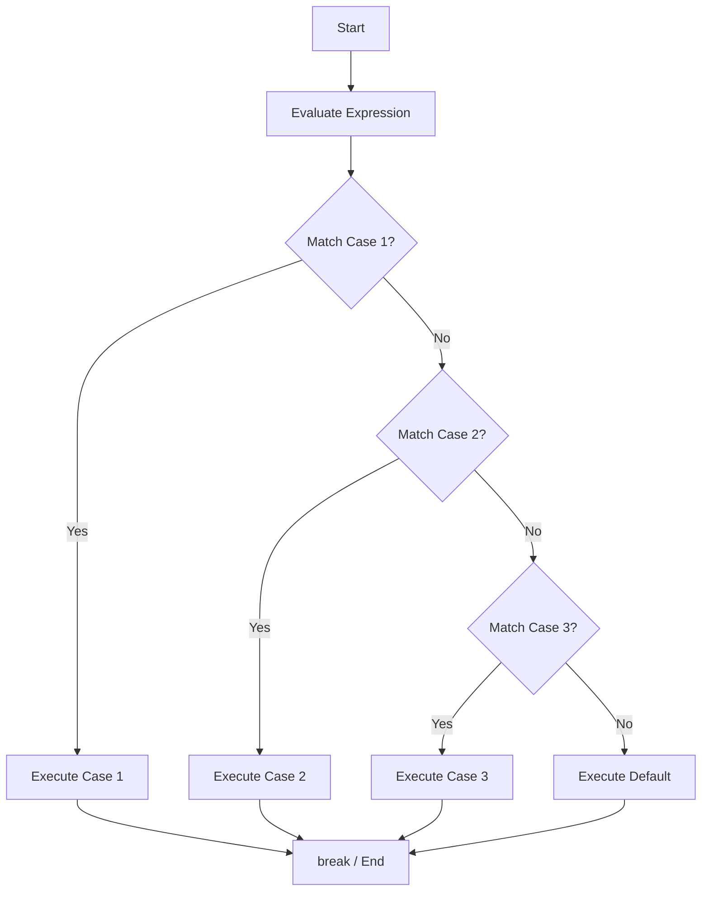
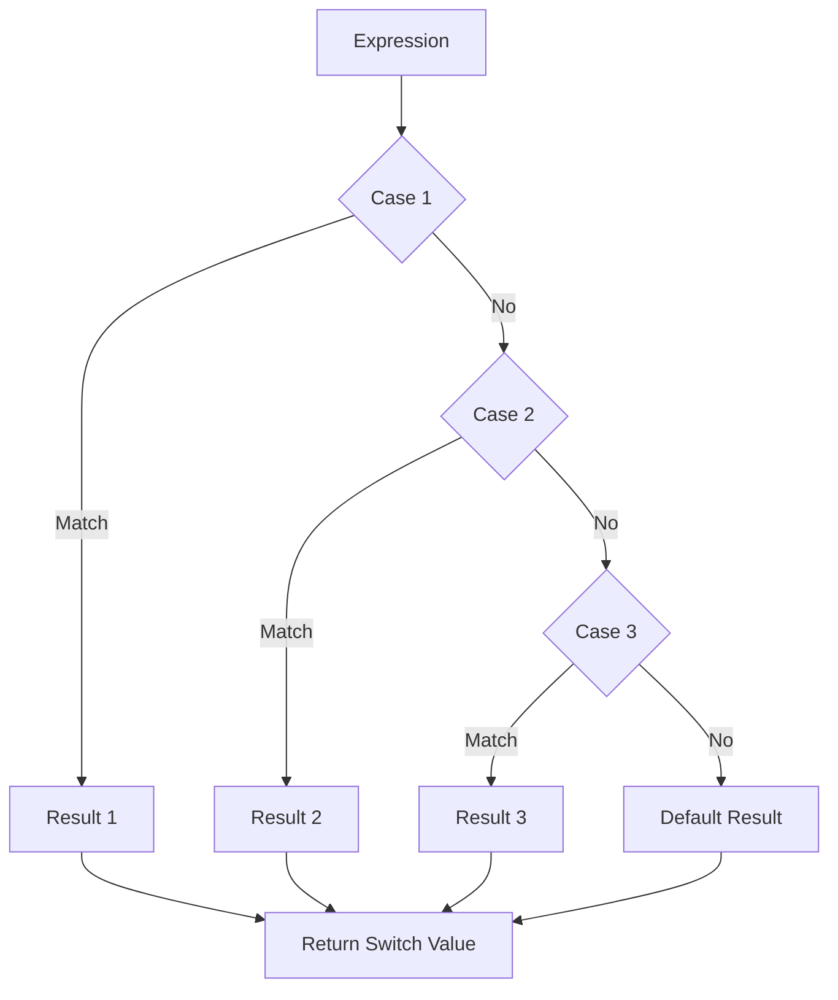
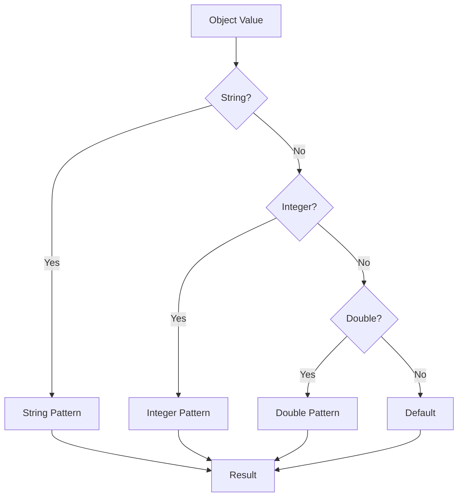
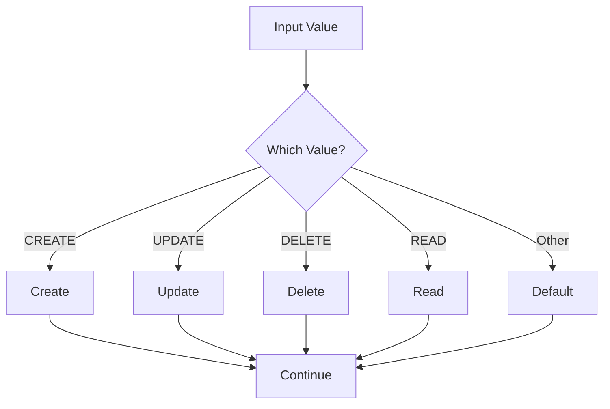
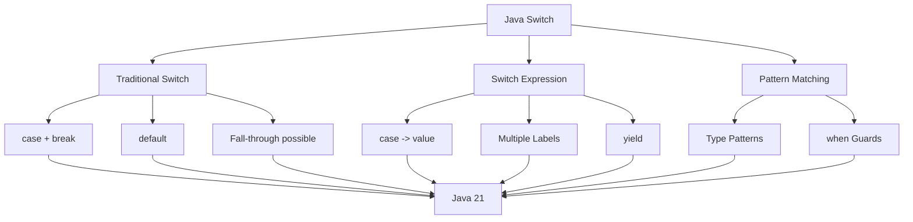

# 📘 Java Switch

## 1. What Is a Switch Statement?

The Java `switch` statement is used to select **one execution path from multiple possible options**.

It is useful when you want to compare one value against several possible values.

For example:

```text
Customer Type
      |
      v
+-----+-----+-----+-----+
|     |     |     |     |
ADMIN USER  STAFF GUEST
```

Instead of writing many `if / else if` statements, a `switch` can make the code easier to read.

---

## 2. Basic Syntax

The traditional `switch` syntax is:

```java
switch (expression) {

    case value1:
        // code
        break;

    case value2:
        // code
        break;

    default:
        // code
}
```

Example:

```java
int day = 1;

switch (day) {

    case 1:
        System.out.println("Monday");
        break;

    case 2:
        System.out.println("Tuesday");
        break;

    case 3:
        System.out.println("Wednesday");
        break;

    default:
        System.out.println("Unknown day");
}
```

Output:

```text
Monday
```

---

# 3. How Switch Works

The `switch` statement evaluates an expression.

Then Java compares the result with each `case`.

```text
                    switch(day)
                         |
                         v
                 +-------+-------+
                 |               |
              day == 1?       day == 2?
                 |               |
                YES              NO
                 |               |
              Monday          continue
```

Conceptually:

```text
switch expression
       |
       v
Compare with case 1
       |
       +-- match --> execute case 1
       |
       +-- no match --> compare case 2
       |
       +-- no match --> compare case 3
       |
       +-- no match --> default
```

---

# 4. The `case` Keyword

The `case` keyword defines a possible value.

Example:

```java
int status = 1;

switch (status) {

    case 1:
        System.out.println("Active");
        break;

    case 2:
        System.out.println("Blocked");
        break;
}
```

If:

```text
status = 1
```

Java executes:

```java
System.out.println("Active");
```

---

# 5. The `break` Keyword

The `break` statement stops execution of the current `switch`.

Example:

```java
int day = 2;

switch (day) {

    case 1:
        System.out.println("Monday");
        break;

    case 2:
        System.out.println("Tuesday");
        break;

    case 3:
        System.out.println("Wednesday");
        break;
}
```

Output:

```text
Tuesday
```

When Java reaches:

```java
break;
```

it exits the `switch`.

---

# 6. What Happens Without `break`?

Consider:

```java
int day = 2;

switch (day) {

    case 1:
        System.out.println("Monday");

    case 2:
        System.out.println("Tuesday");

    case 3:
        System.out.println("Wednesday");
}
```

Output:

```text
Tuesday
Wednesday
```

Why?

Because traditional Java `switch` has **fall-through behavior**.

When Java matches:

```text
case 2
```

it continues executing the following cases until it reaches a `break` or the end of the switch.

---

# 7. Switch Fall-Through

The behavior can be visualized as:

```text
day = 2

    |
    v
case 1
    |
    X No match
    |
    v
case 2
    |
    YES
    |
    v
Execute case 2
    |
    v
Execute case 3
    |
    v
End
```

This is called **fall-through**.

---

# 8. Using `break` to Prevent Fall-Through

Usually, traditional switch statements use `break`.

```java
int day = 2;

switch (day) {

    case 1:
        System.out.println("Monday");
        break;

    case 2:
        System.out.println("Tuesday");
        break;

    case 3:
        System.out.println("Wednesday");
        break;

    default:
        System.out.println("Unknown");
}
```

Output:

```text
Tuesday
```

---

# 9. The `default` Case

The `default` case executes when no `case` matches.

Example:

```java
int day = 10;

switch (day) {

    case 1:
        System.out.println("Monday");
        break;

    case 2:
        System.out.println("Tuesday");
        break;

    case 3:
        System.out.println("Wednesday");
        break;

    default:
        System.out.println("Invalid day");
}
```

Output:

```text
Invalid day
```

---

# 10. Is `default` Required?

No.

A switch can work without `default`.

Example:

```java
int status = 1;

switch (status) {

    case 1:
        System.out.println("Active");
        break;

    case 2:
        System.out.println("Blocked");
        break;
}
```

However, using `default` is often a good idea when unexpected values need to be handled.

---

# 11. Switch With `int`

One of the most common uses is switching on an integer.

```java
int option = 2;

switch (option) {

    case 1:
        System.out.println("Create");
        break;

    case 2:
        System.out.println("Update");
        break;

    case 3:
        System.out.println("Delete");
        break;

    default:
        System.out.println("Invalid option");
}
```

Output:

```text
Update
```

---

# 12. Switch With `byte`

Java also supports `byte`.

```java
byte status = 1;

switch (status) {

    case 1:
        System.out.println("Active");
        break;

    case 2:
        System.out.println("Inactive");
        break;

    default:
        System.out.println("Unknown");
}
```

---

# 13. Switch With `short`

Example:

```java
short code = 100;

switch (code) {

    case 100:
        System.out.println("Success");
        break;

    case 200:
        System.out.println("Pending");
        break;

    default:
        System.out.println("Unknown");
}
```

---

# 14. Switch With `char`

You can use `char`.

```java
char grade = 'A';

switch (grade) {

    case 'A':
        System.out.println("Excellent");
        break;

    case 'B':
        System.out.println("Good");
        break;

    case 'C':
        System.out.println("Average");
        break;

    default:
        System.out.println("Unknown grade");
}
```

Output:

```text
Excellent
```

---

# 15. Switch With `String`

Java supports `String` in switch statements.

Example:

```java
String role = "ADMIN";

switch (role) {

    case "ADMIN":
        System.out.println("Administrator");
        break;

    case "USER":
        System.out.println("Normal User");
        break;

    case "GUEST":
        System.out.println("Guest User");
        break;

    default:
        System.out.println("Unknown role");
}
```

Output:

```text
Administrator
```

---

# 16. String Switch Is Case-Sensitive

Consider:

```java
String role = "admin";

switch (role) {

    case "ADMIN":
        System.out.println("Administrator");
        break;

    default:
        System.out.println("Unknown role");
}
```

Output:

```text
Unknown role
```

Because:

```text
"admin"
```

and:

```text
"ADMIN"
```

are different strings.

---

# 17. Handling Case-Insensitive Values

If input may have different capitalization, you can normalize it first.

Example:

```java
String role = "admin";

switch (role.toUpperCase()) {

    case "ADMIN":
        System.out.println("Administrator");
        break;

    case "USER":
        System.out.println("Normal User");
        break;

    default:
        System.out.println("Unknown role");
}
```

Output:

```text
Administrator
```

In production code, be aware of locale concerns when normalizing user input. For predictable technical identifiers, you can use:

```java
role.toUpperCase(Locale.ROOT)
```

---

# 18. Switch With Enum

`enum` is another important type that works very well with `switch`.

Example:

```java
enum AccountStatus {
    ACTIVE,
    BLOCKED,
    CLOSED
}
```

Then:

```java
AccountStatus status = AccountStatus.ACTIVE;

switch (status) {

    case ACTIVE:
        System.out.println("Account is active.");
        break;

    case BLOCKED:
        System.out.println("Account is blocked.");
        break;

    case CLOSED:
        System.out.println("Account is closed.");
        break;
}
```

Output:

```text
Account is active.
```

---

# 19. Why Enum + Switch Is Useful

Using an enum is often better than using numeric codes.

Instead of:

```java
int status = 1;
```

you can use:

```java
AccountStatus status =
        AccountStatus.ACTIVE;
```

This makes the code more readable.

Compare:

```java
if (status == 1) {
}
```

with:

```java
if (status == AccountStatus.ACTIVE) {
}
```

The second version communicates the meaning more clearly.

---

# 20. Switch vs If-Else

Consider this `if / else if`:

```java
int option = 2;

if (option == 1) {

    System.out.println("Create");

} else if (option == 2) {

    System.out.println("Update");

} else if (option == 3) {

    System.out.println("Delete");

} else {

    System.out.println("Invalid option");
}
```

The same logic using `switch`:

```java
int option = 2;

switch (option) {

    case 1:
        System.out.println("Create");
        break;

    case 2:
        System.out.println("Update");
        break;

    case 3:
        System.out.println("Delete");
        break;

    default:
        System.out.println("Invalid option");
}
```

For discrete values, the `switch` version can be easier to read.

---

# 21. When Should You Use Switch?

Use `switch` when:

```text
One value
    |
    +-- exact value A
    |
    +-- exact value B
    |
    +-- exact value C
    |
    +-- default
```

Example:

```java
switch (status) {
    case "ACTIVE":
        ...
        break;

    case "BLOCKED":
        ...
        break;

    case "CLOSED":
        ...
        break;

    default:
        ...
}
```

---

# 22. When Should You Use If?

Use `if` when conditions involve ranges or complex expressions.

Example:

```java
int age = 25;

if (age >= 18 && age <= 60) {
    System.out.println("Working age.");
}
```

This is more natural with `if` than with traditional `switch`.

Another example:

```java
if (balance.compareTo(amount) >= 0
        && account.isActive()
        && customer.isVerified()) {

    processTransaction();
}
```

This is not a natural use case for traditional switch.

---

# 23. Switch Decision Flow



---

# 24. Traditional Switch Syntax

The traditional form is:

```java
switch (value) {

    case VALUE_1:
        // statements
        break;

    case VALUE_2:
        // statements
        break;

    default:
        // statements
}
```

This style has been available for many Java versions and is still valid in Java 21.

---

# 25. Java Switch Expressions

Modern Java provides **switch expressions**.

A switch expression produces a value.

Example:

```java
int day = 1;

String dayName = switch (day) {

    case 1 -> "Monday";
    case 2 -> "Tuesday";
    case 3 -> "Wednesday";

    default -> "Unknown";
};

System.out.println(dayName);
```

Output:

```text
Monday
```

This is an important modern Java feature.

---

# 26. Arrow Syntax

Modern switch uses:

```java
case value -> result;
```

Example:

```java
int status = 1;

String message = switch (status) {

    case 1 -> "Active";
    case 2 -> "Blocked";
    case 3 -> "Closed";

    default -> "Unknown";
};
```

The variable:

```java
message
```

receives the result.

---

# 27. Switch Statement vs Switch Expression

Traditional switch:

```java
switch (status) {

    case 1:
        message = "Active";
        break;

    case 2:
        message = "Blocked";
        break;

    default:
        message = "Unknown";
}
```

Modern switch expression:

```java
String message = switch (status) {

    case 1 -> "Active";
    case 2 -> "Blocked";
    default -> "Unknown";
};
```

The second version is shorter and expresses the intent more clearly.

---

# 28. No `break` With Arrow Syntax

With arrow syntax:

```java
switch (status) {

    case 1 -> System.out.println("Active");
    case 2 -> System.out.println("Blocked");
    case 3 -> System.out.println("Closed");
    default -> System.out.println("Unknown");
}
```

You do not write:

```java
break;
```

The arrow case does not fall through into the next case.

---

# 29. Multiple Labels in One Case

Modern switch allows multiple labels.

Example:

```java
int day = 6;

String type = switch (day) {

    case 1, 2, 3, 4, 5 -> "Weekday";

    case 6, 7 -> "Weekend";

    default -> "Invalid";
};

System.out.println(type);
```

Output:

```text
Weekend
```

This is cleaner than repeating the same logic.

---

# 30. Multiple Labels With Traditional Syntax

You can also group cases in traditional switch.

```java
int day = 6;

switch (day) {

    case 1:
    case 2:
    case 3:
    case 4:
    case 5:
        System.out.println("Weekday");
        break;

    case 6:
    case 7:
        System.out.println("Weekend");
        break;

    default:
        System.out.println("Invalid");
}
```

Modern syntax is shorter:

```java
case 1, 2, 3, 4, 5 -> "Weekday";
case 6, 7 -> "Weekend";
```

---

# 31. Switch Expression With Block

Sometimes a case needs multiple statements.

You can use a block:

```java
int score = 95;

String result = switch (score) {

    case 100 -> "Perfect";

    case 90, 91, 92, 93, 94, 95, 96, 97, 98, 99 -> {
        System.out.println("High score.");
        yield "Excellent";
    }

    default -> "Normal";
};

System.out.println(result);
```

Output:

```text
High score.
Excellent
```

---

# 32. The `yield` Keyword

When a switch expression case contains multiple statements, use `yield` to return a value.

Example:

```java
String result = switch (status) {

    case 1 -> {

        System.out.println("Processing active status.");

        yield "ACTIVE";
    }

    case 2 -> {

        System.out.println("Processing blocked status.");

        yield "BLOCKED";
    }

    default -> "UNKNOWN";
};
```

The `yield` statement provides the value of that switch expression branch.

---

# 33. Switch Expression Flow



---

# 34. Switch With String Example

A common enterprise example is processing an operation type.

```java
String operation = "CREATE";

switch (operation) {

    case "CREATE":
        System.out.println("Creating record.");
        break;

    case "UPDATE":
        System.out.println("Updating record.");
        break;

    case "DELETE":
        System.out.println("Deleting record.");
        break;

    case "READ":
        System.out.println("Reading record.");
        break;

    default:
        System.out.println("Unknown operation.");
}
```

Output:

```text
Creating record.
```

---

# 35. Switch Expression for Operation

The same logic can be written using a switch expression.

```java
String operation = "CREATE";

String message = switch (operation) {

    case "CREATE" -> "Creating record.";
    case "UPDATE" -> "Updating record.";
    case "DELETE" -> "Deleting record.";
    case "READ" -> "Reading record.";

    default -> "Unknown operation.";
};

System.out.println(message);
```

Output:

```text
Creating record.
```

---

# 36. Banking Example: Account Status

Suppose a banking system has:

```text
ACTIVE
BLOCKED
CLOSED
DORMANT
```

Using an enum:

```java
enum AccountStatus {
    ACTIVE,
    BLOCKED,
    CLOSED,
    DORMANT
}
```

Then:

```java
AccountStatus status =
        AccountStatus.ACTIVE;

String message = switch (status) {

    case ACTIVE ->
            "Account is available.";

    case BLOCKED ->
            "Account is blocked.";

    case CLOSED ->
            "Account is closed.";

    case DORMANT ->
            "Account is dormant.";
};

System.out.println(message);
```

Output:

```text
Account is available.
```

---

# 37. Banking Example: Transaction Type

```java
enum TransactionType {
    DEPOSIT,
    WITHDRAWAL,
    TRANSFER,
    PAYMENT
}
```

Then:

```java
TransactionType type =
        TransactionType.TRANSFER;

String message = switch (type) {

    case DEPOSIT ->
            "Processing deposit.";

    case WITHDRAWAL ->
            "Processing withdrawal.";

    case TRANSFER ->
            "Processing transfer.";

    case PAYMENT ->
            "Processing payment.";
};

System.out.println(message);
```

Output:

```text
Processing transfer.
```

---

# 38. Switch With Enum and Business Logic

You can also execute logic directly.

```java
TransactionType type =
        TransactionType.WITHDRAWAL;

switch (type) {

    case DEPOSIT:
        System.out.println(
                "Increase account balance."
        );
        break;

    case WITHDRAWAL:
        System.out.println(
                "Decrease account balance."
        );
        break;

    case TRANSFER:
        System.out.println(
                "Move funds between accounts."
        );
        break;

    case PAYMENT:
        System.out.println(
                "Process payment."
        );
        break;
}
```

Output:

```text
Decrease account balance.
```

---

# 39. Switch With HTTP Methods

Switch is also useful for simple API routing logic.

For example:

```java
String method = "GET";

switch (method) {

    case "GET":
        System.out.println("Read resource.");
        break;

    case "POST":
        System.out.println("Create resource.");
        break;

    case "PUT":
        System.out.println("Replace resource.");
        break;

    case "PATCH":
        System.out.println("Update resource.");
        break;

    case "DELETE":
        System.out.println("Delete resource.");
        break;

    default:
        System.out.println("Unsupported method.");
}
```

Output:

```text
Read resource.
```

In a Spring Boot application, however, HTTP routing is normally handled by Spring MVC/WebFlux annotations rather than implementing your own switch-based router.

---

# 40. Switch With Menu

A simple console application can use switch for menu selection.

```java
import java.util.Scanner;

public class Main {

    public static void main(String[] args) {

        Scanner scanner =
                new Scanner(System.in);

        System.out.println("1. Create");
        System.out.println("2. Update");
        System.out.println("3. Delete");
        System.out.println("4. Exit");

        System.out.print("Choose option: ");

        int option = scanner.nextInt();

        switch (option) {

            case 1:
                System.out.println("Create selected.");
                break;

            case 2:
                System.out.println("Update selected.");
                break;

            case 3:
                System.out.println("Delete selected.");
                break;

            case 4:
                System.out.println("Exit.");
                break;

            default:
                System.out.println("Invalid option.");
        }

        scanner.close();
    }
}
```

---

# 41. Switch With User Input

Example input:

```text
2
```

Output:

```text
Update selected.
```

Flow:

```text
User Input
    |
    v
Option = 2
    |
    v
switch(option)
    |
    v
case 2
    |
    v
Update selected
```

---

# 42. Switch and Null Values

Be careful when switching on a `String` or other reference type.

Traditional switch can throw `NullPointerException` when the selector expression is `null`.

Example:

```java
String status = null;

switch (status) {

    case "ACTIVE":
        System.out.println("Active");
        break;

    default:
        System.out.println("Unknown");
}
```

This does not safely handle `null`.

You should validate or handle `null` before the switch when using traditional switch code.

Example:

```java
String status = null;

if (status == null) {

    System.out.println("Status is required.");

} else {

    switch (status) {

        case "ACTIVE":
            System.out.println("Active");
            break;

        case "BLOCKED":
            System.out.println("Blocked");
            break;

        default:
            System.out.println("Unknown");
    }
}
```

---

# 43. Modern Switch and `null`

Modern Java switch supports an explicit `case null` label.

Example:

```java
String status = null;

String message = switch (status) {

    case null -> "Status is missing.";

    case "ACTIVE" -> "Account is active.";

    case "BLOCKED" -> "Account is blocked.";

    default -> "Unknown status.";
};

System.out.println(message);
```

Output:

```text
Status is missing.
```

This can be useful when null is an intentional part of the input model.

---

# 44. Exhaustive Switch Expressions

A switch expression must be exhaustive.

That means every possible input must be covered.

For example:

```java
int status = 5;

String message = switch (status) {

    case 1 -> "Active";
    case 2 -> "Blocked";
    default -> "Unknown";
};
```

The `default` handles all other integer values.

---

# 45. Exhaustive Enum Switch

For an enum:

```java
enum Status {
    ACTIVE,
    BLOCKED
}
```

You can write:

```java
Status status = Status.ACTIVE;

String message = switch (status) {

    case ACTIVE -> "Active";
    case BLOCKED -> "Blocked";
};
```

There is no `default`, because all enum constants are covered.

This can be useful because if a new enum constant is added later, the compiler can help identify switch expressions that need updating.

---

# 46. Switch and Pattern Matching

Modern Java has expanded switch capabilities with **pattern matching**.

Java 21 supports pattern matching for switch as a standard language feature.

Example:

```java
Object value = "Hello";

String result = switch (value) {

    case String s -> "String: " + s;

    case Integer i -> "Integer: " + i;

    case Double d -> "Double: " + d;

    default -> "Other type";
};

System.out.println(result);
```

Output:

```text
String: Hello
```

---

# 47. Pattern Matching Flow



---

# 48. Pattern Matching With a Guard

Java 21 also supports `when` guards in switch patterns.

Example:

```java
Object value = 100;

String result = switch (value) {

    case Integer i when i > 0 ->
            "Positive integer";

    case Integer i ->
            "Zero or negative integer";

    default ->
            "Other type";
};

System.out.println(result);
```

Output:

```text
Positive integer
```

The `when` condition provides an additional condition for the pattern.

---

# 49. Pattern Matching Example

```java
Object value = -10;

String result = switch (value) {

    case Integer i when i > 0 ->
            "Positive";

    case Integer i when i < 0 ->
            "Negative";

    case Integer i ->
            "Zero";

    default ->
            "Not an integer";
};

System.out.println(result);
```

Output:

```text
Negative
```

---

# 50. Important Java 21 Note

When learning Java 21, it is useful to understand the evolution:

```text
Traditional switch
        |
        v
case + break
        |
        v
Modern switch expressions
        |
        v
case value -> result
        |
        v
Multiple labels
        |
        v
Pattern matching for switch
        |
        v
when guards
```

Modern Java code can therefore be much more expressive than older switch syntax.

---

# 51. Switch vs Nested If

Suppose we need to process account status.

Nested `if`:

```java
String status = "ACTIVE";

if ("ACTIVE".equals(status)) {

    System.out.println("Account active.");

} else if ("BLOCKED".equals(status)) {

    System.out.println("Account blocked.");

} else if ("CLOSED".equals(status)) {

    System.out.println("Account closed.");

} else {

    System.out.println("Unknown status.");
}
```

Switch:

```java
String status = "ACTIVE";

switch (status) {

    case "ACTIVE":
        System.out.println("Account active.");
        break;

    case "BLOCKED":
        System.out.println("Account blocked.");
        break;

    case "CLOSED":
        System.out.println("Account closed.");
        break;

    default:
        System.out.println("Unknown status.");
}
```

Modern switch:

```java
String status = "ACTIVE";

String message = switch (status) {

    case "ACTIVE" -> "Account active.";
    case "BLOCKED" -> "Account blocked.";
    case "CLOSED" -> "Account closed.";
    default -> "Unknown status.";
};

System.out.println(message);
```

The modern switch expression is often the cleanest when the goal is simply to map one value to another.

---

# 52. Common Mistake: Forgetting `break`

Incorrect:

```java
int option = 1;

switch (option) {

    case 1:
        System.out.println("Create");

    case 2:
        System.out.println("Update");

    case 3:
        System.out.println("Delete");
}
```

Output:

```text
Create
Update
Delete
```

If you intended only `Create`, this is a bug.

Correct:

```java
int option = 1;

switch (option) {

    case 1:
        System.out.println("Create");
        break;

    case 2:
        System.out.println("Update");
        break;

    case 3:
        System.out.println("Delete");
        break;
}
```

Output:

```text
Create
```

---

# 53. Common Mistake: Duplicate Case Values

This is invalid:

```java
int option = 1;

switch (option) {

    case 1:
        System.out.println("Create");
        break;

    case 1:
        System.out.println("Another Create");
        break;
}
```

The same case value cannot appear more than once in the same switch.

---

# 54. Common Mistake: Using Range Conditions

A traditional switch is not designed for conditions such as:

```text
score >= 90
score >= 80
score >= 70
```

Use `if / else if`:

```java
if (score >= 90) {

    System.out.println("A");

} else if (score >= 80) {

    System.out.println("B");

} else if (score >= 70) {

    System.out.println("C");

} else {

    System.out.println("F");
}
```

For ranges, `if` is usually clearer.

---

# 55. Common Mistake: Overly Complex Switch

Avoid putting huge amounts of business logic directly inside each case.

Avoid:

```java
switch (transactionType) {

    case TRANSFER:

        // 100 lines of business logic

        break;

    case PAYMENT:

        // 150 lines of business logic

        break;
}
```

Prefer extracting business logic into methods or services.

Example:

```java
switch (transactionType) {

    case TRANSFER:
        processTransfer();
        break;

    case PAYMENT:
        processPayment();
        break;

    default:
        throw new IllegalArgumentException(
                "Unsupported transaction type"
        );
}
```

---

# 56. Switch With Methods

Example:

```java
String operation = "CREATE";

switch (operation) {

    case "CREATE":
        createAccount();
        break;

    case "UPDATE":
        updateAccount();
        break;

    case "DELETE":
        deleteAccount();
        break;

    default:
        throw new IllegalArgumentException(
                "Unsupported operation: " + operation
        );
}
```

This keeps the switch readable.

---

# 57. Modern Version With Methods

```java
String operation = "CREATE";

switch (operation) {

    case "CREATE" -> createAccount();

    case "UPDATE" -> updateAccount();

    case "DELETE" -> deleteAccount();

    default ->
            throw new IllegalArgumentException(
                    "Unsupported operation: " + operation
            );
}
```

This is concise and works well for Java 21 code.

---

# 58. Complete Java 21 Example

```java
public class Main {

    public static void main(String[] args) {

        String operation = "TRANSFER";

        String message = switch (operation) {

            case "CREATE" ->
                    "Creating account.";

            case "UPDATE" ->
                    "Updating account.";

            case "TRANSFER" ->
                    "Processing transfer.";

            case "PAYMENT" ->
                    "Processing payment.";

            case "DELETE" ->
                    "Deleting account.";

            default ->
                    "Unknown operation.";
        };

        System.out.println(message);
    }
}
```

Output:

```text
Processing transfer.
```

---

# 59. Complete Enum Example

```java
public class Main {

    enum TransactionType {
        DEPOSIT,
        WITHDRAWAL,
        TRANSFER,
        PAYMENT
    }

    public static void main(String[] args) {

        TransactionType type =
                TransactionType.TRANSFER;

        String message = switch (type) {

            case DEPOSIT ->
                    "Processing deposit.";

            case WITHDRAWAL ->
                    "Processing withdrawal.";

            case TRANSFER ->
                    "Processing transfer.";

            case PAYMENT ->
                    "Processing payment.";
        };

        System.out.println(message);
    }
}
```

Output:

```text
Processing transfer.
```

---

# 60. Switch Decision-Making Diagram



---

# 61. Traditional Switch vs Modern Switch

| Feature                          | Traditional Switch | Modern Switch          |
| -------------------------------- | ------------------ | ---------------------- |
| `case`                           | Yes                | Yes                    |
| `break`                          | Usually required   | Not required with `->` |
| Fall-through                     | Possible           | Not with arrow cases   |
| Expression result                | Indirect           | Direct                 |
| `yield`                          | No                 | Yes                    |
| Multiple labels                  | Yes                | Yes                    |
| Enum                             | Yes                | Yes                    |
| String                           | Yes                | Yes                    |
| Pattern matching                 | No                 | Yes                    |
| `when` guards                    | No                 | Yes                    |
| Recommended for new Java 21 code | Sometimes          | Often preferred        |

---

# 62. If vs Switch

| Situation                     | Recommended        |                |      |
| ----------------------------- | ------------------ | -------------- | ---- |
| Exact value comparison        | `switch`           |                |      |
| Multiple exact values         | `switch`           |                |      |
| String commands               | `switch`           |                |      |
| Enum states                   | `switch`           |                |      |
| Range conditions              | `if`               |                |      |
| Complex boolean conditions    | `if`               |                |      |
| `&&` / `                      |                    | ` combinations | `if` |
| Multiple dependent conditions | `if` / nested `if` |                |      |
| Mapping one value to another  | Switch expression  |                |      |

---

# 63. Switch Best Practices

### 1. Prefer switch expressions when returning a value

Instead of:

```java
String message;

switch (status) {

    case "ACTIVE":
        message = "Active";
        break;

    case "BLOCKED":
        message = "Blocked";
        break;

    default:
        message = "Unknown";
}
```

Prefer:

```java
String message = switch (status) {

    case "ACTIVE" -> "Active";
    case "BLOCKED" -> "Blocked";
    default -> "Unknown";
};
```

---

### 2. Prefer arrow syntax for new Java 21 code

```java
case "ACTIVE" -> "Active";
```

This avoids accidental fall-through.

---

### 3. Use enums for fixed business states

Prefer:

```java
enum AccountStatus {
    ACTIVE,
    BLOCKED,
    CLOSED
}
```

over unexplained numeric codes:

```java
int status = 1;
```

---

### 4. Keep cases small

Prefer:

```java
case TRANSFER -> processTransfer();
```

rather than putting hundreds of lines into a case.

---

### 5. Handle unexpected values

For String or integer inputs:

```java
default -> throw new IllegalArgumentException(
        "Unsupported value: " + value
);
```

or provide a suitable fallback.

---

# 64. Practical Enterprise Example

Suppose your banking application receives:

```text
Transaction Type
        |
        +-- DEPOSIT
        |
        +-- WITHDRAWAL
        |
        +-- TRANSFER
        |
        +-- PAYMENT
```

Java code:

```java
enum TransactionType {
    DEPOSIT,
    WITHDRAWAL,
    TRANSFER,
    PAYMENT
}

public String processTransaction(
        TransactionType type
) {

    return switch (type) {

        case DEPOSIT ->
                "Deposit processing started.";

        case WITHDRAWAL ->
                "Withdrawal processing started.";

        case TRANSFER ->
                "Transfer processing started.";

        case PAYMENT ->
                "Payment processing started.";
    };
}
```

This is a clean example of using a Java 21 switch expression in enterprise code.

---

# 65. Switch in Spring Boot

In a Spring Boot service, you might have:

```java
public TransactionResult process(
        TransactionType type
) {

    return switch (type) {

        case DEPOSIT ->
                processDeposit();

        case WITHDRAWAL ->
                processWithdrawal();

        case TRANSFER ->
                processTransfer();

        case PAYMENT ->
                processPayment();
    };
}
```

The switch selects the appropriate business operation.

However, when the number of transaction types becomes large or each operation has substantial independent business logic, a strategy pattern or separate service implementations may be more maintainable than a very large switch.

---

# 66. Switch and Strategy Pattern

A small number of cases can be perfectly fine:

```java
return switch (type) {

    case DEPOSIT -> processDeposit();

    case WITHDRAWAL -> processWithdrawal();

    case TRANSFER -> processTransfer();
};
```

But if you have:

```text
20 transaction types
50 transaction types
100 transaction types
```

a large switch may become difficult to maintain.

At that point, consider:

```text
TransactionType
       |
       v
TransactionProcessor
       |
       +-- DepositProcessor
       +-- WithdrawalProcessor
       +-- TransferProcessor
       +-- PaymentProcessor
```

This is an architectural consideration rather than a limitation of `switch`.

---

# 67. Exercise 1: Day of Week

Create a program:

```java
int day = 3;
```

Use switch to print:

```text
Monday
Tuesday
Wednesday
Thursday
Friday
Saturday
Sunday
```

Expected output:

```text
Wednesday
```

---

# 68. Exercise 2: Account Status

Create:

```java
String status = "BLOCKED";
```

Use switch to produce:

```text
Account is active.
Account is blocked.
Account is closed.
Unknown status.
```

Expected output:

```text
Account is blocked.
```

---

# 69. Exercise 3: Transaction Type

Create:

```java
TransactionType type =
        TransactionType.TRANSFER;
```

Use a switch expression to produce:

```text
Processing transfer.
```

---

# 70. Exercise 4: Weekday or Weekend

Create:

```java
int day = 6;
```

Use a switch expression:

```text
1-5 → Weekday
6-7 → Weekend
```

Expected output:

```text
Weekend
```

---

# 71. Exercise 5: Grade

Create:

```java
char grade = 'A';
```

Use switch:

```text
A → Excellent
B → Good
C → Average
D → Poor
F → Fail
```

Expected output:

```text
Excellent
```

---

# 72. Exercise 6: Java 21 Switch Expression

Create:

```java
int option = 2;
```

Use a switch expression:

```text
1 → Create
2 → Update
3 → Delete
4 → Exit
```

Expected output:

```text
Update
```

---

# 73. Exercise 7: Pattern Matching

Create:

```java
Object value = 100;
```

Use Java 21 pattern matching for switch to distinguish:

```text
String
Integer
Double
Other
```

Expected output:

```text
Integer: 100
```

---

# 74. Interview Questions

## Question 1

What is a switch statement?

A `switch` statement selects an execution path based on the value of an expression.

---

## Question 2

What is the purpose of `case`?

`case` defines a possible value that can match the switch expression.

---

## Question 3

What is the purpose of `break`?

In traditional switch syntax, `break` exits the switch and prevents execution from falling through to subsequent cases.

---

## Question 4

What happens if you forget `break`?

Traditional switch can fall through into subsequent cases.

---

## Question 5

What is the `default` case?

It handles situations where no case matches.

---

## Question 6

Can switch work with String?

Yes.

```java
String status = "ACTIVE";

switch (status) {
    case "ACTIVE":
        ...
        break;
}
```

---

## Question 7

Can switch work with enum?

Yes.

Enums are an excellent use case for switch.

---

## Question 8

What is a switch expression?

A switch expression produces a value.

Example:

```java
String result = switch (status) {

    case "ACTIVE" -> "Active";
    default -> "Unknown";
};
```

---

## Question 9

What is the difference between `:` and `->` in switch?

Traditional syntax uses:

```java
case 1:
```

and usually requires `break`.

Modern arrow syntax uses:

```java
case 1 ->
```

and does not fall through to the next case.

---

## Question 10

What is `yield`?

`yield` provides the value of a switch expression from a case block containing multiple statements.

---

## Question 11

Can switch handle multiple values in one case?

Yes.

Example:

```java
case 1, 2, 3 -> "Low";
```

---

## Question 12

Can switch handle ranges like `age >= 18`?

Traditional switch is not intended for arbitrary range conditions. `if` is usually more appropriate.

Modern pattern matching can express some guarded conditions, but it should be used when it improves the model rather than simply replacing every `if`.

---

# 75. Key Takeaways

```text
1. switch selects between multiple possible cases.

2. case defines a possible matching value.

3. default handles unmatched values.

4. Traditional switch uses break to prevent fall-through.

5. Missing break can cause fall-through.

6. Java supports switch with int, byte, short, char, String, and enum.

7. Java 21 supports modern switch expressions.

8. Arrow syntax uses:
       case value -> result;

9. Arrow cases do not fall through.

10. Multiple labels can be combined:
       case 1, 2, 3 -> result;

11. Switch expressions can return values.

12. yield is used inside multi-statement switch expression blocks.

13. Java 21 supports pattern matching for switch.

14. when guards can add conditions to switch patterns.

15. Use switch for discrete values.

16. Use if for ranges and complex boolean conditions.

17. Enums + switch are excellent for fixed business states.

18. Keep switch cases small and maintainable.

19. For large and changing business logic, consider strategy-based designs.

20. Modern Java 21 switch expressions are generally preferable for new code when they make the logic clearer.
```

---

# 76. Final Concept Diagram



---

# 77. Final Summary

The Java `switch` statement is useful when one value needs to be compared against several possible values.

Traditional switch:

```java
switch (status) {

    case 1:
        System.out.println("Active");
        break;

    case 2:
        System.out.println("Blocked");
        break;

    default:
        System.out.println("Unknown");
}
```

Modern Java 21 switch expression:

```java
String message = switch (status) {

    case 1 -> "Active";
    case 2 -> "Blocked";
    default -> "Unknown";
};
```

For multiple values:

```java
String type = switch (day) {

    case 1, 2, 3, 4, 5 -> "Weekday";
    case 6, 7 -> "Weekend";
    default -> "Invalid";
};
```

For enums:

```java
String message = switch (accountStatus) {

    case ACTIVE -> "Account is active.";
    case BLOCKED -> "Account is blocked.";
    case CLOSED -> "Account is closed.";
};
```

For Java 21 pattern matching:

```java
String result = switch (value) {

    case String s -> "String: " + s;
    case Integer i -> "Integer: " + i;
    default -> "Other";
};
```

The overall decision-making concept is:

```text
                       Input Value
                           |
                           v
                     +-----+-----+
                     |   switch  |
                     +-----+-----+
                           |
          +----------------+----------------+
          |                |                |
          v                v                v
       Case A           Case B           Case C
          |                |                |
          v                v                v
      Action A          Action B          Action C
          |                |                |
          +----------------+----------------+
                           |
                           v
                       Continue
```

The key rule to remember is:

```text
if
 ↓
Best for conditions, ranges, and complex boolean logic

switch
 ↓
Best for selecting between discrete values

switch expression
 ↓
Best when selecting a value based on one input

enum + switch
 ↓
Excellent for fixed business states

Java 21 pattern matching
 ↓
Useful when the decision depends on an object's type and additional conditions
```
