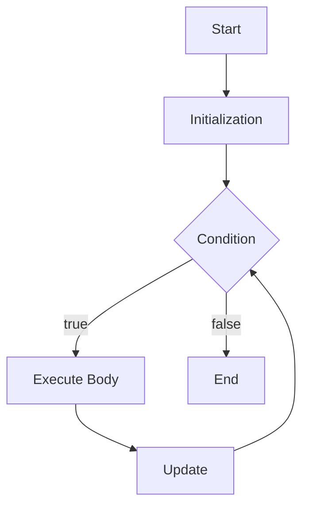

# 📘 Java For Loop

## 1. What Is a For Loop?

A `for` loop in Java is used to repeatedly execute a block of code while a condition is `true`.

It is especially useful when you know, or can clearly define, how many times you want to repeat an operation.

For example:

```java
for (int i = 1; i <= 5; i++) {

    System.out.println(i);
}
```

Output:

```text
1
2
3
4
5
```

The basic flow is:

```text
        Start
          |
          v
   Initialization
          |
          v
    Check Condition
       /       \
     true     false
      |          |
      v          v
 Execute Code   End
      |
      v
    Update
      |
      +----------> Check Condition
```

---

# 2. Basic Syntax

The basic syntax of a Java `for` loop is:

```java
for (initialization; condition; update) {

    // code to execute
}
```

Example:

```java
for (int i = 1; i <= 5; i++) {

    System.out.println(i);
}
```

There are three important parts:

```text
for (
      initialization;
      condition;
      update
)
```

---

# 3. The Three Parts of a For Loop

A `for` loop normally contains:

```text
+----------------+
| Initialization |
+----------------+
        |
        v
+----------------+
|   Condition    |
+----------------+
        |
        v
+----------------+
|      Body      |
+----------------+
        |
        v
+----------------+
|     Update     |
+----------------+
        |
        +---------> Condition
```

Example:

```java
for (int i = 1; i <= 5; i++) {

    System.out.println(i);
}
```

### Initialization

```java
int i = 1
```

### Condition

```java
i <= 5
```

### Update

```java
i++
```

---

# 4. How a For Loop Executes

Consider:

```java
for (int i = 1; i <= 5; i++) {

    System.out.println(i);
}
```

The execution is:

```text
i = 1
 |
 v
1 <= 5 ?
 |
 +---- Yes
 |
 v
Print 1
 |
 v
i++
 |
 v
i = 2
 |
 v
2 <= 5 ?
 |
 +---- Yes
 |
 v
Print 2
 |
 v
i++
 |
 v
i = 3
 |
 v
3 <= 5 ?
 |
 +---- Yes
 |
 v
Print 3
 |
 v
i++
 |
 v
i = 4
 |
 v
4 <= 5 ?
 |
 +---- Yes
 |
 v
Print 4
 |
 v
i++
 |
 v
i = 5
 |
 v
5 <= 5 ?
 |
 +---- Yes
 |
 v
Print 5
 |
 v
i++
 |
 v
i = 6
 |
 v
6 <= 5 ?
 |
 +---- No
 |
 v
End
```

---

# 5. Simple Example

```java
public class Main {

    public static void main(String[] args) {

        for (int i = 1; i <= 5; i++) {

            System.out.println("Number: " + i);
        }
    }
}
```

Output:

```text
Number: 1
Number: 2
Number: 3
Number: 4
Number: 5
```

---

# 6. Why Use a For Loop?

Without a loop:

```java
System.out.println(1);
System.out.println(2);
System.out.println(3);
System.out.println(4);
System.out.println(5);
```

With a `for` loop:

```java
for (int i = 1; i <= 5; i++) {

    System.out.println(i);
}
```

The second version is shorter and easier to maintain.

---

# 7. For Loop vs While Loop

The following `while` loop:

```java
int i = 1;

while (i <= 5) {

    System.out.println(i);

    i++;
}
```

is equivalent to:

```java
for (int i = 1; i <= 5; i++) {

    System.out.println(i);
}
```

The main difference is readability and typical usage.

Use `for` when the initialization, condition, and update naturally belong together.

Use `while` when the loop is primarily controlled by a condition or state.

---

# 8. For Loop Flow Diagram



---

# 9. Counting From 1 to 10

```java
for (int i = 1; i <= 10; i++) {

    System.out.println(i);
}
```

Output:

```text
1
2
3
4
5
6
7
8
9
10
```

---

# 10. Counting From 10 to 1

You can count backwards.

```java
for (int i = 10; i >= 1; i--) {

    System.out.println(i);
}
```

Output:

```text
10
9
8
7
6
5
4
3
2
1
```

The update is:

```java
i--
```

which means:

```java
i = i - 1;
```

---

# 11. Increment by 2

You don't have to increment by exactly `1`.

Example:

```java
for (int i = 2; i <= 10; i += 2) {

    System.out.println(i);
}
```

Output:

```text
2
4
6
8
10
```

The update:

```java
i += 2;
```

means:

```java
i = i + 2;
```

---

# 12. Increment by 5

```java
for (int i = 5; i <= 30; i += 5) {

    System.out.println(i);
}
```

Output:

```text
5
10
15
20
25
30
```

---

# 13. Print Odd Numbers

```java
for (int i = 1; i <= 10; i += 2) {

    System.out.println(i);
}
```

Output:

```text
1
3
5
7
9
```

---

# 14. Print Even Numbers

```java
for (int i = 2; i <= 10; i += 2) {

    System.out.println(i);
}
```

Output:

```text
2
4
6
8
10
```

---

# 15. Calculate a Sum

A `for` loop can calculate a total.

```java
int sum = 0;

for (int i = 1; i <= 5; i++) {

    sum += i;
}

System.out.println("Sum = " + sum);
```

Output:

```text
Sum = 15
```

Calculation:

```text
1 + 2 + 3 + 4 + 5 = 15
```

---

# 16. Calculate Sum From 1 to 100

```java
int sum = 0;

for (int i = 1; i <= 100; i++) {

    sum += i;
}

System.out.println("Sum = " + sum);
```

Output:

```text
Sum = 5050
```

---

# 17. Calculate Factorial

Factorial:

```text
5! = 5 × 4 × 3 × 2 × 1
```

Java:

```java
int factorial = 1;

for (int i = 1; i <= 5; i++) {

    factorial *= i;
}

System.out.println("Factorial = " + factorial);
```

Output:

```text
Factorial = 120
```

---

# 18. Multiplication Table

A `for` loop is very useful for multiplication tables.

```java
int number = 5;

for (int i = 1; i <= 10; i++) {

    System.out.println(
            number + " x " + i +
            " = " + (number * i)
    );
}
```

Output:

```text
5 x 1 = 5
5 x 2 = 10
5 x 3 = 15
5 x 4 = 20
5 x 5 = 25
5 x 6 = 30
5 x 7 = 35
5 x 8 = 40
5 x 9 = 45
5 x 10 = 50
```

---

# 19. String With For Loop

You can use a `for` loop to process characters in a string.

```java
String text = "Java";

for (int i = 0; i < text.length(); i++) {

    System.out.println(text.charAt(i));
}
```

Output:

```text
J
a
v
a
```

The indexes are:

```text
J   a   v   a
0   1   2   3
```

---

# 20. String Processing Diagram

```text
String = "Java"

        |
        v
      index = 0
        |
        v
index < text.length()
        |
       YES
        |
        v
text.charAt(index)
        |
        v
      Print
        |
        v
      index++
        |
        +---------> Condition
```

---

# 21. Array With For Loop

One of the most common uses of a `for` loop is iterating over an array.

Example:

```java
String[] names = {
    "John",
    "David",
    "Mary"
};

for (int i = 0; i < names.length; i++) {

    System.out.println(names[i]);
}
```

Output:

```text
John
David
Mary
```

---

# 22. Array Indexes

For this array:

```java
String[] names = {
    "John",
    "David",
    "Mary"
};
```

The indexes are:

```text
Index       Value

  0         John
  1         David
  2         Mary
```

Therefore:

```java
names[0]
```

returns:

```text
John
```

and:

```java
names[1]
```

returns:

```text
David
```

---

# 23. Why Use `i < array.length`?

Use:

```java
for (int i = 0; i < names.length; i++) {
```

instead of:

```java
for (int i = 0; i <= names.length; i++) {
```

Because array indexes start at `0`.

For an array with length `3`, valid indexes are:

```text
0
1
2
```

There is no index `3`.

Therefore:

```java
i < names.length
```

is correct.

---

# 24. Common Array Error

Incorrect:

```java
String[] names = {
    "John",
    "David",
    "Mary"
};

for (int i = 0; i <= names.length; i++) {

    System.out.println(names[i]);
}
```

This eventually attempts:

```java
names[3]
```

which causes:

```text
ArrayIndexOutOfBoundsException
```

Correct:

```java
for (int i = 0; i < names.length; i++) {

    System.out.println(names[i]);
}
```

---

# 25. Enhanced For Loop

Java also provides an enhanced `for` loop, sometimes called the **for-each loop**.

Example:

```java
String[] names = {
    "John",
    "David",
    "Mary"
};

for (String name : names) {

    System.out.println(name);
}
```

Output:

```text
John
David
Mary
```

Syntax:

```java
for (Type variable : collection) {

    // code
}
```

---

# 26. Normal For vs Enhanced For

### Normal For

```java
for (int i = 0; i < names.length; i++) {

    System.out.println(names[i]);
}
```

### Enhanced For

```java
for (String name : names) {

    System.out.println(name);
}
```

The enhanced `for` loop is usually easier to read when you only need each element and do not need the index.

---

# 27. When to Use Normal For

Use a traditional `for` loop when you need the index.

Example:

```java
for (int i = 0; i < names.length; i++) {

    System.out.println(
            "Index: " + i +
            ", Name: " + names[i]
    );
}
```

Output:

```text
Index: 0, Name: John
Index: 1, Name: David
Index: 2, Name: Mary
```

---

# 28. When to Use Enhanced For

Use enhanced `for` when you only need the values.

Example:

```java
for (String name : names) {

    System.out.println(name);
}
```

This is simpler than manually managing an index.

---

# 29. For Loop With List

Example:

```java
List<String> names = List.of(
        "John",
        "David",
        "Mary"
);

for (String name : names) {

    System.out.println(name);
}
```

Output:

```text
John
David
Mary
```

---

# 30. Traditional For With List

You can also use an index:

```java
List<String> names = List.of(
        "John",
        "David",
        "Mary"
);

for (int i = 0; i < names.size(); i++) {

    System.out.println(
            names.get(i)
    );
}
```

Use:

```java
names.size()
```

for a `List`.

Use:

```java
array.length
```

for an array.

---

# 31. Nested For Loops

A `for` loop can contain another `for` loop.

Example:

```java
for (int i = 1; i <= 3; i++) {

    for (int j = 1; j <= 3; j++) {

        System.out.println(
                "i = " + i +
                ", j = " + j
        );
    }
}
```

Output:

```text
i = 1, j = 1
i = 1, j = 2
i = 1, j = 3
i = 2, j = 1
i = 2, j = 2
i = 2, j = 3
i = 3, j = 1
i = 3, j = 2
i = 3, j = 3
```

---

# 32. Nested For Loop Diagram

```text
Outer Loop
    |
    v
i = 1
    |
    v
Inner Loop
    |
    +-- j = 1
    |
    +-- j = 2
    |
    +-- j = 3
    |
    v
i = 2
    |
    v
Inner Loop
    |
    +-- j = 1
    |
    +-- j = 2
    |
    +-- j = 3
    |
    v
i = 3
    |
    v
Inner Loop
    |
    +-- j = 1
    |
    +-- j = 2
    |
    +-- j = 3
    |
    v
End
```

---

# 33. Nested Loop Example: Multiplication Table

You can generate multiple multiplication tables.

```java
for (int number = 1; number <= 3; number++) {

    for (int i = 1; i <= 5; i++) {

        System.out.println(
                number + " x " + i +
                " = " + (number * i)
        );
    }

    System.out.println();
}
```

Output:

```text
1 x 1 = 1
1 x 2 = 2
1 x 3 = 3
1 x 4 = 4
1 x 5 = 5

2 x 1 = 2
2 x 2 = 4
2 x 3 = 6
2 x 4 = 8
2 x 5 = 10

3 x 1 = 3
3 x 2 = 6
3 x 3 = 9
3 x 4 = 12
3 x 5 = 15
```

---

# 34. Nested Loop Complexity

Be careful with nested loops.

Example:

```java
for (int i = 0; i < 100; i++) {

    for (int j = 0; j < 100; j++) {

        process();
    }
}
```

The inner operation executes:

```text
100 × 100 = 10,000
```

times.

This is commonly described as:

```text
O(n²)
```

for two loops whose bounds both grow with `n`.

---

# 35. Three Nested Loops

You can technically nest loops multiple levels.

Example:

```java
for (int i = 1; i <= 2; i++) {

    for (int j = 1; j <= 2; j++) {

        for (int k = 1; k <= 2; k++) {

            System.out.println(
                    i + ", " + j + ", " + k
            );
        }
    }
}
```

This produces:

```text
1, 1, 1
1, 1, 2
1, 2, 1
1, 2, 2
2, 1, 1
2, 1, 2
2, 2, 1
2, 2, 2
```

Deep nesting can make code difficult to understand and may indicate that the algorithm should be redesigned.

---

# 36. Using `break`

The `break` statement exits the loop immediately.

Example:

```java
for (int i = 1; i <= 10; i++) {

    if (i == 5) {
        break;
    }

    System.out.println(i);
}
```

Output:

```text
1
2
3
4
```

When `i` reaches `5`, the loop stops.

---

# 37. Break Flow

```text
        Start
          |
          v
    Initialization
          |
          v
      Condition
          |
          v
      Execute Body
          |
          v
       i == 5?
       /     \
     Yes      No
      |        |
      v        v
    break     Update
      |        |
      v        +------> Condition
     End
```

---

# 38. Using `continue`

The `continue` statement skips the current iteration.

Example:

```java
for (int i = 1; i <= 5; i++) {

    if (i == 3) {
        continue;
    }

    System.out.println(i);
}
```

Output:

```text
1
2
4
5
```

The iteration where `i == 3` is skipped.

---

# 39. Continue Flow

```text
       Start
         |
         v
   Initialization
         |
         v
      Condition
         |
         v
       Body
         |
         v
      i == 3?
      /     \
    Yes      No
     |        |
     v        v
 continue    Print
     |        |
     +--------+
         |
         v
       Update
         |
         +------> Condition
```

An important point is that in a normal `for` loop, the update expression still runs after `continue`.

For example:

```java
for (int i = 1; i <= 5; i++) {

    if (i == 3) {
        continue;
    }

    System.out.println(i);
}
```

When `i == 3`, `continue` skips the print statement, but the `i++` update still happens.

---

# 40. Multiple Variables in a For Loop

Java allows multiple initialization and update expressions.

Example:

```java
for (
    int i = 0, j = 10;
    i < 5;
    i++, j--
) {

    System.out.println(
            "i = " + i +
            ", j = " + j
    );
}
```

Output:

```text
i = 0, j = 10
i = 1, j = 9
i = 2, j = 8
i = 3, j = 7
i = 4, j = 6
```

This can be useful when two values need to move together.

---

# 41. Empty For Loop Sections

Technically, Java allows you to omit one or more parts of the `for` statement.

For example:

```java
int i = 1;

for (; i <= 5; i++) {

    System.out.println(i);
}
```

Initialization was moved outside.

This works, but usually:

```java
for (int i = 1; i <= 5; i++) {

    System.out.println(i);
}
```

is clearer.

---

# 42. Infinite For Loop

You can create an infinite `for` loop:

```java
for (;;) {

    System.out.println("Running...");
}
```

This is equivalent in concept to:

```java
while (true) {

    System.out.println("Running...");
}
```

Infinite loops should be used intentionally and should have a proper lifecycle or termination strategy when used in production systems.

---

# 43. Infinite Loop With Break

Example:

```java
for (;;) {

    String command = readCommand();

    if ("exit".equals(command)) {
        break;
    }

    process(command);
}
```

Flow:

```text
for (;;)
   |
   v
Read command
   |
   v
Is command "exit"?
   /          \
 Yes           No
  |             |
  v             v
break         Process
  |             |
  |             +----> Read command
  |
  v
 End
```

---

# 44. Scope of the Loop Variable

Consider:

```java
for (int i = 0; i < 5; i++) {

    System.out.println(i);
}
```

The variable `i` exists only within the `for` loop.

This will not compile:

```java
for (int i = 0; i < 5; i++) {

    System.out.println(i);
}

System.out.println(i);
```

Because `i` is outside its scope.

---

# 45. Variable Declared Outside

If you need the variable after the loop, declare it outside.

```java
int i;

for (i = 0; i < 5; i++) {

    System.out.println(i);
}

System.out.println(
        "Final i = " + i
);
```

Output:

```text
0
1
2
3
4
Final i = 5
```

---

# 46. For Loop With `if`

A `for` loop can contain conditional statements.

Example:

```java
for (int i = 1; i <= 10; i++) {

    if (i % 2 == 0) {

        System.out.println(
                i + " is even"
        );
    }
}
```

Output:

```text
2 is even
4 is even
6 is even
8 is even
10 is even
```

---

# 47. For Loop With Multiple Conditions

You can use logical operators.

Example:

```java
for (
    int i = 1;
    i <= 20 && i < 10;
    i++
) {

    System.out.println(i);
}
```

The loop continues while both conditions are true.

---

# 48. Reverse a String

A `for` loop can process a string backwards.

Example:

```java
String text = "Java";

for (int i = text.length() - 1; i >= 0; i--) {

    System.out.print(
            text.charAt(i)
    );
}
```

Output:

```text
avaJ
```

---

# 49. Find Maximum Value

Example:

```java
int[] numbers = {
    10,
    25,
    7,
    40,
    15
};

int max = numbers[0];

for (int i = 1; i < numbers.length; i++) {

    if (numbers[i] > max) {

        max = numbers[i];
    }
}

System.out.println(
        "Maximum = " + max
);
```

Output:

```text
Maximum = 40
```

---

# 50. Find Minimum Value

```java
int[] numbers = {
    10,
    25,
    7,
    40,
    15
};

int min = numbers[0];

for (int i = 1; i < numbers.length; i++) {

    if (numbers[i] < min) {

        min = numbers[i];
    }
}

System.out.println(
        "Minimum = " + min
);
```

Output:

```text
Minimum = 7
```

---

# 51. Count Even Numbers

```java
int[] numbers = {
    10,
    25,
    7,
    40,
    15,
    8
};

int count = 0;

for (int number : numbers) {

    if (number % 2 == 0) {

        count++;
    }
}

System.out.println(
        "Even numbers = " + count
);
```

Output:

```text
Even numbers = 3
```

---

# 52. Search an Array

Example:

```java
int[] numbers = {
    10,
    20,
    30,
    40,
    50
};

int target = 30;

boolean found = false;

for (int number : numbers) {

    if (number == target) {

        found = true;

        break;
    }
}

System.out.println(
        "Found = " + found
);
```

Output:

```text
Found = true
```

---

# 53. Search Flow

```text
Array
  |
  v
Read next element
  |
  v
Is element target?
 /           \
Yes           No
 |             |
 v             v
found=true   next element
 |             |
 v             +-----> Read next element
break
 |
 v
End
```

---

# 54. Processing Objects

For loops are frequently used to process objects.

Example:

```java
List<String> accounts = List.of(
        "ACC001",
        "ACC002",
        "ACC003"
);

for (String account : accounts) {

    System.out.println(
            "Processing account: " + account
    );
}
```

Output:

```text
Processing account: ACC001
Processing account: ACC002
Processing account: ACC003
```

---

# 55. Banking Example: Process Accounts

A simplified banking example:

```java
List<String> accountNumbers = List.of(
        "ACC001",
        "ACC002",
        "ACC003"
);

for (String accountNumber : accountNumbers) {

    System.out.println(
            "Checking account: " +
            accountNumber
    );

    processAccount(accountNumber);
}
```

Conceptually:

```text
Account List
     |
     v
+-----------+
| ACC001    |
+-----------+
     |
     v
Process
     |
     v
+-----------+
| ACC002    |
+-----------+
     |
     v
Process
     |
     v
+-----------+
| ACC003    |
+-----------+
     |
     v
Process
     |
     v
    End
```

---

# 56. Banking Example: Transaction Processing

Suppose you have several transactions:

```java
List<Transaction> transactions =
        loadPendingTransactions();

for (Transaction transaction : transactions) {

    processTransaction(transaction);
}
```

This is a common application pattern.

However, real banking systems need to consider:

```text
1. Transaction atomicity
2. Idempotency
3. Duplicate processing
4. Concurrency
5. Error handling
6. Transaction rollback
7. Transaction status
8. Audit logging
9. Retry strategy
10. Database consistency
```

A simple `for` loop alone does not solve these concerns.

---

# 57. Banking Example: Calculate Total Amount

Suppose transactions contain amounts.

Conceptually:

```java
BigDecimal total = BigDecimal.ZERO;

for (Transaction transaction : transactions) {

    total = total.add(
            transaction.getAmount()
    );
}

System.out.println(
        "Total = " + total
);
```

Using `BigDecimal` is appropriate for monetary values because financial calculations require precise decimal arithmetic.

---

# 58. Java 21 and For Loops

Java 21 continues to support the traditional `for` loop:

```java
for (int i = 0; i < 10; i++) {

    System.out.println(i);
}
```

It also supports the enhanced `for` loop:

```java
for (String name : names) {

    System.out.println(name);
}
```

These remain fundamental Java language constructs.

---

# 59. For Loop and Modern Java

Modern Java provides additional ways to process collections and streams.

For example:

```java
names.forEach(
        name -> System.out.println(name)
);
```

Or:

```java
names.forEach(System.out::println);
```

You can also use streams:

```java
names.stream()
        .filter(name -> name.startsWith("J"))
        .forEach(System.out::println);
```

However, streams do not replace every `for` loop.

Choose the approach that makes the business logic easiest to understand and maintain.

---

# 60. For Loop vs Stream

Traditional loop:

```java
for (String name : names) {

    if (name.startsWith("J")) {

        System.out.println(name);
    }
}
```

Stream:

```java
names.stream()
        .filter(name -> name.startsWith("J"))
        .forEach(System.out::println);
```

Both can be valid.

A traditional loop can be easier when you need:

```text
break
continue
complex state
multiple statements
exception handling
index manipulation
```

Streams can be attractive for:

```text
filtering
mapping
sorting
aggregation
pipeline-style data processing
```

---

# 61. Common Mistake: Wrong Boundary

Incorrect:

```java
for (int i = 0; i <= names.length; i++) {

    System.out.println(names[i]);
}
```

Correct:

```java
for (int i = 0; i < names.length; i++) {

    System.out.println(names[i]);
}
```

Remember:

```text
Array length = 3

Valid indexes:
0
1
2

Invalid:
3
```

---

# 62. Common Mistake: Infinite Loop

Incorrect:

```java
for (int i = 1; i <= 5;) {

    System.out.println(i);
}
```

There is no update.

Therefore:

```text
i = 1
 |
 v
1 <= 5 → true
 |
 v
Print 1
 |
 v
1 <= 5 → true
 |
 v
Print 1
 |
 v
...
```

Correct:

```java
for (int i = 1; i <= 5; i++) {

    System.out.println(i);
}
```

---

# 63. Common Mistake: Wrong Direction

Incorrect:

```java
for (int i = 10; i >= 1; i++) {

    System.out.println(i);
}
```

The condition requires `i` to decrease, but the update increases it.

Correct:

```java
for (int i = 10; i >= 1; i--) {

    System.out.println(i);
}
```

---

# 64. Common Mistake: Modifying Collection During Enhanced For

Be careful when modifying a collection while using an enhanced `for` loop.

For example, this can cause problems:

```java
List<String> names =
        new ArrayList<>(
                List.of("John", "David", "Mary")
        );

for (String name : names) {

    if ("David".equals(name)) {

        names.remove(name);
    }
}
```

This may result in:

```text
ConcurrentModificationException
```

For removals, consider using:

```java
names.removeIf(
        name -> "David".equals(name)
);
```

or use an explicit iterator when appropriate.

---

# 65. For Loop With Iterator

Example:

```java
Iterator<String> iterator =
        names.iterator();

while (iterator.hasNext()) {

    String name = iterator.next();

    if ("David".equals(name)) {

        iterator.remove();
    }
}
```

This demonstrates why choosing the correct iteration technique matters.

---

# 66. Performance Considerations

Consider:

```java
for (int i = 0; i < list.size(); i++) {

    process(list.get(i));
}
```

For an `ArrayList`, indexed access is generally efficient.

For a linked list implementation, repeated indexed access can be inefficient.

An enhanced `for` loop:

```java
for (Item item : list) {

    process(item);
}
```

can be clearer and avoid unnecessary indexed traversal.

The right choice depends on the collection and what the algorithm needs.

---

# 67. For Loop and Time Complexity

A single loop over `n` elements is commonly:

```text
O(n)
```

Example:

```java
for (int i = 0; i < n; i++) {

    process(i);
}
```

The body executes approximately `n` times.

Nested loops may be:

```text
O(n²)
```

Example:

```java
for (int i = 0; i < n; i++) {

    for (int j = 0; j < n; j++) {

        process(i, j);
    }
}
```

Understanding complexity becomes important when processing large banking datasets.

---

# 68. For Loop With Multiple Statements

The loop body can contain many statements.

```java
for (int i = 0; i < 5; i++) {

    System.out.println(
            "Start processing"
    );

    validate();

    process();

    save();

    System.out.println(
            "Processing completed"
    );
}
```

However, if the body becomes too large, move logic into methods.

For example:

```java
for (Transaction transaction : transactions) {

    processTransaction(transaction);
}
```

This is often easier to understand.

---

# 69. Good Design Practice

Instead of:

```java
for (Transaction transaction : transactions) {

    validate(transaction);

    calculate(transaction);

    updateAccount(transaction);

    createLedger(transaction);

    sendNotification(transaction);

    writeAudit(transaction);

    updateStatus(transaction);
}
```

consider:

```java
for (Transaction transaction : transactions) {

    processTransaction(transaction);
}
```

Then:

```java
void processTransaction(Transaction transaction) {

    validate(transaction);

    calculate(transaction);

    updateAccount(transaction);

    createLedger(transaction);

    sendNotification(transaction);

    writeAudit(transaction);

    updateStatus(transaction);
}
```

This separates iteration from business logic.

---

# 70. For Loop Best Practices

## 1. Keep the loop simple

Prefer:

```java
for (Transaction transaction : transactions) {

    processTransaction(transaction);
}
```

over putting a huge amount of business logic directly inside the loop.

---

## 2. Use meaningful variable names

Instead of:

```java
for (int x = 0; x < accounts.size(); x++) {
```

prefer:

```java
for (int accountIndex = 0;
     accountIndex < accounts.size();
     accountIndex++) {
```

when the index has semantic meaning.

For simple counters, `i` is perfectly normal.

---

## 3. Use enhanced for when the index is unnecessary

Instead of:

```java
for (int i = 0; i < accounts.size(); i++) {

    Account account = accounts.get(i);

    process(account);
}
```

use:

```java
for (Account account : accounts) {

    process(account);
}
```

---

## 4. Be careful with nested loops

Nested loops can become expensive and difficult to maintain.

---

## 5. Avoid modifying collections unexpectedly

Use appropriate collection APIs or iterators.

---

## 6. Check loop boundaries carefully

Pay special attention to:

```java
<
<=
>
>=
```

---

# 71. Common Interview Questions

## Question 1

What is a `for` loop?

A `for` loop repeatedly executes a block of code while its condition is true.

---

## Question 2

What are the three parts of a `for` loop?

They are:

```text
1. Initialization
2. Condition
3. Update
```

Example:

```java
for (int i = 0; i < 10; i++) {
}
```

---

## Question 3

When is the condition checked?

The condition is checked before each iteration.

---

## Question 4

Can a `for` loop execute zero times?

Yes.

Example:

```java
for (int i = 10; i < 5; i++) {

    System.out.println(i);
}
```

The condition is false initially.

---

## Question 5

What does `i++` mean?

It increases `i` by one.

Equivalent to:

```java
i = i + 1;
```

---

## Question 6

What does `i += 2` mean?

It increases `i` by two.

Equivalent to:

```java
i = i + 2;
```

---

## Question 7

What is an enhanced for loop?

It is a simplified loop for iterating over arrays and iterable collections.

Example:

```java
for (String name : names) {

    System.out.println(name);
}
```

---

## Question 8

When should you use an enhanced for loop?

Use it when you need each element but do not need the element's index.

---

## Question 9

What is the difference between `break` and `continue`?

`break` exits the loop completely.

`continue` skips the current iteration and continues with the next iteration.

---

## Question 10

Can a `for` loop be infinite?

Yes.

Example:

```java
for (;;) {

    // infinite loop
}
```

---

## Question 11

Can you have nested `for` loops?

Yes.

Example:

```java
for (int i = 0; i < 10; i++) {

    for (int j = 0; j < 10; j++) {

        // ...
    }
}
```

---

## Question 12

What is an off-by-one error?

It is an error where the loop executes one time too many or one time too few because of an incorrect boundary.

---

# 72. Practice Exercise 1

Write a program that prints:

```text
1
2
3
4
5
6
7
8
9
10
```

using a `for` loop.

---

# 73. Practice Exercise 2

Print numbers from `10` down to `1`.

Expected output:

```text
10
9
8
7
6
5
4
3
2
1
```

---

# 74. Practice Exercise 3

Print all even numbers from `1` to `20`.

Expected output:

```text
2
4
6
8
10
12
14
16
18
20
```

---

# 75. Practice Exercise 4

Calculate the sum from `1` to `100`.

Expected output:

```text
Sum = 5050
```

---

# 76. Practice Exercise 5

Print the multiplication table of `7`.

Expected output:

```text
7 x 1 = 7
7 x 2 = 14
7 x 3 = 21
7 x 4 = 28
7 x 5 = 35
7 x 6 = 42
7 x 7 = 49
7 x 8 = 56
7 x 9 = 63
7 x 10 = 70
```

---

# 77. Practice Exercise 6

Given:

```java
int[] numbers = {
    10,
    20,
    30,
    40,
    50
};
```

Use a `for` loop to calculate the total.

Expected output:

```text
Total = 150
```

---

# 78. Practice Exercise 7

Given:

```java
int[] numbers = {
    10,
    5,
    20,
    15,
    30
};
```

Find the maximum value.

Expected output:

```text
Maximum = 30
```

---

# 79. Practice Exercise 8

Given:

```java
String text = "Java Programming";
```

Count the number of characters.

Try to use:

```java
for
```

and:

```java
charAt()
```

---

# 80. Practice Exercise 9

Create a program that searches for an account number:

```text
ACC003
```

inside:

```java
String[] accounts = {
    "ACC001",
    "ACC002",
    "ACC003",
    "ACC004"
};
```

Expected result:

```text
Account found
```

---

# 81. Practice Exercise 10

Create a simple transaction-processing simulation.

Given:

```java
List<String> transactions = List.of(
    "TX001",
    "TX002",
    "TX003",
    "TX004",
    "TX005"
);
```

Use an enhanced `for` loop to print:

```text
Processing transaction: TX001
Processing transaction: TX002
Processing transaction: TX003
Processing transaction: TX004
Processing transaction: TX005
```

---

# 82. Summary

The Java `for` loop is one of the most important control-flow structures in Java.

Basic syntax:

```java
for (initialization; condition; update) {

    // code
}
```

Example:

```java
for (int i = 1; i <= 5; i++) {

    System.out.println(i);
}
```

Remember the three main parts:

```text
Initialization
      |
      v
Condition
      |
      v
Body
      |
      v
Update
      |
      +------> Condition
```

The enhanced `for` loop is especially useful for collections and arrays:

```java
for (String name : names) {

    System.out.println(name);
}
```

Use a traditional `for` loop when you need:

```text
1. Index access
2. Custom increments
3. Reverse iteration
4. Complex loop control
5. break
6. continue
```

Use an enhanced `for` loop when you simply need to process each element:

```java
for (Account account : accounts) {

    process(account);
}
```

---

# 83. Key Takeaways

```text
1. A for loop repeats code while a condition is true.

2. A traditional for loop contains initialization,
   condition, and update.

3. The condition is checked before every iteration.

4. A for loop can execute zero times.

5. i++ increases a value by one.

6. i-- decreases a value by one.

7. i += 2 increases a value by two.

8. You can count forwards or backwards.

9. You can use for loops with arrays.

10. You can use for loops with collections.

11. Enhanced for loops make collection iteration simpler.

12. Use < rather than <= when iterating array indexes
    from 0 to length - 1.

13. break exits the loop.

14. continue skips the current iteration.

15. Nested loops are possible but can increase complexity.

16. Infinite for loops are possible using for (;;).

17. Keep loop bodies simple and readable.

18. Move complex business logic into methods.

19. For banking applications, consider transaction safety,
    idempotency, concurrency, error handling, and auditability.

20. Choose traditional for, enhanced for, while, or streams
    based on what makes the intent of the code clearest.
```

---

# 84. Final Concept to Remember

The most important `for` loop pattern to remember is:

```java
for (int i = 0; i < 10; i++) {

    // repeated code
}
```

Think of it as:

```text
        Initialize
            |
            v
      Check Condition
            |
       +----+----+
       |         |
      YES        NO
       |         |
       v         v
    Execute     End
       |
       v
     Update
       |
       +-------------> Check Condition
```

And when processing a collection:

```java
for (Account account : accounts) {

    processAccount(account);
}
```

Think:

```text
Collection
    |
    v
Get next element
    |
    v
Process element
    |
    v
More elements?
   /       \
 Yes        No
  |          |
  +--------> End
```

The key question when choosing a `for` loop is:

```text
"Am I repeating an operation over a known range
or over a collection of elements?"
```

If the answer is yes, a `for` loop is often a natural choice.
