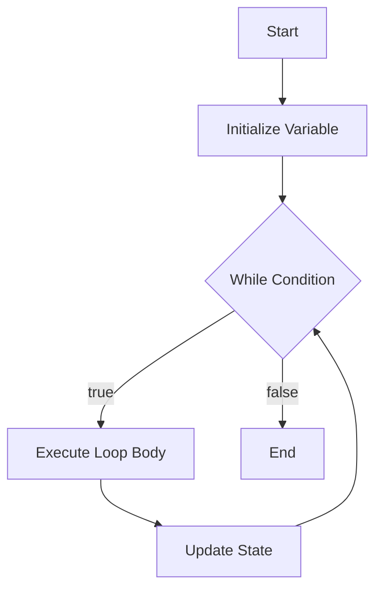

# 📘 Java While Loop

## 1. What Is a While Loop?

A `while` loop in Java is used to repeatedly execute a block of code **as long as a condition is `true`**.

The basic idea is:

```text
Condition
    |
    v
  true?
  /   \
Yes    No
 |      |
 v      v
Execute End
   |
   v
Check condition again
```

For example:

```java
int count = 1;

while (count <= 5) {

    System.out.println(count);

    count++;
}
```

Output:

```text
1
2
3
4
5
```

The loop continues while:

```java
count <= 5
```

is `true`.

---

# 2. Basic Syntax

The basic syntax is:

```java
while (condition) {

    // code to execute
}
```

Example:

```java
int number = 1;

while (number <= 5) {

    System.out.println(number);

    number++;
}
```

---

# 3. How a While Loop Works

A `while` loop follows this process:

```text
             Start
               |
               v
        Initialize variable
               |
               v
       +----------------+
       | Check condition|
       +----------------+
               |
          +----+----+
          |         |
        true      false
          |         |
          v         v
     Execute code  End
          |
          v
     Update variable
          |
          +---------> Check condition again
```

For:

```java
int number = 1;

while (number <= 5) {

    System.out.println(number);

    number++;
}
```

The execution is:

```text
number = 1
   |
   v
1 <= 5 ? ---- Yes
   |
   v
Print 1
   |
   v
number = 2
   |
   v
2 <= 5 ? ---- Yes
   |
   v
Print 2
   |
   v
number = 3
   |
   v
3 <= 5 ? ---- Yes
   |
   v
Print 3
   |
   v
number = 4
   |
   v
4 <= 5 ? ---- Yes
   |
   v
Print 4
   |
   v
number = 5
   |
   v
5 <= 5 ? ---- Yes
   |
   v
Print 5
   |
   v
number = 6
   |
   v
6 <= 5 ? ---- No
   |
   v
End
```

---

# 4. Simple Example

```java
public class Main {

    public static void main(String[] args) {

        int count = 1;

        while (count <= 5) {

            System.out.println("Count: " + count);

            count++;
        }
    }
}
```

Output:

```text
Count: 1
Count: 2
Count: 3
Count: 4
Count: 5
```

---

# 5. Why Do We Need Loops?

Without a loop, you might write:

```java
System.out.println(1);
System.out.println(2);
System.out.println(3);
System.out.println(4);
System.out.println(5);
```

With a loop:

```java
int count = 1;

while (count <= 5) {

    System.out.println(count);

    count++;
}
```

The loop reduces repetitive code.

---

# 6. The Three Important Parts

A typical while loop has three important parts:

```text
Initialization
      |
      v
Condition
      |
      v
Body
      |
      v
Update
      |
      +------> Condition
```

Example:

```java
int count = 1;       // Initialization

while (count <= 5) { // Condition

    System.out.println(count); // Body

    count++;         // Update
}
```

---

# 7. Initialization

Initialization defines the starting value.

Example:

```java
int count = 1;
```

The variable starts at:

```text
1
```

---

# 8. Condition

The condition determines whether the loop should continue.

Example:

```java
while (count <= 5)
```

If:

```text
count = 3
```

then:

```text
3 <= 5
```

is `true`.

The loop continues.

If:

```text
count = 6
```

then:

```text
6 <= 5
```

is `false`.

The loop stops.

---

# 9. Loop Body

The loop body is the code inside `{ }`.

Example:

```java
while (count <= 5) {

    System.out.println(count);
}
```

This is the loop body:

```java
System.out.println(count);
```

---

# 10. Update

The update changes the variable so the loop can eventually stop.

Example:

```java
count++;
```

This means:

```java
count = count + 1;
```

For example:

```text
count = 1
count = 2
count = 3
count = 4
count = 5
count = 6
```

When count becomes `6`, the condition:

```java
count <= 5
```

becomes false.

---

# 11. Important: Avoid Infinite Loops

Consider:

```java
int count = 1;

while (count <= 5) {

    System.out.println(count);
}
```

This is an **infinite loop** because `count` never changes.

The condition:

```java
count <= 5
```

will always remain true.

The program will continuously print:

```text
1
1
1
1
1
1
...
```

The correct version is:

```java
int count = 1;

while (count <= 5) {

    System.out.println(count);

    count++;
}
```

---

# 12. Infinite Loop Diagram

```text
       count = 1
           |
           v
    count <= 5 ?
           |
          YES
           |
           v
       Print count
           |
           |
           +--------+
                    |
                    v
             Check condition
                    |
                   YES
                    |
                    +------> Print count
```

There is no update, so the loop never reaches `false`.

---

# 13. While Loop With Decrement

A while loop does not have to increment.

Example:

```java
int count = 5;

while (count >= 1) {

    System.out.println(count);

    count--;
}
```

Output:

```text
5
4
3
2
1
```

Here:

```java
count--;
```

means:

```java
count = count - 1;
```

---

# 14. Counting From 1 to 10

```java
int number = 1;

while (number <= 10) {

    System.out.println(number);

    number++;
}
```

Output:

```text
1
2
3
4
5
6
7
8
9
10
```

---

# 15. Counting From 10 to 1

```java
int number = 10;

while (number >= 1) {

    System.out.println(number);

    number--;
}
```

Output:

```text
10
9
8
7
6
5
4
3
2
1
```

---

# 16. Printing Even Numbers

You can use a while loop to print even numbers.

```java
int number = 2;

while (number <= 10) {

    System.out.println(number);

    number += 2;
}
```

Output:

```text
2
4
6
8
10
```

---

# 17. Printing Odd Numbers

```java
int number = 1;

while (number <= 10) {

    System.out.println(number);

    number += 2;
}
```

Output:

```text
1
3
5
7
9
```

---

# 18. Calculate a Sum

A while loop can calculate a total.

Example:

```java
int number = 1;
int sum = 0;

while (number <= 5) {

    sum += number;

    number++;
}

System.out.println("Sum = " + sum);
```

Output:

```text
Sum = 15
```

Calculation:

```text
1 + 2 + 3 + 4 + 5 = 15
```

---

# 19. Sum Flow Diagram

```text
number = 1
sum = 0
    |
    v
number <= 5?
    |
   YES
    |
    v
sum = sum + number
    |
    v
number++
    |
    +----------+
               |
               v
       Check condition
               |
               v
number <= 5?
```

---

# 20. Calculate a Product

You can also calculate multiplication.

Example:

```java
int number = 1;
int product = 1;

while (number <= 5) {

    product *= number;

    number++;
}

System.out.println("Product = " + product);
```

Output:

```text
Product = 120
```

Because:

```text
1 × 2 × 3 × 4 × 5 = 120
```

---

# 21. Factorial Example

A while loop can calculate factorial.

For example:

```text
5! = 5 × 4 × 3 × 2 × 1
```

Java:

```java
int number = 5;
int factorial = 1;

while (number >= 1) {

    factorial *= number;

    number--;
}

System.out.println("Factorial = " + factorial);
```

Output:

```text
Factorial = 120
```

---

# 22. While Loop With String

A while loop can process a string character by character.

Example:

```java
String text = "Java";

int index = 0;

while (index < text.length()) {

    System.out.println(text.charAt(index));

    index++;
}
```

Output:

```text
J
a
v
a
```

---

# 23. String Processing Flow

```text
String: "Java"

index = 0
   |
   v
index < length?
   |
  YES
   |
   v
text.charAt(index)
   |
   v
Print character
   |
   v
index++
   |
   +---------> Check condition
```

---

# 24. While Loop With Array

You can use a while loop to process an array.

Example:

```java
String[] names = {
    "John",
    "David",
    "Mary"
};

int index = 0;

while (index < names.length) {

    System.out.println(names[index]);

    index++;
}
```

Output:

```text
John
David
Mary
```

---

# 25. Array Processing

The condition:

```java
index < names.length
```

ensures that the index stays within the array boundaries.

For:

```text
names.length = 3
```

the indexes are:

```text
0
1
2
```

The loop stops when:

```text
index = 3
```

because:

```text
3 < 3
```

is false.

---

# 26. Reading User Input

A while loop is commonly used when repeatedly processing user input.

Example:

```java
import java.util.Scanner;

public class Main {

    public static void main(String[] args) {

        Scanner scanner = new Scanner(System.in);

        String input = "";

        while (!input.equals("exit")) {

            System.out.print("Enter command: ");

            input = scanner.nextLine();

            System.out.println(
                    "You entered: " + input
            );
        }

        scanner.close();
    }
}
```

The loop continues until the user enters:

```text
exit
```

---

# 27. User Input Loop Flow

```text
        Start
          |
          v
    Ask for input
          |
          v
    Read input
          |
          v
   Is input "exit"?
       /       \
     No         Yes
      |           |
      v           v
   Process       End
    input
      |
      +-------> Ask again
```

---

# 28. Better String Comparison

When comparing strings, use:

```java
input.equals("exit")
```

instead of:

```java
input == "exit"
```

Correct:

```java
while (!input.equals("exit")) {
    // ...
}
```

Even safer when the variable could be `null`:

```java
while (!"exit".equals(input)) {
    // ...
}
```

---

# 29. Using a Boolean Condition

A while loop can use a boolean variable.

Example:

```java
boolean running = true;

while (running) {

    System.out.println("Application is running.");

    running = false;
}
```

Output:

```text
Application is running.
```

The loop stops when:

```java
running = false;
```

---

# 30. Boolean Loop Flow

```text
running = true
      |
      v
while (running)
      |
     YES
      |
      v
Execute code
      |
      v
running = false
      |
      v
Check condition
      |
      v
   false
      |
      v
     End
```

---

# 31. Using `break`

The `break` statement immediately terminates a loop.

Example:

```java
int number = 1;

while (number <= 10) {

    if (number == 5) {
        break;
    }

    System.out.println(number);

    number++;
}
```

Output:

```text
1
2
3
4
```

When:

```java
number == 5
```

becomes true, `break` stops the loop.

---

# 32. Break Flow

```text
number = 1
    |
    v
Condition
    |
    v
Execute
    |
    v
number == 5?
   /      \
 YES       NO
  |         |
  v         v
 break    number++
  |         |
  v         +-----> Condition
 End
```

---

# 33. Using `continue`

The `continue` statement skips the rest of the current iteration and moves to the next iteration.

Example:

```java
int number = 0;

while (number < 5) {

    number++;

    if (number == 3) {
        continue;
    }

    System.out.println(number);
}
```

Output:

```text
1
2
4
5
```

The number `3` is skipped.

---

# 34. Continue Flow

```text
       Start
         |
         v
     number++
         |
         v
    number == 3?
      /      \
    YES       NO
     |         |
     v         v
 continue    Print
     |         |
     |         v
     |      next iteration
     |
     +-------> next iteration
```

---

# 35. Important With `continue`

Be careful about where the update occurs.

This is dangerous:

```java
int number = 1;

while (number <= 5) {

    if (number == 3) {
        continue;
    }

    number++;
}
```

When `number` becomes `3`, `continue` executes before:

```java
number++;
```

Therefore `number` remains `3` forever.

This creates an infinite loop.

Better:

```java
int number = 1;

while (number <= 5) {

    number++;

    if (number == 3) {
        continue;
    }

    System.out.println(number);
}
```

Or structure the condition so that the update always occurs.

---

# 36. Nested While Loops

A while loop can contain another while loop.

Example:

```java
int outer = 1;

while (outer <= 3) {

    int inner = 1;

    while (inner <= 3) {

        System.out.println(
                "Outer: " + outer +
                ", Inner: " + inner
        );

        inner++;
    }

    outer++;
}
```

Output:

```text
Outer: 1, Inner: 1
Outer: 1, Inner: 2
Outer: 1, Inner: 3
Outer: 2, Inner: 1
Outer: 2, Inner: 2
Outer: 2, Inner: 3
Outer: 3, Inner: 1
Outer: 3, Inner: 2
Outer: 3, Inner: 3
```

---

# 37. Nested While Diagram

```text
Outer Loop
    |
    v
Outer = 1
    |
    v
Inner Loop
    |
    +-- Inner = 1
    |
    +-- Inner = 2
    |
    +-- Inner = 3
    |
    v
Outer = 2
    |
    v
Inner Loop
    |
    +-- Inner = 1
    |
    +-- Inner = 2
    |
    +-- Inner = 3
    |
    v
Outer = 3
    |
    v
Inner Loop
    |
    +-- Inner = 1
    |
    +-- Inner = 2
    |
    +-- Inner = 3
    |
    v
   End
```

---

# 38. While Loop vs For Loop

The same operation can often be written using either `while` or `for`.

### While

```java
int number = 1;

while (number <= 5) {

    System.out.println(number);

    number++;
}
```

### For

```java
for (int number = 1; number <= 5; number++) {

    System.out.println(number);
}
```

Both produce:

```text
1
2
3
4
5
```

---

# 39. When Should You Use While?

A `while` loop is especially useful when you **don't know in advance how many times the loop will execute**.

Example:

```java
while (!userInput.equals("exit")) {

    processInput();
}
```

The number of iterations depends on the user.

Another example:

```java
while (connection.isOpen()) {

    processMessage();
}
```

The number of iterations depends on when the connection closes.

---

# 40. While vs For

| Situation                      | Recommended             |
| ------------------------------ | ----------------------- |
| Known number of iterations     | `for`                   |
| Unknown number of iterations   | `while`                 |
| User-controlled loop           | `while`                 |
| Loop until a condition changes | `while`                 |
| Iterate over an array          | `for` or enhanced `for` |
| Simple counter                 | `for`                   |
| Application/process loop       | `while`                 |

This is a guideline, not a strict rule.

---

# 41. While Loop With Counter

Example:

```java
int counter = 0;

while (counter < 3) {

    System.out.println(
            "Processing..."
    );

    counter++;
}
```

Output:

```text
Processing...
Processing...
Processing...
```

---

# 42. Banking Example: Retry Processing

A simple example is retrying an operation.

```java
int attempt = 1;
int maxAttempts = 3;
boolean success = false;

while (attempt <= maxAttempts && !success) {

    System.out.println(
            "Processing attempt: " + attempt
    );

    success = processTransaction();

    attempt++;
}
```

Conceptually:

```text
Attempt 1
   |
   v
Success?
  /   \
Yes    No
 |      |
End   Attempt 2
          |
          v
       Success?
        /   \
      Yes    No
       |      |
      End   Attempt 3
```

Note that real banking transaction retry logic must be designed carefully to avoid duplicate financial transactions. Idempotency, transaction status, and unique transaction references are important.

---

# 43. Banking Example: Processing Records

Suppose a system processes pending records.

```java
int processed = 0;

while (processed < 100) {

    processNextRecord();

    processed++;
}
```

This processes up to 100 records.

---

# 44. Queue Processing Example

A conceptual message-processing loop:

```java
while (queue.hasMessages()) {

    Message message = queue.receive();

    processMessage(message);
}
```

The loop continues while messages are available.

This type of pattern is common in backend applications.

---

# 45. AMQ Message Processing Example

For a message queue application, the conceptual logic might look like:

```java
while (consumer.isRunning()) {

    Message message = consumer.receive();

    if (message != null) {

        processMessage(message);
    }
}
```

The loop continues while the consumer is running.

In real Java messaging applications, the messaging framework or listener container often manages this loop for you, so you normally don't need to implement a manual infinite `while` loop.

---

# 46. Spring Boot Example

In Spring Boot, message listeners are commonly preferred over manually managing a `while` loop.

Conceptually:

```java
@JmsListener(destination = "transaction.queue")
public void receiveMessage(String message) {

    System.out.println(
            "Received: " + message
    );

    processMessage(message);
}
```

The framework handles message consumption and invocation.

This is an important enterprise programming principle:

```text
Manual while loop
       |
       v
You manage lifecycle,
errors, threads, shutdown, etc.

Framework listener
       |
       v
Framework manages
message consumption lifecycle
```

---

# 47. While Loop With Input Validation

A while loop is useful when input must satisfy a condition.

Example:

```java
Scanner scanner = new Scanner(System.in);

int age = -1;

while (age < 0) {

    System.out.print("Enter age: ");

    age = scanner.nextInt();
}

System.out.println(
        "Age = " + age
);

scanner.close();
```

The loop continues until the user enters a non-negative number.

---

# 48. Input Validation Flow

```text
       User Input
           |
           v
      Is age < 0?
        /       \
      Yes        No
       |          |
       v          v
   Ask again     Accept
       |          |
       +----->    End
```

---

# 49. While Loop With Multiple Conditions

A while loop can contain multiple conditions.

Example:

```java
int number = 1;
boolean running = true;

while (number <= 10 && running) {

    System.out.println(number);

    if (number == 5) {
        running = false;
    }

    number++;
}
```

Output:

```text
1
2
3
4
5
```

The loop continues only when both conditions are true:

```java
number <= 10 && running
```

---

# 50. Logical Operators in While Conditions

You can use:

```java
&&
||
!
```

Example:

```java
while (count < 10 && running) {
    // ...
}
```

Both conditions must be true.

Example:

```java
while (count < 10 || retry) {
    // ...
}
```

At least one condition must be true.

Example:

```java
while (!finished) {
    // ...
}
```

The loop continues while `finished` is false.

---

# 51. While Loop With Object State

A loop can depend on an object's state.

Example:

```java
while (processor.hasWork()) {

    processor.processNext();
}
```

This is often more meaningful than using a numeric counter when the loop is driven by application state.

---

# 52. Avoid Hard-Coded Infinite Loops Unless Intentional

You may see:

```java
while (true) {

    // process something
}
```

This is an infinite loop.

It can be valid for certain applications, workers, servers, or consumers, but it should have a clear shutdown mechanism.

For example:

```java
while (running) {

    process();
}
```

This makes the lifecycle easier to understand.

---

# 53. Infinite Loop With Break

Another pattern is:

```java
while (true) {

    String input = readInput();

    if ("exit".equals(input)) {
        break;
    }

    process(input);
}
```

Flow:

```text
while true
    |
    v
Read input
    |
    v
Input = exit?
   /       \
 Yes        No
  |          |
  v          v
break      process
  |          |
  |          +------> Read input
  |
  v
 End
```

This can be useful, but use it carefully because the termination condition is inside the loop.

---

# 54. Difference Between `break` and `continue`

| Keyword    | Purpose                                 |
| ---------- | --------------------------------------- |
| `break`    | Completely exits the loop               |
| `continue` | Skips current iteration                 |
| `break`    | Execution continues after the loop      |
| `continue` | Execution continues with next iteration |

Example:

```java
int number = 0;

while (number < 5) {

    number++;

    if (number == 2) {
        continue;
    }

    if (number == 4) {
        break;
    }

    System.out.println(number);
}
```

Output:

```text
1
3
```

Explanation:

```text
1 -> print
2 -> continue
3 -> print
4 -> break
5 -> never reached
```

---

# 55. Common Mistake: Forgetting the Update

Incorrect:

```java
int number = 1;

while (number <= 5) {

    System.out.println(number);
}
```

Problem:

```text
number never changes
        |
        v
number = 1
        |
        v
1 <= 5 → true
        |
        v
Print 1
        |
        v
1 <= 5 → true
        |
        v
Print 1
        |
       ...
```

Correct:

```java
int number = 1;

while (number <= 5) {

    System.out.println(number);

    number++;
}
```

---

# 56. Common Mistake: Wrong Condition

Incorrect:

```java
int number = 1;

while (number >= 5) {

    System.out.println(number);

    number++;
}
```

The condition:

```java
1 >= 5
```

is already false.

Therefore the loop executes zero times.

Correct:

```java
while (number <= 5) {
```

---

# 57. Common Mistake: Off-by-One Error

Consider:

```java
int number = 1;

while (number < 5) {

    System.out.println(number);

    number++;
}
```

Output:

```text
1
2
3
4
```

It does not print `5`.

If you want `1` through `5`:

```java
while (number <= 5) {
```

This type of error is called an **off-by-one error**.

---

# 58. `<` vs `<=`

These conditions are different.

```java
number < 5
```

means:

```text
1, 2, 3, 4
```

while:

```java
number <= 5
```

means:

```text
1, 2, 3, 4, 5
```

Diagram:

```text
number < 5

1  2  3  4  |  5
-------------+-----
   included  | excluded
```

```text
number <= 5

1  2  3  4  5  |  6
----------------+----
    included    | excluded
```

---

# 59. While Loop With `char`

You can use a character as the loop variable.

Example:

```java
char letter = 'A';

while (letter <= 'E') {

    System.out.println(letter);

    letter++;
}
```

Output:

```text
A
B
C
D
E
```

---

# 60. While Loop With Decimal Values

You can technically use floating-point values:

```java
double value = 0.0;

while (value <= 1.0) {

    System.out.println(value);

    value += 0.2;
}
```

However, floating-point precision can produce surprising results.

For precise counting or financial calculations, avoid using `double` as a loop counter where exact decimal behavior is required.

For money, use `BigDecimal` rather than `double`.

---

# 61. While Loop With BigDecimal

Example:

```java
import java.math.BigDecimal;

BigDecimal amount =
        BigDecimal.ZERO;

BigDecimal limit =
        new BigDecimal("10.00");

while (amount.compareTo(limit) <= 0) {

    System.out.println(amount);

    amount = amount.add(
            new BigDecimal("2.00")
    );
}
```

Output:

```text
0.00
2.00
4.00
6.00
8.00
10.00
```

For financial applications, this approach avoids the binary floating-point precision problems associated with `double`.

---

# 62. While Loop With Collections

You can manually use an iterator:

```java
List<String> names = List.of(
        "John",
        "David",
        "Mary"
);

Iterator<String> iterator =
        names.iterator();

while (iterator.hasNext()) {

    String name = iterator.next();

    System.out.println(name);
}
```

Output:

```text
John
David
Mary
```

However, for simple collection iteration, enhanced `for` or `forEach` is usually more readable.

---

# 63. While Loop and Iterator

The pattern is:

```text
Iterator
    |
    v
hasNext()?
   /   \
 Yes    No
  |      |
  v      v
next()  End
  |
  v
Process
  |
  +-----> hasNext()
```

Example:

```java
while (iterator.hasNext()) {

    String value = iterator.next();

    process(value);
}
```

---

# 64. While Loop and Thread Processing

A worker thread might conceptually use:

```java
while (running) {

    Task task = queue.take();

    process(task);
}
```

Here:

```java
running
```

controls the lifecycle.

However, production concurrent applications need proper thread interruption and shutdown handling.

For example:

```java
while (running && !Thread.currentThread().isInterrupted()) {

    // process work
}
```

The exact implementation depends on the concurrency architecture.

---

# 65. While Loop in Real Applications

While loops are useful for:

```text
1. Input validation
2. User interaction
3. Retry operations
4. Processing queues
5. Processing streams
6. Reading data
7. Waiting for state changes
8. Worker processes
9. Iterating with an iterator
10. Repeating until a business condition changes
```

---

# 66. While Loop vs Do-While Loop

Java also has a `do-while` loop.

### While

```java
while (condition) {

    // code
}
```

The condition is checked **before** execution.

### Do-While

```java
do {

    // code

} while (condition);
```

The condition is checked **after** execution.

---

# 67. Important Difference

Consider:

```java
int number = 10;

while (number < 5) {

    System.out.println(number);
}
```

Output:

```text
No output
```

The condition is false before the first execution.

Now:

```java
int number = 10;

do {

    System.out.println(number);

} while (number < 5);
```

Output:

```text
10
```

The `do-while` loop executes at least once.

---

# 68. While vs Do-While Diagram

### While

```text
        Start
          |
          v
      Condition
       /     \
    false    true
      |        |
      v        v
     End     Execute
                |
                +----> Condition
```

### Do-While

```text
        Start
          |
          v
       Execute
          |
          v
      Condition
       /     \
    false    true
      |        |
      v        +----> Execute
     End
```

---

# 69. When to Use While vs Do-While

Use `while` when:

```text
The condition should be checked
before the first execution.
```

Example:

```java
while (hasData()) {

    processData();
}
```

Use `do-while` when:

```text
The operation must execute
at least once.
```

Example:

```java
do {

    displayMenu();

    option = readOption();

} while (option != 0);
```

---

# 70. Java 21 While Loop

The basic while loop syntax remains straightforward in Java 21:

```java
while (condition) {

    // statements
}
```

Java 21 does not change the fundamental behavior of the `while` loop.

The important concepts remain:

```text
condition
body
update
break
continue
nested loops
```

---

# 71. Complete Java Example

```java
public class Main {

    public static void main(String[] args) {

        int number = 1;
        int sum = 0;

        while (number <= 10) {

            System.out.println(
                    "Processing number: " + number
            );

            sum += number;

            number++;
        }

        System.out.println(
                "Total = " + sum
        );
    }
}
```

Output:

```text
Processing number: 1
Processing number: 2
Processing number: 3
Processing number: 4
Processing number: 5
Processing number: 6
Processing number: 7
Processing number: 8
Processing number: 9
Processing number: 10
Total = 55
```

---

# 72. Complete Input Example

```java
import java.util.Scanner;

public class Main {

    public static void main(String[] args) {

        Scanner scanner = new Scanner(System.in);

        String command;

        while (true) {

            System.out.print(
                    "Enter command (exit to stop): "
            );

            command = scanner.nextLine();

            if ("exit".equalsIgnoreCase(command)) {
                break;
            }

            System.out.println(
                    "Processing: " + command
            );
        }

        System.out.println("Application stopped.");

        scanner.close();
    }
}
```

Example:

```text
Enter command (exit to stop): create
Processing: create

Enter command (exit to stop): update
Processing: update

Enter command (exit to stop): delete
Processing: delete

Enter command (exit to stop): exit
Application stopped.
```

---

# 73. Practical Banking Example

Suppose a system needs to process pending transactions.

Conceptually:

```java
int processed = 0;

while (processed < pendingTransactions.size()) {

    Transaction transaction =
            pendingTransactions.get(processed);

    processTransaction(transaction);

    processed++;
}
```

The flow is:

```text
Pending Transactions
        |
        v
processed = 0
        |
        v
processed < size?
      /       \
    Yes        No
     |          |
     v          v
Get transaction End
     |
     v
Process transaction
     |
     v
processed++
     |
     +-------> Condition
```

---

# 74. Practical Message Processing Example

A simplified message-processing design:

```java
while (consumer.isRunning()) {

    Message message = consumer.receive();

    if (message == null) {
        continue;
    }

    processMessage(message);
}
```

Conceptually:

```text
Consumer Running?
       |
      YES
       |
       v
 Receive Message
       |
       v
 Message Available?
    /          \
  No            Yes
   |             |
   v             v
continue    Process Message
   |             |
   +-------------+
          |
          v
   Check Consumer
```

Again, in frameworks such as Spring JMS, the framework normally manages this consumer loop.

---

# 75. Best Practices

## 1. Make the termination condition clear

Prefer:

```java
while (count < maxCount) {
    ...
}
```

over unclear conditions.

---

## 2. Always ensure the loop can terminate

Ask yourself:

```text
What causes the condition
to become false?
```

---

## 3. Be careful with `continue`

Make sure `continue` does not skip the code responsible for updating the loop condition.

---

## 4. Avoid unnecessary nested loops

Deep nesting can make code difficult to understand.

---

## 5. Avoid manual loops when a collection API is clearer

Instead of:

```java
int index = 0;

while (index < names.size()) {

    System.out.println(names.get(index));

    index++;
}
```

you might use:

```java
for (String name : names) {

    System.out.println(name);
}
```

or:

```java
names.forEach(System.out::println);
```

Choose the approach that best communicates the intent.

---

## 6. Be careful with infinite loops

This:

```java
while (true) {
    ...
}
```

should have a clear lifecycle and shutdown strategy when used in production systems.

---

# 76. Common Interview Questions

## Question 1

What is a while loop?

A `while` loop repeatedly executes a block of code while a specified condition is `true`.

---

## Question 2

When is the condition checked?

The condition is checked **before each iteration**.

---

## Question 3

Can a while loop execute zero times?

Yes.

Example:

```java
int number = 10;

while (number < 5) {

    System.out.println(number);
}
```

The body never executes because the initial condition is false.

---

## Question 4

Can a while loop become infinite?

Yes.

Example:

```java
while (true) {

    System.out.println("Running...");
}
```

It continues forever unless something terminates it.

---

## Question 5

What is the difference between `break` and `continue`?

`break` exits the loop completely.

`continue` skips the current iteration and proceeds to the next iteration.

---

## Question 6

What is the difference between while and do-while?

`while` checks the condition before executing.

`do-while` executes once before checking the condition.

---

## Question 7

When should you use while instead of for?

A while loop is often preferable when the number of iterations is not known in advance and the loop is driven by a condition or state.

---

## Question 8

Can a while loop contain another while loop?

Yes.

This is called a nested while loop.

---

## Question 9

Can you use `&&` and `||` in a while condition?

Yes.

Example:

```java
while (running && count < 10) {

    process();
}
```

---

## Question 10

What is an off-by-one error?

An off-by-one error occurs when a loop executes one time too many or one time too few because of an incorrect boundary condition.

---

# 77. Practice Exercise 1

Create a program that prints numbers:

```text
1
2
3
4
5
6
7
8
9
10
```

Use a `while` loop.

Expected output:

```text
1
2
3
4
5
6
7
8
9
10
```

---

# 78. Practice Exercise 2

Print numbers from `10` down to `1`.

Expected output:

```text
10
9
8
7
6
5
4
3
2
1
```

---

# 79. Practice Exercise 3

Print all even numbers from `1` to `20`.

Expected output:

```text
2
4
6
8
10
12
14
16
18
20
```

---

# 80. Practice Exercise 4

Calculate the sum from `1` to `100`.

Expected output:

```text
Sum = 5050
```

---

# 81. Practice Exercise 5

Calculate:

```text
5!
```

Expected output:

```text
120
```

---

# 82. Practice Exercise 6

Create a program that asks the user for a password repeatedly until the correct password is entered.

Concept:

```text
Enter password
      |
      v
Correct?
  /       \
No         Yes
 |          |
 v          v
Ask again   End
```

---

# 83. Practice Exercise 7

Create a menu:

```text
1. Create Account
2. Update Account
3. Delete Account
4. Exit
```

Continue displaying the menu until the user selects:

```text
4
```

---

# 84. Practice Exercise 8

Create a program that processes numbers until the user enters `0`.

Example:

```text
Enter number: 10
Enter number: 20
Enter number: 30
Enter number: 0
```

Expected result:

```text
Total = 60
```

---

# 85. Practice Exercise 9

Create a simple transaction-processing simulation.

Process transactions while:

```java
transactionCount < 5
```

For each transaction print:

```text
Processing transaction 1
Processing transaction 2
Processing transaction 3
Processing transaction 4
Processing transaction 5
```

---

# 86. Practice Exercise 10

Create a message-processing simulation:

```java
while (messageCount < 10) {

    // process message

}
```

Print:

```text
Processing message 1
Processing message 2
...
Processing message 10
```

---

# 87. Key Takeaways

```text
1. A while loop repeatedly executes code while a condition is true.

2. The condition is checked before every iteration.

3. A while loop can execute zero times.

4. Initialization defines the starting state.

5. The condition determines whether the loop continues.

6. The loop body contains the repeated code.

7. The update changes the state of the loop.

8. Forgetting the update can create an infinite loop.

9. break exits the loop completely.

10. continue skips the current iteration.

11. while loops can be nested.

12. while loops can use &&, ||, and !.

13. while is useful when the number of iterations is unknown.

14. for is often better for simple counter-based iteration.

15. do-while executes at least once.

16. Be careful with off-by-one errors.

17. Be careful with continue and loop-variable updates.

18. Infinite loops can be useful for workers and consumers,
    but production code needs a proper shutdown strategy.

19. For banking and financial systems, loop logic must consider
    transaction safety, idempotency, and failure handling.

20. In Spring Boot messaging applications, framework-managed
    listeners are often preferable to manually implementing
    message-consumption while loops.
```

---

# 88. Final Concept Diagram



---

# 89. Final Example to Remember

If you remember only one basic example, remember this:

```java
int count = 1;

while (count <= 5) {

    System.out.println(count);

    count++;
}
```

The concept is:

```text
Initialize
    |
    v
Check Condition
    |
    +---- false ----> End
    |
   true
    |
    v
Execute Code
    |
    v
Update
    |
    +--------------> Check Condition
```

The most important question to ask whenever you write a `while` loop is:

```text
"How will this loop eventually stop?"
```
