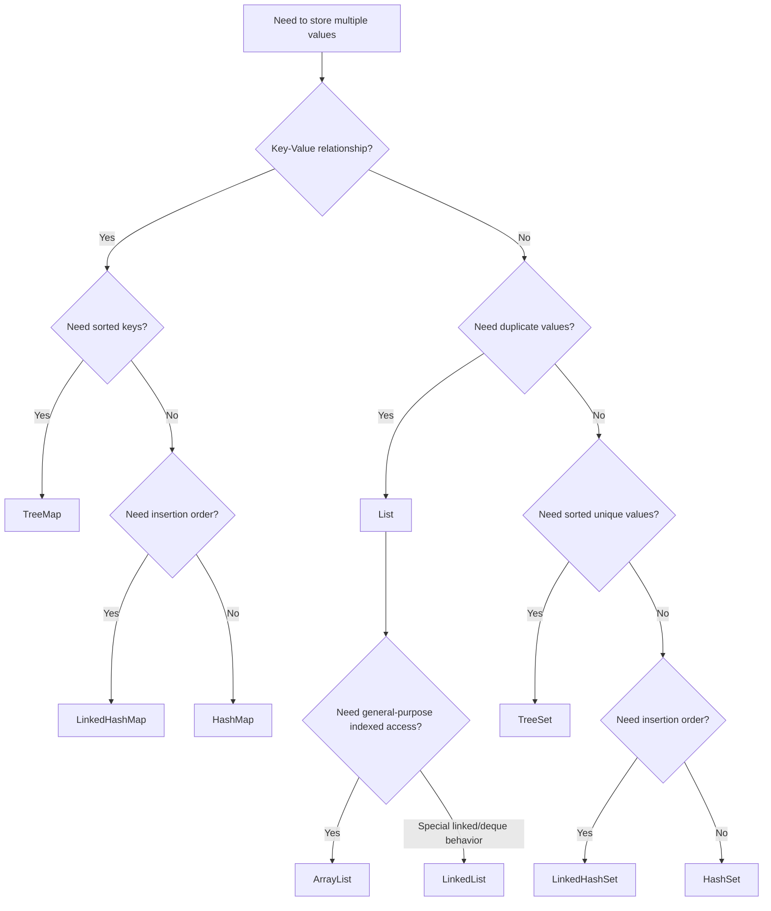
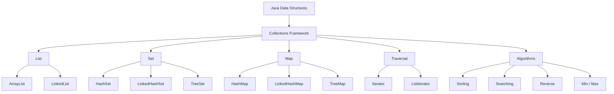

# 📘 Java Data Structures

---

## 1. What Are Data Structures?

A **data structure** is a way of organizing and storing data so that a program can efficiently access, modify, search, and process that data.

For example, imagine we have several customer accounts:

```text
ACC001
ACC002
ACC003
ACC004
ACC005
```

We need a way to store these accounts in our Java application.

Java provides several data structures for this purpose.

Common examples include:

```text
Array
List
Set
Map
Queue
Deque
```

The Java Collections Framework provides many ready-to-use implementations of these structures.

---

# 2. Java Data Structures Overview

A simplified view of Java's collection hierarchy is:

```text
                    Iterable
                       |
                    Collection
                       |
          +------------+-------------+
          |            |             |
         List          Set          Queue
          |            |             |
     +----+----+    +---+---+       ...
     |         |    |       |
ArrayList  LinkedList |    SortedSet
                      |       |
                   HashSet   TreeSet
                      |
                 LinkedHashSet


                  Map
                   |
          +--------+---------+
          |        |         |
       HashMap  TreeMap  LinkedHashMap
```

Note that `Map` is **not** a subtype of `Collection`.

This is an important concept.

---

# 3. Java Collections Framework

The **Java Collections Framework (JCF)** is a set of interfaces, classes, and algorithms provided by Java for storing and manipulating groups of objects.

The main interfaces include:

```text
Collection
    |
    +-- List
    |
    +-- Set
    |
    +-- Queue

Map
```

Important implementations include:

```text
List
 |
 +-- ArrayList
 |
 +-- LinkedList

Set
 |
 +-- HashSet
 |
 +-- LinkedHashSet
 |
 +-- TreeSet

Map
 |
 +-- HashMap
 |
 +-- LinkedHashMap
 |
 +-- TreeMap
```

---

# 4. Why Do We Need Collections?

Before collections, developers often used arrays.

Example:

```java
String[] accounts = new String[3];

accounts[0] = "ACC001";
accounts[1] = "ACC002";
accounts[2] = "ACC003";
```

The problem is that an array has a fixed size.

```java
String[] accounts = new String[3];
```

The size is:

```text
3
```

You cannot simply add a fourth element.

Collections solve many of these problems.

Example:

```java
List<String> accounts = new ArrayList<>();

accounts.add("ACC001");
accounts.add("ACC002");
accounts.add("ACC003");
accounts.add("ACC004");
```

The `ArrayList` can grow dynamically.

---

# 5. Collections vs Arrays

| Feature                | Array               | Collection                           |
| ---------------------- | ------------------- | ------------------------------------ |
| Size                   | Fixed               | Usually dynamic                      |
| Add elements           | Manual              | Built-in methods                     |
| Remove elements        | Manual              | Built-in methods                     |
| Search                 | Manual              | APIs available                       |
| Sorting                | `Arrays.sort()`     | `Collections.sort()` / `List.sort()` |
| Generics               | Supported           | Strongly supported                   |
| Utility methods        | Limited             | Many                                 |
| Common implementations | `int[]`, `String[]` | `ArrayList`, `HashSet`, `HashMap`    |

Example array:

```java
String[] names = {
    "John",
    "David",
    "Mary"
};
```

Example collection:

```java
List<String> names = new ArrayList<>();

names.add("John");
names.add("David");
names.add("Mary");
```

---

# 6. Generics

Java collections commonly use **generics**.

Example:

```java
List<String> names = new ArrayList<>();
```

This means:

```text
List
 |
 +-- only String objects
```

You cannot normally add an integer:

```java
names.add(100);
```

This produces a compile-time error.

Instead:

```java
List<Integer> numbers = new ArrayList<>();

numbers.add(100);
numbers.add(200);
```

Generics provide type safety.

---

# 7. Raw Collections

Older Java code may contain:

```java
List names = new ArrayList();
```

This is called a raw type.

Avoid this in modern Java.

Prefer:

```java
List<String> names = new ArrayList<>();
```

This provides compile-time type checking.

---

# 8. Java List

A `List` is an ordered collection.

Important characteristics:

```text
1. Maintains order
2. Allows duplicate elements
3. Supports index-based access
4. Usually allows null values
5. Can grow dynamically depending on implementation
```

Example:

```java
List<String> names = new ArrayList<>();

names.add("John");
names.add("David");
names.add("John");
```

The list contains:

```text
Index    Value

  0      John
  1      David
  2      John
```

Duplicates are allowed.

---

# 9. List Interface

`List` is an interface.

You normally declare:

```java
List<String> names;
```

and instantiate an implementation:

```java
names = new ArrayList<>();
```

This is recommended because your code depends on the interface rather than a specific implementation.

Example:

```java
List<String> names = new ArrayList<>();
```

instead of:

```java
ArrayList<String> names = new ArrayList<>();
```

The first approach gives you more flexibility to change implementations later.

---

# 10. Common List Methods

Important methods include:

```java
add()
get()
set()
remove()
contains()
size()
isEmpty()
clear()
indexOf()
lastIndexOf()
```

Example:

```java
List<String> names = new ArrayList<>();

names.add("John");
names.add("David");
names.add("Mary");

System.out.println(names.size());
System.out.println(names.get(0));
System.out.println(names.contains("David"));
```

Output:

```text
3
John
true
```

---

# 11. Add Elements to a List

```java
List<String> names = new ArrayList<>();

names.add("John");
names.add("David");
names.add("Mary");
```

Result:

```text
[John, David, Mary]
```

You can also insert an element at a specific position:

```java
names.add(1, "Peter");
```

Result:

```text
[John, Peter, David, Mary]
```

---

# 12. Get Elements

Use `get()`:

```java
List<String> names = List.of(
    "John",
    "David",
    "Mary"
);

String name = names.get(1);

System.out.println(name);
```

Output:

```text
David
```

Indexes start at `0`.

```text
Index

0 -> John
1 -> David
2 -> Mary
```

---

# 13. Modify Elements

Use `set()`.

```java
List<String> names = new ArrayList<>(
    List.of("John", "David", "Mary")
);

names.set(1, "Peter");

System.out.println(names);
```

Output:

```text
[John, Peter, Mary]
```

---

# 14. Remove Elements

Remove by value:

```java
names.remove("David");
```

Remove by index:

```java
names.remove(1);
```

Example:

```java
List<String> names = new ArrayList<>(
    List.of("John", "David", "Mary")
);

names.remove("David");

System.out.println(names);
```

Output:

```text
[John, Mary]
```

---

# 15. List Size

Use:

```java
names.size();
```

Example:

```java
List<String> names = List.of(
    "John",
    "David",
    "Mary"
);

System.out.println(names.size());
```

Output:

```text
3
```

Remember:

```text
Array:
array.length

List:
list.size()
```

---

# 16. ArrayList

`ArrayList` is one of the most commonly used Java collection classes.

Example:

```java
List<String> names = new ArrayList<>();

names.add("John");
names.add("David");
names.add("Mary");
```

Conceptually:

```text
ArrayList

+-------+-------+-------+
| John  | David | Mary  |
+-------+-------+-------+
   0       1       2
```

It provides fast indexed access.

---

# 17. ArrayList Internal Concept

An `ArrayList` is backed by an internal array.

Conceptually:

```text
ArrayList
    |
    v
Internal Array
    |
    +----+----+----+----+
    | A  | B  | C  |    |
    +----+----+----+----+
     0    1    2    3
```

When the internal capacity becomes insufficient, the implementation grows its internal storage.

You should not normally depend on its exact growth factor because that is an implementation detail.

---

# 18. ArrayList Example

```java
List<String> accounts = new ArrayList<>();

accounts.add("ACC001");
accounts.add("ACC002");
accounts.add("ACC003");

for (String account : accounts) {

    System.out.println(account);
}
```

Output:

```text
ACC001
ACC002
ACC003
```

---

# 19. ArrayList Initial Capacity

You can specify an initial capacity:

```java
List<String> accounts =
    new ArrayList<>(1000);
```

This can be useful when you know approximately how many elements will be added.

However, capacity and size are different concepts.

```text
Capacity = internal storage available

Size = number of actual elements
```

Example:

```java
List<String> names = new ArrayList<>(100);

names.add("John");
```

Conceptually:

```text
Capacity: 100
Size:       1
```

---

# 20. ArrayList Performance

Typical characteristics:

| Operation           | Typical Complexity |
| ------------------- | -----------------: |
| `get(index)`        |               O(1) |
| `set(index)`        |               O(1) |
| Add at end          |     O(1) amortized |
| Add at beginning    |               O(n) |
| Remove at beginning |               O(n) |
| Search by value     |               O(n) |

These are general performance characteristics, not guarantees for every operation under every condition.

---

# 21. LinkedList

`LinkedList` is another implementation of `List`.

It is based on linked nodes.

Conceptually:

```text
+-------+      +-------+      +-------+
| John  | ---> | David | ---> | Mary  |
+-------+      +-------+      +-------+
```

Each node is linked to another node.

In Java, `LinkedList` is also a `Deque`, so it provides operations for both list and deque usage.

---

# 22. LinkedList Example

```java
List<String> names = new LinkedList<>();

names.add("John");
names.add("David");
names.add("Mary");

System.out.println(names);
```

Output:

```text
[John, David, Mary]
```

---

# 23. LinkedList as a Deque

Because `LinkedList` implements `Deque`, you can use:

```java
LinkedList<String> names = new LinkedList<>();

names.addFirst("John");
names.addLast("Mary");

System.out.println(names);
```

Result:

```text
[John, Mary]
```

You can also use:

```java
names.removeFirst();
names.removeLast();
```

---

# 24. ArrayList vs LinkedList

| Feature                 | ArrayList         | LinkedList                           |
| ----------------------- | ----------------- | ------------------------------------ |
| Internal structure      | Dynamic array     | Doubly linked nodes                  |
| Random access           | Fast              | Slow                                 |
| `get(index)`            | O(1) typical      | O(n)                                 |
| Add at end              | Fast              | Fast                                 |
| Insert/remove in middle | Requires shifting | Can be efficient after reaching node |
| Memory overhead         | Lower             | Higher                               |
| Implements Deque        | No                | Yes                                  |

Important:

Do not automatically choose `LinkedList` just because you frequently add/remove elements.

In many real applications, `ArrayList` is still the better default because of memory locality and fast indexed access.

---

# 25. Choosing ArrayList

Use `ArrayList` when:

```text
1. You frequently read elements by index.
2. You mainly add elements at the end.
3. You need a general-purpose List.
4. You want lower memory overhead than LinkedList.
```

Example:

```java
List<Account> accounts = new ArrayList<>();
```

This is a very common choice.

---

# 26. Choosing LinkedList

Use `LinkedList` when its linked/deque behavior actually matches your requirements.

For example:

```java
Deque<String> queue = new LinkedList<>();
```

However, for queue/deque use cases, other implementations such as `ArrayDeque` are often preferable.

Example:

```java
Deque<String> queue = new ArrayDeque<>();
```

---

# 27. List Sorting

Java provides several ways to sort a list.

Example:

```java
List<Integer> numbers = new ArrayList<>(
    List.of(5, 2, 8, 1, 3)
);

numbers.sort(null);

System.out.println(numbers);
```

Output:

```text
[1, 2, 3, 5, 8]
```

---

# 28. Collections.sort()

You can also use:

```java
Collections.sort(numbers);
```

Example:

```java
List<Integer> numbers = new ArrayList<>(
    List.of(5, 2, 8, 1, 3)
);

Collections.sort(numbers);

System.out.println(numbers);
```

Output:

```text
[1, 2, 3, 5, 8]
```

For modern Java, `List.sort()` is often the more direct API.

---

# 29. Sort in Descending Order

Use a comparator:

```java
numbers.sort(Comparator.reverseOrder());
```

Example:

```java
List<Integer> numbers = new ArrayList<>(
    List.of(5, 2, 8, 1, 3)
);

numbers.sort(Comparator.reverseOrder());

System.out.println(numbers);
```

Output:

```text
[8, 5, 3, 2, 1]
```

---

# 30. Sorting Strings

```java
List<String> names = new ArrayList<>(
    List.of("John", "David", "Mary", "Alice")
);

names.sort(null);

System.out.println(names);
```

Output:

```text
[Alice, David, John, Mary]
```

---

# 31. Sorting Custom Objects

Suppose:

```java
class Account {

    private String accountNumber;
    private BigDecimal balance;

    // constructors, getters, setters
}
```

You can sort accounts by balance:

```java
accounts.sort(
    Comparator.comparing(Account::getBalance)
);
```

Descending:

```java
accounts.sort(
    Comparator.comparing(Account::getBalance)
              .reversed()
);
```

---

# 32. Set

A `Set` is a collection that does not allow duplicate elements.

Example:

```java
Set<String> accounts = new HashSet<>();

accounts.add("ACC001");
accounts.add("ACC002");
accounts.add("ACC001");

System.out.println(accounts);
```

Only one `"ACC001"` is retained.

Conceptually:

```text
Input:

ACC001
ACC002
ACC001

        |
        v

Set:

ACC001
ACC002
```

---

# 33. Set Characteristics

A `Set` generally represents:

```text
Unique elements
```

But ordering depends on the implementation.

```text
HashSet
    -> no guaranteed iteration order

LinkedHashSet
    -> insertion order

TreeSet
    -> sorted order
```

This distinction is very important.

---

# 34. HashSet

`HashSet` is a common `Set` implementation.

Example:

```java
Set<String> names = new HashSet<>();

names.add("John");
names.add("David");
names.add("John");

System.out.println(names);
```

The duplicate `"John"` is not added twice.

---

# 35. HashSet and Hashing

A `HashSet` uses hashing internally to organize elements.

Conceptually:

```text
Object
   |
   v
hashCode()
   |
   v
Hash structure
   |
   v
Find / store element
```

For correct behavior, the relationship between:

```java
equals()
```

and:

```java
hashCode()
```

is critical.

---

# 36. equals() and hashCode()

If two objects are considered equal:

```java
a.equals(b)
```

then they must have the same hash code:

```java
a.hashCode() == b.hashCode()
```

For classes used in hash-based collections, implement `equals()` and `hashCode()` consistently.

Example:

```java
public class Account {

    private String accountNumber;

    @Override
    public boolean equals(Object o) {
        // implementation
    }

    @Override
    public int hashCode() {
        // implementation
    }
}
```

Modern Java records automatically provide suitable implementations based on their components.

---

# 37. HashSet Duplicate Example

```java
Set<String> ids = new HashSet<>();

ids.add("100");
ids.add("200");
ids.add("100");

System.out.println(ids.size());
```

Output:

```text
2
```

---

# 38. TreeSet

`TreeSet` stores unique elements in sorted order.

Example:

```java
Set<Integer> numbers = new TreeSet<>();

numbers.add(50);
numbers.add(10);
numbers.add(30);
numbers.add(20);

System.out.println(numbers);
```

Output:

```text
[10, 20, 30, 50]
```

---

# 39. TreeSet Diagram

```text
Input:

50
10
30
20

     |
     v

+----------------+
|    TreeSet     |
+----------------+
        |
        v
10
20
30
50
```

---

# 40. TreeSet Requirements

Elements stored in a `TreeSet` must be mutually comparable, or you must provide a suitable `Comparator`.

Example:

```java
Set<String> names = new TreeSet<>();
```

Strings already implement `Comparable`.

For custom objects:

```java
Set<Account> accounts =
    new TreeSet<>(
        Comparator.comparing(Account::getAccountNumber)
    );
```

---

# 41. TreeSet Performance

Typical operations are:

```text
add       O(log n)
remove    O(log n)
contains  O(log n)
```

because `TreeSet` is based on a tree structure.

---

# 42. LinkedHashSet

`LinkedHashSet` maintains insertion order while ensuring uniqueness.

Example:

```java
Set<String> names = new LinkedHashSet<>();

names.add("John");
names.add("David");
names.add("Mary");
names.add("John");

System.out.println(names);
```

Output:

```text
[John, David, Mary]
```

The second `"John"` is ignored.

---

# 43. HashSet vs LinkedHashSet vs TreeSet

| Feature         | HashSet      | LinkedHashSet                | TreeSet              |
| --------------- | ------------ | ---------------------------- | -------------------- |
| Duplicates      | No           | No                           | No                   |
| Insertion order | No guarantee | Yes                          | No                   |
| Sorted          | No           | No                           | Yes                  |
| Typical lookup  | O(1) average | O(1) average                 | O(log n)             |
| Main structure  | Hash table   | Hash table + linked ordering | Balanced search tree |

---

# 44. Map

A `Map` stores data as:

```text
Key -> Value
```

Example:

```text
ACC001 -> John
ACC002 -> David
ACC003 -> Mary
```

Unlike `List` and `Set`, `Map` does not extend `Collection`.

---

# 45. Map Example

```java
Map<String, String> customers = new HashMap<>();

customers.put("ACC001", "John");
customers.put("ACC002", "David");
customers.put("ACC003", "Mary");
```

Conceptually:

```text
+--------+---------+
| Key    | Value   |
+--------+---------+
| ACC001 | John    |
| ACC002 | David   |
| ACC003 | Mary    |
+--------+---------+
```

---

# 46. Map Keys Must Be Unique

Example:

```java
Map<String, String> customers = new HashMap<>();

customers.put("ACC001", "John");
customers.put("ACC001", "Peter");
```

The second `put()` replaces the value associated with `"ACC001"`.

Result:

```text
ACC001 -> Peter
```

---

# 47. Map Methods

Common methods:

```java
put()
get()
remove()
containsKey()
containsValue()
size()
isEmpty()
clear()
getOrDefault()
putIfAbsent()
computeIfAbsent()
computeIfPresent()
merge()
```

Example:

```java
Map<String, Integer> balances = new HashMap<>();

balances.put("ACC001", 1000);
balances.put("ACC002", 2000);

System.out.println(
    balances.get("ACC001")
);
```

Output:

```text
1000
```

---

# 48. HashMap

`HashMap` is one of the most commonly used `Map` implementations.

Example:

```java
Map<String, String> users = new HashMap<>();

users.put("U001", "John");
users.put("U002", "David");
users.put("U003", "Mary");
```

It uses hashing for efficient average-case key lookup.

---

# 49. HashMap Characteristics

Typical characteristics:

```text
1. Key-value structure
2. Unique keys
3. No guaranteed iteration order
4. Average O(1) lookup
5. Allows one null key
6. Allows multiple null values
7. Not synchronized
```

For concurrent access, consider appropriate concurrent collections such as:

```java
ConcurrentHashMap
```

rather than synchronizing a `HashMap` casually.

---

# 50. HashMap Example

```java
Map<String, BigDecimal> balances =
    new HashMap<>();

balances.put(
    "ACC001",
    new BigDecimal("1000.00")
);

balances.put(
    "ACC002",
    new BigDecimal("2500.00")
);

BigDecimal balance =
    balances.get("ACC001");

System.out.println(balance);
```

Output:

```text
1000.00
```

---

# 51. HashMap getOrDefault()

Instead of:

```java
Integer count = map.get("ERROR");

if (count == null) {

    count = 0;
}
```

you can use:

```java
int count =
    map.getOrDefault("ERROR", 0);
```

Example:

```java
Map<String, Integer> counts =
    new HashMap<>();

int count =
    counts.getOrDefault("ERROR", 0);

System.out.println(count);
```

Output:

```text
0
```

---

# 52. HashMap putIfAbsent()

Example:

```java
Map<String, String> users =
    new HashMap<>();

users.putIfAbsent("U001", "John");
users.putIfAbsent("U001", "David");

System.out.println(
    users.get("U001")
);
```

Output:

```text
John
```

The second value is not used because the key already exists.

---

# 53. HashMap computeIfAbsent()

This is useful for grouping.

Example:

```java
Map<String, List<String>> groups =
    new HashMap<>();

groups.computeIfAbsent(
    "BANKING",
    key -> new ArrayList<>()
).add("ACCOUNT");
```

Result:

```text
BANKING -> [ACCOUNT]
```

This pattern is very useful in real applications.

---

# 54. TreeMap

`TreeMap` stores keys in sorted order.

Example:

```java
Map<Integer, String> employees =
    new TreeMap<>();

employees.put(300, "Mary");
employees.put(100, "John");
employees.put(200, "David");

System.out.println(employees);
```

Output:

```text
{100=John, 200=David, 300=Mary}
```

---

# 55. TreeMap Diagram

```text
Input:

300 -> Mary
100 -> John
200 -> David

        |
        v

       TreeMap
          |
          v

100 -> John
200 -> David
300 -> Mary
```

The keys are sorted.

---

# 56. TreeMap Custom Sorting

You can provide a comparator.

Example:

```java
Map<String, Integer> accounts =
    new TreeMap<>(Comparator.reverseOrder());

accounts.put("ACC001", 100);
accounts.put("ACC003", 300);
accounts.put("ACC002", 200);

System.out.println(accounts);
```

Output:

```text
{ACC003=300, ACC002=200, ACC001=100}
```

---

# 57. LinkedHashMap

`LinkedHashMap` maintains insertion order.

Example:

```java
Map<String, String> users =
    new LinkedHashMap<>();

users.put("U001", "John");
users.put("U002", "David");
users.put("U003", "Mary");

System.out.println(users);
```

Output:

```text
{U001=John, U002=David, U003=Mary}
```

---

# 58. LinkedHashMap Ordering

Conceptually:

```text
Insert:

U001 -> John
U002 -> David
U003 -> Mary

        |
        v

LinkedHashMap

U001 -> John
  |
  v
U002 -> David
  |
  v
U003 -> Mary
```

The insertion order is preserved during iteration.

---

# 59. LinkedHashMap Access Order

`LinkedHashMap` can also maintain access order.

Example:

```java
LinkedHashMap<String, String> map =
    new LinkedHashMap<>(
        16,
        0.75f,
        true
    );
```

The third constructor argument:

```java
true
```

enables access-order mode.

This can be useful for implementing LRU-style caches.

---

# 60. HashMap vs LinkedHashMap vs TreeMap

| Feature        | HashMap             | LinkedHashMap               | TreeMap                                     |
| -------------- | ------------------- | --------------------------- | ------------------------------------------- |
| Key-value      | Yes                 | Yes                         | Yes                                         |
| Duplicate keys | No                  | No                          | No                                          |
| Ordering       | No guarantee        | Insertion/access order      | Sorted keys                                 |
| Typical lookup | O(1) average        | O(1) average                | O(log n)                                    |
| Null key       | One allowed         | One allowed                 | Generally not allowed with natural ordering |
| Main use       | General-purpose map | Predictable iteration order | Sorted keys                                 |

---

# 61. Iterating a List

Example:

```java
List<String> names = List.of(
    "John",
    "David",
    "Mary"
);

for (String name : names) {

    System.out.println(name);
}
```

---

# 62. Iterating a Set

```java
Set<String> names = new HashSet<>();

names.add("John");
names.add("David");
names.add("Mary");

for (String name : names) {

    System.out.println(name);
}
```

Remember that `HashSet` does not guarantee iteration order.

---

# 63. Iterating a Map

You can iterate over entries:

```java
Map<String, String> users =
    new HashMap<>();

users.put("U001", "John");
users.put("U002", "David");

for (Map.Entry<String, String> entry
        : users.entrySet()) {

    System.out.println(
        entry.getKey() +
        " -> " +
        entry.getValue()
    );
}
```

Output:

```text
U001 -> John
U002 -> David
```

The exact iteration order is not guaranteed for `HashMap`.

---

# 64. Map keySet()

You can iterate keys:

```java
for (String key : users.keySet()) {

    System.out.println(key);
}
```

Use this when you primarily need keys.

---

# 65. Map values()

You can iterate values:

```java
for (String value : users.values()) {

    System.out.println(value);
}
```

Use this when you primarily need values.

---

# 66. Iterator

An `Iterator` provides a standard way to traverse elements.

Example:

```java
List<String> names = new ArrayList<>(
    List.of("John", "David", "Mary")
);

Iterator<String> iterator =
    names.iterator();

while (iterator.hasNext()) {

    String name = iterator.next();

    System.out.println(name);
}
```

Output:

```text
John
David
Mary
```

---

# 67. Iterator Flow

```text
       Collection
           |
           v
       iterator()
           |
           v
      Iterator
           |
           v
      hasNext()?
       /      \
     Yes       No
      |         |
      v         v
   next()      End
      |
      v
   Process
      |
      +--------> hasNext()
```

---

# 68. Iterator Methods

Important methods:

```java
hasNext()
next()
remove()
```

Example:

```java
Iterator<String> iterator =
    names.iterator();

while (iterator.hasNext()) {

    String name = iterator.next();

    if ("David".equals(name)) {

        iterator.remove();
    }
}
```

This safely removes the current element through the iterator.

---

# 69. ListIterator

For lists, Java also provides `ListIterator`.

Example:

```java
ListIterator<String> iterator =
    names.listIterator();
```

It supports forward and backward traversal.

```java
iterator.hasNext();
iterator.next();

iterator.hasPrevious();
iterator.previous();
```

It can also modify the list:

```java
iterator.add("Peter");
iterator.set("John");
iterator.remove();
```

---

# 70. Iterator vs ListIterator

| Feature                    | Iterator | ListIterator |
| -------------------------- | -------- | ------------ |
| Forward traversal          | Yes      | Yes          |
| Backward traversal         | No       | Yes          |
| Remove                     | Yes      | Yes          |
| Add                        | No       | Yes          |
| Set                        | No       | Yes          |
| Works with all Collections | Yes      | List only    |

---

# 71. Fail-Fast Iterators

Many standard collection iterators are designed to detect structural modification outside the iterator during iteration.

Example:

```java
for (String name : names) {

    names.remove(name);
}
```

This can result in:

```text
ConcurrentModificationException
```

The exact behavior depends on the collection implementation and modification pattern, but you should not modify a collection structurally through the collection itself while iterating over it.

Use the iterator:

```java
Iterator<String> iterator =
    names.iterator();

while (iterator.hasNext()) {

    String name = iterator.next();

    if ("David".equals(name)) {

        iterator.remove();
    }
}
```

---

# 72. Java Algorithms

The Java Collections Framework provides many useful algorithms and utility methods.

Examples include:

```java
Collections.sort()
Collections.reverse()
Collections.shuffle()
Collections.max()
Collections.min()
Collections.frequency()
Collections.binarySearch()
Collections.fill()
Collections.swap()
```

---

# 73. Collections.sort()

```java
List<Integer> numbers =
    new ArrayList<>(
        List.of(5, 2, 8, 1, 3)
    );

Collections.sort(numbers);

System.out.println(numbers);
```

Output:

```text
[1, 2, 3, 5, 8]
```

---

# 74. Collections.reverse()

```java
List<Integer> numbers =
    new ArrayList<>(
        List.of(1, 2, 3, 4, 5)
    );

Collections.reverse(numbers);

System.out.println(numbers);
```

Output:

```text
[5, 4, 3, 2, 1]
```

---

# 75. Collections.shuffle()

```java
List<String> names =
    new ArrayList<>(
        List.of("John", "David", "Mary")
    );

Collections.shuffle(names);

System.out.println(names);
```

The order is randomized.

Because the result is random, the exact output can differ each time.

---

# 76. Collections.max()

```java
List<Integer> numbers =
    List.of(10, 50, 20, 30);

int max = Collections.max(numbers);

System.out.println(max);
```

Output:

```text
50
```

---

# 77. Collections.min()

```java
List<Integer> numbers =
    List.of(10, 50, 20, 30);

int min = Collections.min(numbers);

System.out.println(min);
```

Output:

```text
10
```

---

# 78. Collections.frequency()

Count how many times a value occurs:

```java
List<String> names =
    List.of(
        "John",
        "David",
        "John",
        "Mary",
        "John"
    );

int count =
    Collections.frequency(
        names,
        "John"
    );

System.out.println(count);
```

Output:

```text
3
```

---

# 79. Collections.binarySearch()

Binary search requires the list to be sorted according to the same ordering used by the search.

Example:

```java
List<Integer> numbers =
    new ArrayList<>(
        List.of(10, 20, 30, 40, 50)
    );

int index =
    Collections.binarySearch(
        numbers,
        30
    );

System.out.println(index);
```

Output:

```text
2
```

Because:

```text
Index:

0 -> 10
1 -> 20
2 -> 30
3 -> 40
4 -> 50
```

If the value is not found, the result is negative and encodes the insertion point.

---

# 80. List.sort()

Modern Java commonly uses:

```java
numbers.sort(null);
```

Example:

```java
List<Integer> numbers =
    new ArrayList<>(
        List.of(5, 3, 1, 4, 2)
    );

numbers.sort(null);

System.out.println(numbers);
```

Output:

```text
[1, 2, 3, 4, 5]
```

---

# 81. Comparator

A `Comparator` defines custom ordering.

Example:

```java
List<String> names =
    new ArrayList<>(
        List.of(
            "John",
            "David",
            "Alexander",
            "Mary"
        )
    );

names.sort(
    Comparator.comparingInt(String::length)
);

System.out.println(names);
```

Output:

```text
[John, Mary, David, Alexander]
```

The strings are sorted by length.

---

# 82. Comparator Reverse Order

```java
names.sort(
    Comparator.comparingInt(String::length)
              .reversed()
);
```

This sorts from longest to shortest.

---

# 83. Comparing Multiple Fields

Suppose:

```java
class Customer {

    private String name;
    private int age;

    // getters
}
```

You can sort by age and then name:

```java
customers.sort(
    Comparator.comparingInt(Customer::getAge)
              .thenComparing(Customer::getName)
);
```

This is very useful in business applications.

---

# 84. Java Collections Immutable Factory Methods

Modern Java provides convenient factory methods.

For a list:

```java
List<String> names =
    List.of(
        "John",
        "David",
        "Mary"
    );
```

For a set:

```java
Set<String> names =
    Set.of(
        "John",
        "David",
        "Mary"
    );
```

For a map:

```java
Map<String, Integer> scores =
    Map.of(
        "John", 90,
        "David", 85,
        "Mary", 95
    );
```

These create unmodifiable collections.

---

# 85. Unmodifiable Collection

This will fail:

```java
List<String> names =
    List.of("John", "David");

names.add("Mary");
```

because the collection returned by `List.of()` is unmodifiable.

You will get:

```text
UnsupportedOperationException
```

If you need a mutable list:

```java
List<String> names =
    new ArrayList<>(
        List.of("John", "David")
    );

names.add("Mary");
```

---

# 86. List.copyOf()

Example:

```java
List<String> source =
    new ArrayList<>();

source.add("John");
source.add("David");

List<String> copy =
    List.copyOf(source);
```

`copy` is unmodifiable.

Similarly:

```java
Set.copyOf(...)
Map.copyOf(...)
```

are available.

---

# 87. Null Values

Different collection implementations have different rules concerning `null`.

For example:

```java
List<String> list =
    new ArrayList<>();

list.add(null);
```

is allowed.

`HashSet` also permits a null element.

`HashMap` permits one null key and multiple null values.

But some sorted collections and concurrent collections have stricter restrictions.

Do not assume all collection types treat `null` the same way.

---

# 88. Collection Selection Guide

A simplified decision process:

```text
              Need to store data?
                     |
                     v
             Need key-value pairs?
                 /          \
               Yes           No
                |             |
                v             v
               Map        Need uniqueness?
                           /          \
                         Yes           No
                          |             |
                          v             v
                     Need sorting?    List
                       /      \
                     Yes       No
                      |         |
                      v         v
                   TreeSet   HashSet
```

For ordering:

```text
Need insertion order?
        |
        v
LinkedHashSet
```

For maps:

```text
Need Map?
   |
   +-- General purpose -> HashMap
   |
   +-- Insertion order -> LinkedHashMap
   |
   +-- Sorted keys -> TreeMap
```

---

# 89. Choosing the Right Data Structure

| Requirement                 | Recommended Structure |
| --------------------------- | --------------------- |
| Ordered elements            | `ArrayList`           |
| General-purpose list        | `ArrayList`           |
| Unique elements             | `HashSet`             |
| Unique + insertion order    | `LinkedHashSet`       |
| Unique + sorted             | `TreeSet`             |
| Key-value lookup            | `HashMap`             |
| Key-value + insertion order | `LinkedHashMap`       |
| Key-value + sorted keys     | `TreeMap`             |
| Queue/deque                 | `ArrayDeque`          |
| Concurrent key-value map    | `ConcurrentHashMap`   |

This table is a starting point, not an absolute rule.

---

# 90. Banking Example: Account Lookup

Suppose you need to quickly find an account by account number.

A `Map` is a natural choice:

```java
Map<String, Account> accounts =
    new HashMap<>();

accounts.put(
    "ACC001",
    account1
);

accounts.put(
    "ACC002",
    account2
);
```

Then:

```java
Account account =
    accounts.get("ACC001");
```

Conceptually:

```text
Account Number
      |
      v
   HashMap
      |
      v
+--------+----------------+
| ACC001 | Account Object |
+--------+----------------+
```

---

# 91. Banking Example: Unique Account Numbers

Suppose you want to ensure account numbers are unique.

A `Set` can be useful:

```java
Set<String> accountNumbers =
    new HashSet<>();

accountNumbers.add("ACC001");
accountNumbers.add("ACC002");
accountNumbers.add("ACC001");
```

Result:

```text
[ACC001, ACC002]
```

---

# 92. Banking Example: Transaction List

Suppose you need to process transactions in order:

```java
List<Transaction> transactions =
    new ArrayList<>();

transactions.add(transaction1);
transactions.add(transaction2);
transactions.add(transaction3);
```

Then:

```java
for (Transaction transaction
        : transactions) {

    processTransaction(transaction);
}
```

The `List` preserves the sequence of elements.

---

# 93. Banking Example: Transaction Grouping

Suppose transactions must be grouped by account:

```java
Map<String, List<Transaction>>
    transactionsByAccount =
        new HashMap<>();
```

Conceptually:

```text
ACC001
 |
 +-- TX001
 +-- TX003
 +-- TX005

ACC002
 |
 +-- TX002
 +-- TX004
```

Using `computeIfAbsent()`:

```java
transactionsByAccount
    .computeIfAbsent(
        transaction.getAccountNumber(),
        key -> new ArrayList<>()
    )
    .add(transaction);
```

---

# 94. Banking Example: Transaction Status

A map can also store transaction counts:

```java
Map<String, Integer> statusCounts =
    new HashMap<>();

statusCounts.merge(
    "SUCCESS",
    1,
    Integer::sum
);

statusCounts.merge(
    "FAILED",
    1,
    Integer::sum
);
```

Conceptually:

```text
SUCCESS -> 100
FAILED  -> 5
PENDING -> 10
```

This pattern is useful for aggregations.

---

# 95. Collection and Database Results

In Spring Data JPA, you commonly encounter:

```java
List<Account> accounts =
    accountRepository.findAll();
```

You might process them:

```java
for (Account account : accounts) {

    process(account);
}
```

You can also transform them into maps or sets depending on the business requirement.

For example:

```java
Set<String> accountNumbers =
    accounts.stream()
        .map(Account::getAccountNumber)
        .collect(Collectors.toSet());
```

---

# 96. Collection vs Stream

A collection stores data.

A stream processes data.

Think:

```text
Collection
    |
    | stores
    v
Objects
    |
    | stream()
    v
Processing Pipeline
    |
    +-- filter
    +-- map
    +-- sorted
    +-- collect
```

Example:

```java
List<String> names =
    List.of(
        "John",
        "David",
        "Mary"
    );

List<String> result =
    names.stream()
        .filter(name ->
            name.startsWith("J")
        )
        .toList();
```

Result:

```text
[John]
```

---

# 97. Collection Performance Overview

A simplified comparison:

| Structure     |      Get |   Search |      Add |   Remove | Ordered          |
| ------------- | -------: | -------: | -------: | -------: | ---------------- |
| ArrayList     |     O(1) |     O(n) |   O(1)\* |     O(n) | Yes              |
| LinkedList    |     O(n) |     O(n) | O(1)\*\* | O(1)\*\* | Yes              |
| HashSet       |      N/A |   O(1)\* |   O(1)\* |   O(1)\* | No guarantee     |
| LinkedHashSet |      N/A |   O(1)\* |   O(1)\* |   O(1)\* | Insertion        |
| TreeSet       |      N/A | O(log n) | O(log n) | O(log n) | Sorted           |
| HashMap       |   O(1)\* |   O(1)\* |   O(1)\* |   O(1)\* | No guarantee     |
| LinkedHashMap |   O(1)\* |   O(1)\* |   O(1)\* |   O(1)\* | Insertion/access |
| TreeMap       | O(log n) | O(log n) | O(log n) | O(log n) | Sorted           |

`*` Average/amortized characteristics.

`**` For linked-list operations when the relevant node/position is already known. Finding a position by index is still O(n).

These complexity values should be used as general guidance rather than a substitute for understanding the actual algorithm.

---

# 98. Big O Overview

Big O describes how an operation grows as the input size increases.

Common complexities:

```text
O(1)
O(log n)
O(n)
O(n log n)
O(n²)
```

Conceptually:

```text
Fast
 |
 | O(1)
 | O(log n)
 | O(n)
 | O(n log n)
 | O(n²)
 |
Slow
```

The actual runtime also depends on constants, memory behavior, hardware, and workload.

---

# 99. Common Mistake: Choosing LinkedList Automatically

A common misconception is:

```text
"LinkedList is always faster for insertion and deletion."
```

This is not generally true.

For example:

```java
List<String> names =
    new ArrayList<>();
```

is often an excellent default.

`LinkedList` has additional memory overhead and poor cache locality.

Choose it because its specific behavior is useful, not simply because it is a linked list.

---

# 100. Common Mistake: Assuming HashMap Order

Do not write code that depends on:

```java
HashMap
```

iteration order.

This is unsafe:

```java
Map<String, String> map =
    new HashMap<>();
```

and then assuming the output order will always be:

```text
A
B
C
```

If you need insertion order, use:

```java
LinkedHashMap
```

If you need sorted keys, use:

```java
TreeMap
```

---

# 101. Common Mistake: Using List When You Need Uniqueness

Suppose:

```java
List<String> accountNumbers =
    new ArrayList<>();
```

and you repeatedly need to check whether an account number already exists.

You might write:

```java
if (!accountNumbers.contains("ACC001")) {

    accountNumbers.add("ACC001");
}
```

For large collections, a `Set` is often a better representation of the requirement:

```java
Set<String> accountNumbers =
    new HashSet<>();

accountNumbers.add("ACC001");
```

The data structure itself expresses the uniqueness rule.

---

# 102. Common Mistake: Using List for Key Lookup

Instead of:

```java
List<Account> accounts;
```

and repeatedly searching:

```java
for (Account account : accounts) {

    if (account.getAccountNumber()
            .equals("ACC001")) {

        // found
    }
}
```

if the primary requirement is lookup by account number, a map may be more appropriate:

```java
Map<String, Account> accountsByNumber;
```

Then:

```java
Account account =
    accountsByNumber.get("ACC001");
```

The appropriate structure can dramatically simplify the code.

---

# 103. Immutable vs Mutable Collections

Mutable:

```java
List<String> names =
    new ArrayList<>();

names.add("John");
```

Unmodifiable:

```java
List<String> names =
    List.of("John", "David");
```

Trying:

```java
names.add("Mary");
```

causes:

```text
UnsupportedOperationException
```

Use immutable/unmodifiable collections when you want to prevent modification through that reference.

---

# 104. Thread Safety

Most standard collection implementations are not automatically thread-safe.

Examples:

```text
ArrayList
HashSet
HashMap
TreeMap
LinkedHashMap
```

are not general-purpose concurrent collections.

For concurrent applications, Java provides structures such as:

```java
ConcurrentHashMap
CopyOnWriteArrayList
BlockingQueue
```

The correct choice depends on the concurrency pattern.

---

# 105. ConcurrentHashMap Example

Example:

```java
Map<String, Integer> counts =
    new ConcurrentHashMap<>();

counts.merge(
    "SUCCESS",
    1,
    Integer::sum
);
```

`ConcurrentHashMap` is designed for concurrent access and is commonly used when multiple threads need to access/update a map.

---

# 106. Queue and Deque

Although this lesson focuses on List, Set, Map, and Iterator, Java also provides:

```text
Queue
Deque
```

Example:

```java
Queue<String> queue =
    new ArrayDeque<>();

queue.offer("TX001");
queue.offer("TX002");
queue.offer("TX003");
```

Then:

```java
String transaction =
    queue.poll();
```

This returns:

```text
TX001
```

This is useful when processing items in FIFO order.

---

# 107. Stack Behavior With Deque

For stack-like behavior:

```java
Deque<String> stack =
    new ArrayDeque<>();

stack.push("A");
stack.push("B");
stack.push("C");
```

Then:

```java
System.out.println(
    stack.pop()
);
```

Output:

```text
C
```

Because the last item pushed is the first item removed.

```text
Push:

A
B
C

Pop:

C
B
A
```

---

# 108. Complete Collection Hierarchy

A simplified hierarchy:

```text
                         Iterable
                            |
                         Collection
                            |
              +-------------+-------------+
              |             |             |
             List           Set          Queue
              |             |             |
       +------+-----+   +----+----+       |
       |            |   |         |       |
   ArrayList   LinkedList |       SortedSet
                          |          |
                       HashSet    TreeSet
                          |
                    LinkedHashSet


                         Map
                          |
              +-----------+-----------+
              |           |           |
           HashMap   LinkedHashMap  TreeMap
```

Remember:

```text
Map is separate from Collection.
```

---

# 109. Practical Selection Example

Suppose you have:

```text
Customer names
```

and duplicates are allowed:

```java
List<String> customers =
    new ArrayList<>();
```

Suppose duplicates are not allowed:

```java
Set<String> customers =
    new HashSet<>();
```

Suppose you need insertion order:

```java
Set<String> customers =
    new LinkedHashSet<>();
```

Suppose you need sorted names:

```java
Set<String> customers =
    new TreeSet<>();
```

Suppose you need:

```text
Customer ID -> Customer
```

use:

```java
Map<String, Customer> customers =
    new HashMap<>();
```

---

# 110. Data Structure Decision Diagram



---

# 111. Real-World Example

Imagine a banking transaction system.

We have:

```text
Transaction
Account
Customer
```

We might use different collections for different requirements.

### List

```java
List<Transaction> transactions;
```

Use when transaction order matters.

### Set

```java
Set<String> accountNumbers;
```

Use when account numbers must be unique.

### Map

```java
Map<String, Account> accountsByNumber;
```

Use when accounts need to be found by account number.

### Map of Lists

```java
Map<String, List<Transaction>>
    transactionsByAccount;
```

Use when transactions are grouped by account.

---

# 112. Complete Banking Example

```java
import java.math.BigDecimal;
import java.util.*;

public class BankingExample {

    public static void main(String[] args) {

        List<String> transactions =
            new ArrayList<>();

        transactions.add("TX001");
        transactions.add("TX002");
        transactions.add("TX003");

        Set<String> accounts =
            new HashSet<>();

        accounts.add("ACC001");
        accounts.add("ACC002");
        accounts.add("ACC001");

        Map<String, BigDecimal> balances =
            new HashMap<>();

        balances.put(
            "ACC001",
            new BigDecimal("1000.00")
        );

        balances.put(
            "ACC002",
            new BigDecimal("2500.00")
        );

        System.out.println(
            "Transactions: " +
            transactions
        );

        System.out.println(
            "Accounts: " +
            accounts
        );

        System.out.println(
            "ACC001 Balance: " +
            balances.get("ACC001")
        );
    }
}
```

Output will conceptually be:

```text
Transactions: [TX001, TX002, TX003]
Accounts: [ACC001, ACC002]
ACC001 Balance: 1000.00
```

The exact order of the `HashSet` output is not guaranteed.

---

# 113. Best Practices

## 1. Program to interfaces

Prefer:

```java
List<Account> accounts =
    new ArrayList<>();
```

instead of:

```java
ArrayList<Account> accounts =
    new ArrayList<>();
```

Prefer:

```java
Set<String> ids =
    new HashSet<>();
```

instead of:

```java
HashSet<String> ids =
    new HashSet<>();
```

This makes implementation changes easier.

---

## 2. Choose based on requirements

Do not choose a collection simply because it is familiar.

Ask:

```text
Do I need ordering?
Do I need uniqueness?
Do I need sorting?
Do I need key-based lookup?
Do I need concurrency?
Do I need index access?
```

---

## 3. Use generics

Prefer:

```java
List<Account>
```

instead of:

```java
List
```

---

## 4. Avoid unnecessary conversions

Do not convert:

```text
List -> Set -> List
```

without a reason.

Choose the appropriate data structure from the beginning when possible.

---

## 5. Understand equality

For:

```text
HashSet
HashMap
LinkedHashSet
LinkedHashMap
```

understanding:

```java
equals()
hashCode()
```

is essential.

---

# 114. Interview Questions

## Question 1

What is the difference between `List` and `Set`?

```text
List:
- Allows duplicates
- Maintains element order
- Supports index access

Set:
- Does not allow duplicates
- Ordering depends on implementation
- Does not provide index-based access
```

---

## Question 2

What is the difference between `ArrayList` and `LinkedList`?

```text
ArrayList:
- Dynamic array
- Fast indexed access
- Generally lower memory overhead

LinkedList:
- Linked nodes
- Slow indexed access
- Also implements Deque
```

---

## Question 3

What is the difference between `HashSet`, `LinkedHashSet`, and `TreeSet`?

```text
HashSet:
No guaranteed order

LinkedHashSet:
Insertion order

TreeSet:
Sorted order
```

---

## Question 4

What is the difference between `HashMap`, `LinkedHashMap`, and `TreeMap`?

```text
HashMap:
No guaranteed iteration order

LinkedHashMap:
Insertion/access order

TreeMap:
Sorted by keys
```

---

## Question 5

Can a Map contain duplicate keys?

No.

A key can occur only once.

Calling:

```java
map.put(key, value);
```

with an existing key replaces its value.

---

## Question 6

Can a Map contain duplicate values?

Yes.

Example:

```java
Map<String, String> map =
    new HashMap<>();

map.put("A", "John");
map.put("B", "John");
```

Both entries are valid.

---

## Question 7

Does Map extend Collection?

No.

`Map` is a separate hierarchy.

---

## Question 8

Why are `equals()` and `hashCode()` important?

Hash-based collections use hashing and equality to determine whether keys/elements are equivalent.

If these methods are inconsistent, collections such as:

```text
HashMap
HashSet
LinkedHashMap
LinkedHashSet
```

may behave incorrectly.

---

## Question 9

What is an Iterator?

An `Iterator` provides a standard mechanism for traversing elements of a collection.

Example:

```java
Iterator<String> iterator =
    names.iterator();

while (iterator.hasNext()) {

    System.out.println(
        iterator.next()
    );
}
```

---

## Question 10

What is the difference between `Iterator` and `ListIterator`?

`ListIterator` supports:

```text
Forward traversal
Backward traversal
Add
Set
Remove
```

while `Iterator` provides a more general forward traversal mechanism.

---

# 115. Practice Exercise 1 — List

Create a list:

```java
List<String> accounts =
    new ArrayList<>();
```

Add:

```text
ACC001
ACC002
ACC003
ACC004
```

Print all accounts.

Expected:

```text
ACC001
ACC002
ACC003
ACC004
```

---

# 116. Practice Exercise 2 — Set

Create:

```java
Set<String> accounts =
    new HashSet<>();
```

Add:

```text
ACC001
ACC002
ACC001
ACC003
ACC002
```

Print the set.

How many unique accounts are there?

Expected size:

```text
3
```

---

# 117. Practice Exercise 3 — TreeSet

Create:

```java
Set<Integer> numbers =
    new TreeSet<>();
```

Add:

```text
50
10
30
20
40
```

Expected:

```text
[10, 20, 30, 40, 50]
```

---

# 118. Practice Exercise 4 — LinkedHashSet

Create a `LinkedHashSet` and add:

```text
C
A
B
D
```

Verify that iteration maintains:

```text
C
A
B
D
```

---

# 119. Practice Exercise 5 — HashMap

Create:

```java
Map<String, BigDecimal> balances =
    new HashMap<>();
```

Add:

```text
ACC001 -> 1000.00
ACC002 -> 2500.00
ACC003 -> 500.00
```

Then retrieve:

```text
ACC002
```

Expected:

```text
2500.00
```

---

# 120. Practice Exercise 6 — TreeMap

Create:

```java
Map<String, String> customers =
    new TreeMap<>();
```

Add:

```text
C003 -> Mary
C001 -> John
C002 -> David
```

Expected iteration order:

```text
C001 -> John
C002 -> David
C003 -> Mary
```

---

# 121. Practice Exercise 7 — Sorting

Given:

```java
List<Integer> numbers =
    new ArrayList<>(
        List.of(50, 10, 30, 20, 40)
    );
```

Sort ascending.

Expected:

```text
[10, 20, 30, 40, 50]
```

Then sort descending.

Expected:

```text
[50, 40, 30, 20, 10]
```

---

# 122. Practice Exercise 8 — Iterator

Given:

```java
List<String> accounts =
    new ArrayList<>(
        List.of(
            "ACC001",
            "ACC002",
            "ACC003"
        )
    );
```

Use an `Iterator` to remove:

```text
ACC002
```

Expected:

```text
[ACC001, ACC003]
```

---

# 123. Practice Exercise 9 — Account Lookup

Create:

```java
Map<String, String> accounts =
    new HashMap<>();
```

Store:

```text
ACC001 -> John
ACC002 -> David
ACC003 -> Mary
```

Ask the user for an account number and retrieve the corresponding customer.

---

# 124. Practice Exercise 10 — Transaction Grouping

Create:

```java
Map<String, List<String>>
    transactionsByAccount =
        new HashMap<>();
```

Group transactions:

```text
ACC001 -> TX001
ACC002 -> TX002
ACC001 -> TX003
ACC003 -> TX004
ACC002 -> TX005
```

Expected structure:

```text
ACC001 -> [TX001, TX003]
ACC002 -> [TX002, TX005]
ACC003 -> [TX004]
```

Use:

```java
computeIfAbsent()
```

to implement the grouping.

---

# 125. Final Summary

Java provides many data structures through the Java Collections Framework.

The most important structures for beginners are:

```text
List
Set
Map
```

For `List`:

```text
ArrayList
LinkedList
```

For `Set`:

```text
HashSet
LinkedHashSet
TreeSet
```

For `Map`:

```text
HashMap
LinkedHashMap
TreeMap
```

For traversal:

```text
Iterator
ListIterator
```

For algorithms and sorting:

```text
Collections
Comparator
List.sort()
```

---

# 126. Quick Reference

```text
+-------------------+--------------------------------+
| Requirement       | Recommended Structure          |
+-------------------+--------------------------------+
| Ordered List      | ArrayList                      |
| Linked/deque use  | LinkedList / ArrayDeque        |
| Unique values     | HashSet                        |
| Unique + ordered  | LinkedHashSet                 |
| Unique + sorted   | TreeSet                        |
| Key-value lookup  | HashMap                        |
| Map + order       | LinkedHashMap                  |
| Map + sorted keys | TreeMap                        |
| Iteration         | Iterator                       |
| Custom sorting    | Comparator                     |
+-------------------+--------------------------------+
```

---

# 127. Most Important Concepts to Remember

```text
1. Array has a fixed size.
2. Collections generally provide dynamic data structures.
3. List allows duplicates.
4. List maintains element order.
5. Set does not allow duplicate elements.
6. HashSet does not guarantee iteration order.
7. LinkedHashSet maintains insertion order.
8. TreeSet maintains sorted order.
9. Map stores key-value pairs.
10. Map keys are unique.
11. HashMap does not guarantee iteration order.
12. LinkedHashMap maintains insertion/access order.
13. TreeMap sorts keys.
14. ArrayList provides fast indexed access.
15. LinkedList provides linked-list and deque operations.
16. Iterator provides collection traversal.
17. ListIterator provides bidirectional list traversal.
18. equals() and hashCode() are important for hash-based collections.
19. Comparator allows custom sorting.
20. Collections provides useful algorithms and utilities.
21. List.of(), Set.of(), and Map.of() create unmodifiable collections.
22. Most standard collections are not thread-safe.
23. Choose a data structure based on the problem requirements.
24. Program to interfaces such as List, Set, and Map.
```

---

# 128. Final Concept Diagram



---

# 129. The Most Important Decision

When you start designing a Java application, don't immediately ask:

```text
"Should I use ArrayList or LinkedList?"
```

First ask:

```text
"What does my data represent?"
```

Then ask:

```text
Do I need duplicates?

Do I need ordering?

Do I need sorting?

Do I need key-based lookup?

Do I need index-based access?

Do I need concurrent access?
```

Then choose the structure.

For example:

```text
Transactions in processing order
        |
        v
     List
        |
        v
   ArrayList


Unique account numbers
        |
        v
      Set
        |
        v
    HashSet


Account number -> Account
        |
        v
      Map
        |
        v
    HashMap


Sorted account numbers
        |
        v
      Map
        |
        v
    TreeMap


Unique values + insertion order
        |
        v
 LinkedHashSet
```

This is the core skill of Java data structures:

```text
Understand the requirement
          |
          v
Choose the correct abstraction
          |
          v
Choose an appropriate implementation
          |
          v
Write simpler and more efficient code
```

---

# 130. Next Level

After learning these data structures, the next important Java topics are:

```text
1. Java Methods
2. Java Classes and Objects
3. Java OOP
4. Inheritance
5. Polymorphism
6. Interfaces
7. Abstract Classes
8. Encapsulation
9. Exception Handling
10. Generics
11. Lambda Expressions
12. Functional Interfaces
13. Stream API
14. Optional
15. Records
16. Sealed Classes
17. Pattern Matching
18. Multithreading
19. Concurrency
20. Virtual Threads
```
